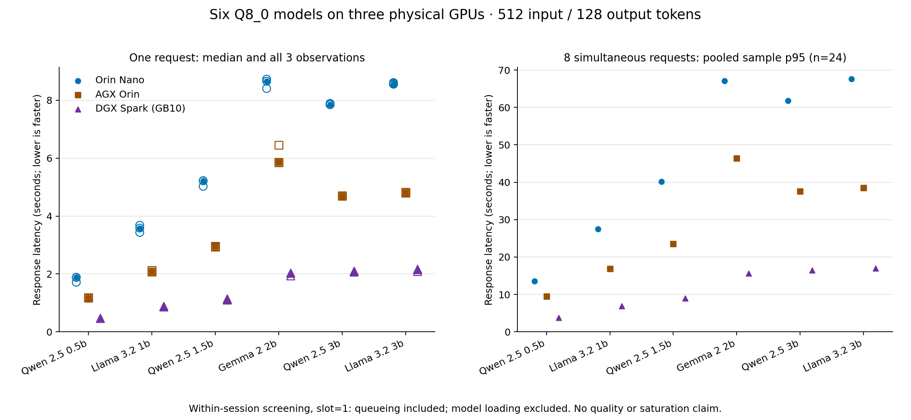
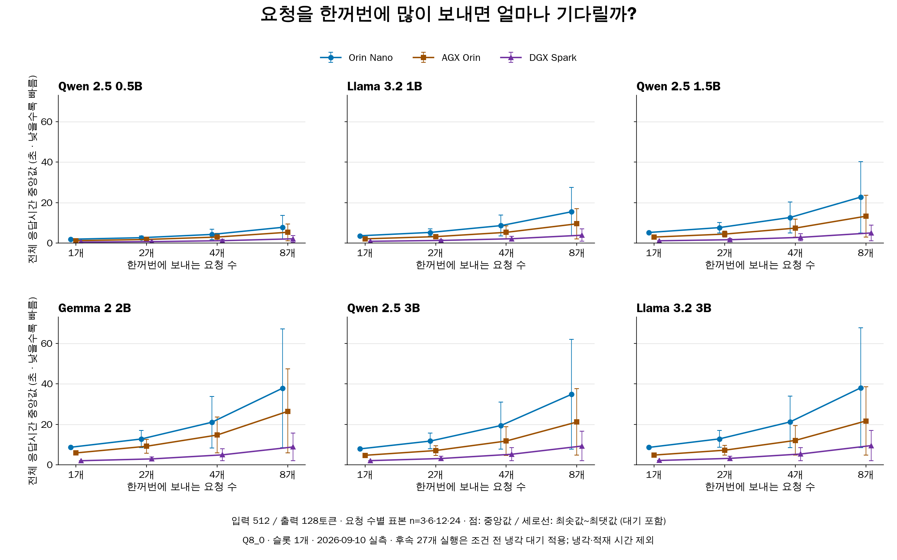
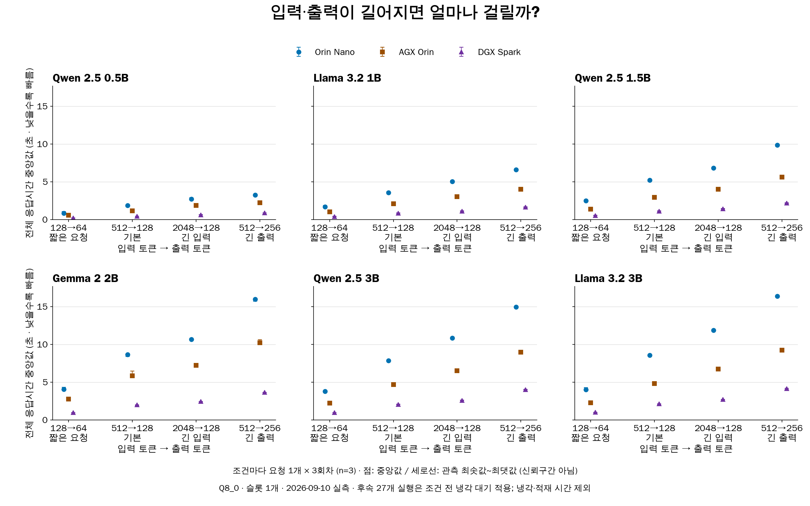
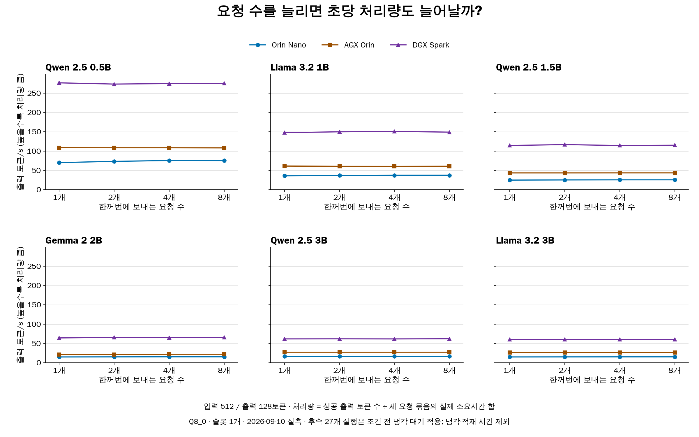

# 기술 메모: Orin Nano·AGX Orin·DGX Spark의 6개 모델 성능 비교

- **측정일:** 2026-09-10
- **갱신일:** 2026-09-11 · 개정 1.3
- **문서번호:** TM-LLM-20260910-01

## 1. 핵심 결과

- **비교 대상:** Orin Nano·AGX Orin·DGX Spark, 언어모델 6종
- **측정 목적:** 같은 모델·토큰 수에서 응답 속도와 처리량 비교
- **기본 단일 요청 결과:** 6개 모델 모두 Spark → AGX → Nano 순으로 빠름
- **Llama 1B 응답시간:** Nano **3.584초** / AGX **2.077초** / Spark **0.859초**
- **최종 집계:** 54개 실행, 실측 972건 성공; 워밍업 54건 제외
- **해석 범위:** 당시 설치 환경과 설정의 속도 비교
- **미확인:** 답변 정확도, 장비 최대 성능, 장시간 지속 처리량, 메모리 제한의 영향
- **중단 이력:** 온도 기준 초과·관리 연결 오류 발생; 중단 시도와 최종 집계 구분

### 1.1 요청 1개를 처리하는 시간

- 조건: **입력 512 → 출력 128토큰**
- 값: 세 회차 중앙값, **단위 초 · 작을수록 빠름**
- 포함: 장비 내부 HTTP 왕복, 응답 완료까지의 시간
- 제외: 다운로드, 모델 적재, 냉각 대기

| 모델 (Q8_0) | Orin Nano | AGX Orin | DGX Spark |
|---|---:|---:|---:|
| Qwen 2.5 0.5B | 1.878 | 1.177 | 0.462 |
| Llama 3.2 1B | 3.584 | 2.077 | 0.859 |
| Qwen 2.5 1.5B | 5.219 | 2.955 | 1.117 |
| Gemma 2 2B | 8.660 | 5.864 | 2.021 |
| Qwen 2.5 3B | 7.852 | 4.697 | 2.069 |
| Llama 3.2 3B | 8.584 | 4.808 | 2.144 |

### 1.2 요청 8개가 동시에 도착했을 때

- 조건: 입력 512 → 출력 128토큰, 요청 8개씩 세 번
- 값: **24개 요청의 표본 p95 · 단위 초 · 대기시간 포함**
- p95: 수집한 응답시간의 95백분위 값; 느린 요청 구간 확인용
- 처리 방식: **슬롯 1개 → 한 요청씩 처리, 나머지는 대기**
- 주의: 8개 동시 계산 성능이나 장시간 운영 p95 보장값으로 해석 불가

| 모델 (Q8_0) | Orin Nano | AGX Orin | DGX Spark |
|---|---:|---:|---:|
| Qwen 2.5 0.5B | 13.579 | 9.454 | 3.714 |
| Llama 3.2 1B | 27.431 | 16.846 | 6.841 |
| Qwen 2.5 1.5B | 40.182 | 23.519 | 8.915 |
| Gemma 2 2B | 67.109 | 46.360 | 15.616 |
| Qwen 2.5 3B | 61.800 | 37.520 | 16.461 |
| Llama 3.2 3B | 67.563 | 38.481 | 16.927 |

### 1.3 동시 요청 1·2·4·8개 전체 비교

- 가로축: **한꺼번에 보내는 요청 수**
- 세로축: **요청별 응답시간 중앙값 · 초 · 낮을수록 빠름**
- 점: 중앙값 / 세로선: 관측 최솟값~최댓값; 대기 차이 포함, 신뢰구간 아님
- 표본 수: 요청 1·2·4·8개 조건별 각각 3·6·12·24건
- 비교: 위 1.2절은 p95, 아래 그래프의 점은 중앙값
- 관측: 요청 수 증가에 따라 대기 포함 응답시간 증가

### 1.4 짧은 요청·긴 입력·긴 출력 전체 비교

- 가로축: 입력 토큰 → 출력 토큰
- 조건: 128→64 / 기본 512→128 / 긴 입력 2048→128 / 긴 출력 512→256
- 요청 방식: **한 번에 1개, 조건별 세 회차**
- 점: 응답시간 중앙값 / 세로선: 세 관측값의 최솟값~최댓값
- 관측: 기본 조건보다 긴 입력·긴 출력 조건에서 응답시간 증가

### 1.5 동시 요청 수별 초당 처리량

- 가로축: 한꺼번에 보내는 요청 수 / 세로축: **출력 토큰/s · 높을수록 처리량 큼**
- 관측: 요청 수가 늘어도 초당 처리량은 대체로 비슷한 수준
- 실행 조건: 슬롯 1개; 대기 중인 요청 증가가 동시 계산 슬롯 증가를 뜻하지 않음
- 측정 범위: 세 요청 묶음의 합산 처리량; 장비의 최대 지속 처리량은 미측정

- 공통 주의: 기존 메모리 5/8/8GiB, 후속 27개 실행의 냉각 조건 유지; 냉각·적재 시간 제외
- [전체 126개 조건 CSV 내려받기](assets/llama-multimodel-20260910/all-conditions/all-conditions.csv)
- [그래프 생성 근거](assets/llama-multimodel-20260910/all-conditions/all-figures-provenance.json)
- 전체 응답시간·첫 응답 p95·처리량 수치: **9절의 장비별 전체 표**

## 2. 실험 조건

### 2.1 장비

| 장비 | 관측 노드 메모리(GiB) | 런타임 컨테이너 메모리 제한 | OS | CUDA backend |
|---|---:|---|---|---|
| Orin Nano | 7.44 | 5Gi | Ubuntu 22.04.5 LTS | cuda_jetpack6 |
| AGX Orin | 61.40 | 8Gi | Ubuntu 24.04.4 LTS | cuda_jetpack6 |
| DGX Spark | 121.69 | 8Gi | Ubuntu 24.04.3 LTS | cuda_v13 |

- 노드 메모리: Kubernetes에서 관측한 시스템 메모리
- 컨테이너 제한: 기존 추론 컨테이너에 설정된 메모리 상한
- OS·CUDA backend·전력 설정: 장비별 기존 설정 유지
- 대상 장비: 실제 Nano·AGX·Spark 사용; RTX 대체값 없음

### 2.2 모델과 실행 설정

- 모델: Llama 3.2 **1B·3B**, Qwen 2.5 **0.5B·1.5B·3B**, Gemma 2 **2B**
- 계열: Instruct / 파일 형식: GGUF / 양자화: Q8_0
- 파일 검증: 세 장비의 모델 SHA256 대조 완료
- 입력 검증: 동일 모델의 세 장비 입력 데이터 일치
- 모델 간 비교: 토큰 수만 동일; tokenizer 차이로 문장·토큰 ID는 다를 수 있음
- 토큰: 모델이 입력·출력을 세는 단위; 글자 수와 다름

| 통제 항목 | 설정 |
|---|---|
| 모델 형식·양자화 | GGUF · Q8_0 |
| 추론 런타임 | `llama-server d222767c7` |
| 문맥 길이 / 처리 슬롯 / 스레드 | 4096 / 1 / 4 |
| batch / ubatch | 512 / 128 |
| KV cache / flash attention | f16 / off |
| 요청 생성 | 기존 factory sensor 텍스트 생성기, seed 20260908 |
| 생성 조건 | temperature 0, 고정 seed, EOS 무시로 출력 토큰 수 고정 |
| 요청 간 prefix 재사용 | `cache_prompt=false`, `cache_n=0`; 실제 미재사용 검증 |
| 측정 경로 | 장비 내 API 컨테이너 → 동일 Pod/host network의 loopback HTTP |

### 2.3 요청 구성과 반복 횟수

| 조건 | 입력 토큰 | 출력 토큰 | 한꺼번에 보내는 요청 수 | 회차당 측정 건수 |
|---|---:|---:|---|---:|
| 기본 부하 | 512 | 128 | 1, 2, 4, 8 | 1 + 2 + 4 + 8 = 15 |
| 짧은 요청 | 128 | 64 | 1 | 1 |
| 긴 입력 | 2048 | 128 | 1 | 1 |
| 긴 출력 | 512 | 256 | 1 | 1 |

- 한 회차: 모델 하나를 장비 한 대에서 시험하는 한 번의 묶음; 예: Nano의 Llama 1B 1회차
- 실행당 요청: 워밍업 1건 + 측정 18건
- 전체 실행: **6모델 × 3장비 × 3회차 = 54개**
- CSV 구성: **실측 972행 + 워밍업 54행 = 1,026행**
- 실행 순서: 첫 회차는 모델 파일 크기 순; 이후 두 회차는 무작위 순서
- 순서 재현: seed 20260910 사용; 조건 순서도 seed로 섞음
- 반복 범위: 같은 날·같은 세션의 세 회차
- 전체 조건 통계: 입력 길이 변화와 동시 요청 2·4개를 포함한 **126개 조건**

### 2.4 측정·종료 기준

| 항목 | 적용 기준 |
|---|---|
| 단일 요청 통계 | 세 회차 중앙값, n=3 |
| 동시 8개 통계 | 세 묶음의 24개 요청을 합친 표본 p95 |
| 요청 제한시간 | 180초 |
| 모델 서버 실행 제한시간 | 900초 |
| 중단 기준 | 관측 온도 80°C 이상 또는 관측 가용 RAM 700MiB 미만 |
| 후속 냉각 조건 | Spark 13개·Nano 14개 실행; 워밍업·각 조건 전 관측 온도 60°C 이하 대기 |
| 집계 제외 | 워밍업·중단 시도; 중단 기록은 별도 보존 |
| 중복 방지 | 같은 실행에 완료 기록이 둘 이상이면 집계 오류 처리; 빠른 값 선택 없음 |
| 서비스 복구 | 시험 종료 후 원래 서비스 복구, 시험용 프로세스·포트 부재 확인 |

- 측정 전: 기존 Llama 요청 처리 완료 대기 → 모델 해제 → 시험 서버 실행
- 기존 설정 유지: Pod 정의, GPU 예약, 센서 서비스, 호스트 설정
- 지연 측정 제외: 관리용 Kubernetes exec 왕복
- 서비스 복구·장비 상태: **2026-09-10 시험 종료 당시 검증 기록**

## 3. 메모리 제한: 왜 5GiB·8GiB인가

- **설정값:** Nano 5GiB / AGX 8GiB / Spark 8GiB
- **설정 경위:** 기존 Llama 실험용 컨테이너 재사용
- **선정 근거:** 이번 비교의 공정성·최적 성능을 기준으로 새로 산정한 값은 아님
- **확인 근거:** `multimodel_cluster.py`, `nodes-before.json`, `nodes-after.json`
- **검증 공백:** 메모리 한도만 바꾼 비교, 연속적인 메모리 압박·회수·스왑 측정 미수행
- **판단 보류:** 제한의 성능 영향 유무, 5/8GiB 차이와 속도 차이의 인과관계
- **주의:** 요청 성공·작은 GPU 모델 할당량만으로 메모리 여유나 무영향 입증 불가

| 비교 목적 | 메모리 설정 방향 | 이번 시험 |
|---|---|---|
| 같은 모델의 장비별 속도 | 실행에 충분한 메모리 확보 + 압박 여부 확인; 동일 상한은 필수 아님 | 기존 5/8/8GiB 환경에서 측정; 제한 영향 미확인 |
| 같은 자원 예산의 성능 | 세 장비의 메모리 상한도 동일하게 설정 | 미수행 |
| 장비별 최대 수용 능력 | 장비별 가용 메모리 활용 + 모델·동시 처리량 확대 | 미수행 |

## 4. 결과를 볼 때 주의할 점

| 항목 | 해석 범위·제한 |
|---|---|
| 장비 순위 | 기본 단일 요청 조건에서 Spark → AGX → Nano; 하드웨어만의 영향으로 분리 불가 |
| 모델 순위 | Qwen 0.5B의 기본 단일 요청 시간이 가장 짧음; 정확도·지능 순위는 미측정 |
| 냉각 대기 | 후속 27개 실행에 적용; 지연·처리량에서 제외 |
| 지속 성능 | 냉각 시간을 포함한 장시간 처리량 미측정 |
| 반복 수 | 같은 세션의 세 회차; 독립 날짜 반복·별도 검증 데이터·유의성 검정 없음 |
| 자원 관측 | 간헐적 수집·관리 연결 공백 존재; 메모리·온도 실제 최고점 보장 불가 |
| 동시 요청 | 슬롯 1개에서 대기 포함; 다중 슬롯 최대 처리량 미측정 |
| 네트워크 | 장비 내부 HTTP 경로; 외부 네트워크 지연 미측정 |
| 기동 시간 | 관리 명령 시작 → GPU 준비 상태 관측; 순수 모델 로딩 시간과 다름 |
| 적용 제외 | 모델 정답률, 에너지 절감량, 자동 오프로딩 임계값, 장비별 최적 성능 |

## 5. 추가 성능 지표

### 5.1 처리량과 첫 응답 시간

- 조건: 입력 512 → 출력 128토큰, 동시 요청 8개씩 세 번
- **출력 토큰/s:** 초당 생성한 답변 토큰 수; 클수록 높은 처리량
- **요청/s:** 초당 완료한 요청 수; 클수록 높은 처리량
- **TTFT:** 요청 후 첫 내용이 도착하기까지의 시간; 대기 포함, 작을수록 빠름
- 처리량 계산: 성공 토큰·요청 수 ÷ 세 요청 묶음의 실제 소요시간 합
- 묶음 소요시간: 가장 이른 요청 예정 시각 → 마지막 요청 완료 시각
- 주의: 개별 요청의 생성 속도 또는 장시간 지속 처리량과 구분

| 장비 | 모델 | 출력 토큰/s | 요청/s | p95 TTFT(초) |
|---|---|---:|---:|---:|
| Orin Nano | Qwen 2.5 0.5B | 75.270 | 0.588 | 12.104 |
| Orin Nano | Llama 3.2 1B | 37.352 | 0.292 | 24.277 |
| Orin Nano | Qwen 2.5 1.5B | 25.458 | 0.199 | 35.554 |
| Orin Nano | Gemma 2 2B | 15.261 | 0.119 | 59.851 |
| Orin Nano | Qwen 2.5 3B | 16.562 | 0.129 | 54.762 |
| Orin Nano | Llama 3.2 3B | 15.159 | 0.118 | 59.817 |
| AGX Orin | Qwen 2.5 0.5B | 108.242 | 0.846 | 8.410 |
| AGX Orin | Llama 3.2 1B | 60.703 | 0.474 | 14.917 |
| AGX Orin | Qwen 2.5 1.5B | 43.463 | 0.340 | 20.822 |
| AGX Orin | Gemma 2 2B | 21.943 | 0.171 | 41.957 |
| AGX Orin | Qwen 2.5 3B | 27.277 | 0.213 | 33.256 |
| AGX Orin | Llama 3.2 3B | 26.586 | 0.208 | 34.089 |
| DGX Spark | Qwen 2.5 0.5B | 275.403 | 2.152 | 3.291 |
| DGX Spark | Llama 3.2 1B | 149.033 | 1.164 | 6.039 |
| DGX Spark | Qwen 2.5 1.5B | 115.118 | 0.899 | 7.892 |
| DGX Spark | Gemma 2 2B | 65.604 | 0.513 | 13.921 |
| DGX Spark | Qwen 2.5 3B | 62.062 | 0.485 | 14.532 |
| DGX Spark | Llama 3.2 3B | 60.496 | 0.473 | 14.937 |

### 5.2 GPU에 적재한 모델 크기

- 측정값: 런타임 로그의 **GPU model buffer · 단위 MiB**
- 포함: 모델 계산에 필요한 tensor 할당량
- 제외: KV cache, 연산 buffer, 드라이버, 프로세스 RSS 등
- 주의: 장치 전체 메모리 사용량 또는 전용 VRAM 용량과 구분
- RSS: 프로세스의 상주 메모리; JSON의 `peak_process_rss_mib`는 관측 표본 중 최댓값
- 단위: 1GiB = 2³⁰바이트 / 1MiB = 2²⁰바이트; manifest의 `Gi` = GiB

| 모델 | Orin Nano | AGX Orin | DGX Spark |
|---|---:|---:|---:|
| Qwen 2.5 0.5B | 500.8 | 500.8 | 500.8 |
| Llama 3.2 1B | 1252.4 | 1252.4 | 1252.4 |
| Qwen 2.5 1.5B | 1564.6 | 1564.6 | 1564.6 |
| Gemma 2 2B | 2649.8 | 2649.8 | 2649.8 |
| Qwen 2.5 3B | 3127.6 | 3127.6 | 3127.6 |
| Llama 3.2 3B | 3255.9 | 3255.9 | 3255.9 |

## 6. 중단·재개 기록

| 실행 | 발생 사항 | 기록·처리 |
|---|---|---|
| 최초 a · Spark Qwen 0.5B | 18건 성공 후 포트 재사용 검사 오류 | a 전체를 최종 집계에서 제외 |
| b · Spark Llama 3B 첫 회차 | 호스트 온도 81.1°C로 중단 기준 80°C 초과; GPU 온도 68°C | 성공 15건·실패/timeout 2건·미전송 1건 보존 |
| b · Spark 종료 확인 | 초기 25초 내 종료 확인 실패 | 후속 조회에서 GPU 프로세스·포트 부재 확인 |
| c · Spark 후속 실행 | 미완료 13개 실행 재개 | 워밍업·각 조건 전 60°C 이하 대기; 냉각 기록 별도 보존 |
| b · Nano Qwen 3B | 관리 exec 연결 중단; GPU 프로세스 잔존 | 성공 9건·진행 중 종료 기록 유실 1건·미시작 8건 구분; OOM 근거 미관측 |
| d · Nano 후속 실행 | 미완료 14개 실행 재개 | 장비 내부 독립 timeout·프로세스·tmpfs 로그 사용; 조건 전 60°C 이하 확인 |
| d · 첫 Nano Qwen 3B | 관리 조회 중단; 장비 내 요청 18건 완료 | 원시 결과·종료 상태 회수; 연속 자원 기록에 공백 |
| b → d · 서비스 복구 | d의 다음 실행 준비로 재일시정지; b의 복구 대기 timeout | 복구 책임·watchdog을 d로 이관; 전체 종료 후 별도 감사로 최종 복구 확인 |

- 후속 실행: 미완료 실행만 보충; 완료된 실행 사이의 유리한 값 선택 없음
- 재시도: 관리 조회의 일시 오류만 재확인; 추론 요청 자체의 재시도 없음
- 기록 유실: 응답시간 추정·대체 없음
- 성공 판단: b 실행기의 종료 코드만으로 판단하지 않고 최종 측정·복구 증거 대조
- 최종 972건 성공: **선택한 최종 행렬 기준**; 중단 시도까지 무실패였다는 의미는 아님

## 7. 후속 확인 항목

- **메모리 영향:** 같은 모델·토큰·슬롯에서 한도만 변경; 사용량·압박·회수·스왑·OOM 함께 측정
- **최대 처리 능력:** 장비별 가용 메모리에 맞춰 모델 크기·처리 슬롯·동시 부하 확대
- **지속 성능:** 냉각 시간을 포함한 처리량과 온도 추이 측정
- **답변 품질:** 동일한 정답 데이터와 채점 기준으로 정확도 평가
- **진행 상태:** 위 항목 모두 미수행

## 8. 원시 결과와 재현 자료

- [조건별 전체 통계 · 126개 조건](assets/llama-multimodel-20260910/comparison.json)
- [전체 요청 CSV · 실측 972건 + 워밍업 54건](assets/llama-multimodel-20260910/requests.csv)
- [모델 파일·SHA256](assets/llama-multimodel-20260910/models.json)
- [실제 노드 환경](assets/llama-multimodel-20260910/hardware.json)
- [측정 검증 결과](assets/llama-multimodel-20260910/verification.json)
- [중단 회차 요청](assets/llama-multimodel-20260910/aborted-attempt-requests.json)
- [원래 서비스 복구](assets/llama-multimodel-20260910/service-restored.json)
- [시험 종료 후 최종 상태](assets/llama-multimodel-20260910/final-state.json)
- [그래프 원본](assets/llama-multimodel-20260910/model-comparison.png)
- [첨부 파일·원본 SHA256 대응](assets/llama-multimodel-20260910/source-manifest.json)
- [CSV 독립 교차검산](assets/llama-multimodel-20260910/analysis-crosscheck.json)
- [기존 Llama 장비별 GPU 성능측정](Llama-장비별-GPU-성능측정.md)
- 실험 계획: `qualification/llama-boundaries/다중모델-3장비-실험계획.md`
- 재현 코드: `qualification/llama-boundaries/multimodel_*.py`
- 원시 기록 ID: `multimodel-three-devices-20260910`
- 서버·회차·냉각 로그: `qualification/llama-boundaries/results/`에 보존
- `comparison.json` 내부 경로: 공개 첨부 폴더가 아닌 원본 실험 디렉터리 기준

## 9. 전체 126개 조건 결과

- 시간 단위: 초 / 처리량: 출력 토큰/s
- 조건 표기: 입력 토큰 → 출력 토큰 / 한꺼번에 보내는 요청 수
- 중앙값·표본 p95: 대기 포함 / 표본 수: 같은 세션의 세 회차 합계
- p95는 작은 표본의 기술통계; 운영 보장값으로 해석 불가

### Orin Nano

| 모델 | 입력→출력 | 요청 수 | 표본 수 | 응답 중앙값 | 응답 p95 | 첫 응답 p95 | 출력 토큰/s |
|---|---|---:|---:|---:|---:|---:|---:|
| Qwen 2.5 0.5B | 512→128 | 1 | 3 | 1.878 | 1.885 | 0.271 | 70.084 |
| Qwen 2.5 0.5B | 512→128 | 2 | 6 | 2.641 | 3.541 | 2.051 | 73.347 |
| Qwen 2.5 0.5B | 512→128 | 4 | 12 | 4.254 | 6.856 | 5.352 | 75.465 |
| Qwen 2.5 0.5B | 512→128 | 8 | 24 | 7.764 | 13.579 | 12.104 | 75.270 |
| Qwen 2.5 0.5B | 128→64 | 1 | 3 | 0.828 | 1.052 | 0.089 | 69.520 |
| Qwen 2.5 0.5B | 2048→128 | 1 | 3 | 2.731 | 2.880 | 1.269 | 46.130 |
| Qwen 2.5 0.5B | 512→256 | 1 | 3 | 3.274 | 3.338 | 0.299 | 77.940 |
| Llama 3.2 1B | 512→128 | 1 | 3 | 3.584 | 3.672 | 0.415 | 35.870 |
| Llama 3.2 1B | 512→128 | 2 | 6 | 5.248 | 7.051 | 3.920 | 36.640 |
| Llama 3.2 1B | 512→128 | 4 | 12 | 8.604 | 13.763 | 10.627 | 37.310 |
| Llama 3.2 1B | 512→128 | 8 | 24 | 15.445 | 27.431 | 24.277 | 37.352 |
| Llama 3.2 1B | 128→64 | 1 | 3 | 1.674 | 1.869 | 0.140 | 36.456 |
| Llama 3.2 1B | 2048→128 | 1 | 3 | 5.042 | 5.146 | 1.808 | 25.185 |
| Llama 3.2 1B | 512→256 | 1 | 3 | 6.625 | 6.699 | 0.390 | 38.553 |
| Qwen 2.5 1.5B | 512→128 | 1 | 3 | 5.219 | 5.223 | 0.532 | 24.815 |
| Qwen 2.5 1.5B | 512→128 | 2 | 6 | 7.627 | 10.185 | 5.565 | 25.205 |
| Qwen 2.5 1.5B | 512→128 | 4 | 12 | 12.621 | 20.158 | 15.534 | 25.427 |
| Qwen 2.5 1.5B | 512→128 | 8 | 24 | 22.683 | 40.182 | 35.554 | 25.458 |
| Qwen 2.5 1.5B | 128→64 | 1 | 3 | 2.509 | 2.609 | 0.185 | 25.329 |
| Qwen 2.5 1.5B | 2048→128 | 1 | 3 | 6.830 | 6.891 | 2.065 | 18.721 |
| Qwen 2.5 1.5B | 512→256 | 1 | 3 | 9.855 | 9.860 | 0.518 | 26.109 |
| Gemma 2 2B | 512→128 | 1 | 3 | 8.660 | 8.724 | 1.361 | 14.882 |
| Gemma 2 2B | 512→128 | 2 | 6 | 12.751 | 17.024 | 9.773 | 15.098 |
| Gemma 2 2B | 512→128 | 4 | 12 | 21.019 | 33.607 | 26.346 | 15.262 |
| Gemma 2 2B | 512→128 | 8 | 24 | 37.814 | 67.109 | 59.851 | 15.261 |
| Gemma 2 2B | 128→64 | 1 | 3 | 4.043 | 4.304 | 0.589 | 15.338 |
| Gemma 2 2B | 2048→128 | 1 | 3 | 10.648 | 10.789 | 3.198 | 11.965 |
| Gemma 2 2B | 512→256 | 1 | 3 | 15.959 | 15.965 | 1.296 | 16.120 |
| Qwen 2.5 3B | 512→128 | 1 | 3 | 7.852 | 7.891 | 0.809 | 16.270 |
| Qwen 2.5 3B | 512→128 | 2 | 6 | 11.730 | 15.588 | 8.557 | 16.424 |
| Qwen 2.5 3B | 512→128 | 4 | 12 | 19.409 | 30.987 | 23.962 | 16.529 |
| Qwen 2.5 3B | 512→128 | 8 | 24 | 34.804 | 61.800 | 54.762 | 16.562 |
| Qwen 2.5 3B | 128→64 | 1 | 3 | 3.774 | 3.875 | 0.259 | 16.871 |
| Qwen 2.5 3B | 2048→128 | 1 | 3 | 10.845 | 10.870 | 3.492 | 11.790 |
| Qwen 2.5 3B | 512→256 | 1 | 3 | 14.930 | 14.966 | 0.823 | 17.138 |
| Llama 3.2 3B | 512→128 | 1 | 3 | 8.584 | 8.611 | 0.826 | 14.908 |
| Llama 3.2 3B | 512→128 | 2 | 6 | 12.807 | 17.032 | 9.284 | 15.036 |
| Llama 3.2 3B | 512→128 | 4 | 12 | 21.168 | 33.884 | 26.130 | 15.135 |
| Llama 3.2 3B | 512→128 | 8 | 24 | 38.003 | 67.563 | 59.817 | 15.159 |
| Llama 3.2 3B | 128→64 | 1 | 3 | 4.013 | 4.247 | 0.315 | 15.557 |
| Llama 3.2 3B | 2048→128 | 1 | 3 | 11.865 | 11.891 | 3.674 | 10.810 |
| Llama 3.2 3B | 512→256 | 1 | 3 | 16.358 | 16.363 | 0.815 | 15.650 |

### AGX Orin

| 모델 | 입력→출력 | 요청 수 | 표본 수 | 응답 중앙값 | 응답 p95 | 첫 응답 p95 | 출력 토큰/s |
|---|---|---:|---:|---:|---:|---:|---:|
| Qwen 2.5 0.5B | 512→128 | 1 | 3 | 1.177 | 1.183 | 0.140 | 108.788 |
| Qwen 2.5 0.5B | 512→128 | 2 | 6 | 1.771 | 2.358 | 1.326 | 108.565 |
| Qwen 2.5 0.5B | 512→128 | 4 | 12 | 2.958 | 4.717 | 3.680 | 108.558 |
| Qwen 2.5 0.5B | 512→128 | 8 | 24 | 5.331 | 9.454 | 8.410 | 108.242 |
| Qwen 2.5 0.5B | 128→64 | 1 | 3 | 0.572 | 0.573 | 0.037 | 109.454 |
| Qwen 2.5 0.5B | 2048→128 | 1 | 3 | 1.856 | 1.895 | 0.784 | 68.165 |
| Qwen 2.5 0.5B | 512→256 | 1 | 3 | 2.211 | 2.220 | 0.141 | 115.600 |
| Llama 3.2 1B | 512→128 | 1 | 3 | 2.077 | 2.123 | 0.177 | 61.169 |
| Llama 3.2 1B | 512→128 | 2 | 6 | 3.161 | 4.248 | 2.299 | 60.571 |
| Llama 3.2 1B | 512→128 | 4 | 12 | 5.288 | 8.470 | 6.537 | 60.501 |
| Llama 3.2 1B | 512→128 | 8 | 24 | 9.503 | 16.846 | 14.917 | 60.703 |
| Llama 3.2 1B | 128→64 | 1 | 3 | 1.021 | 1.026 | 0.047 | 62.284 |
| Llama 3.2 1B | 2048→128 | 1 | 3 | 3.037 | 3.043 | 0.990 | 42.013 |
| Llama 3.2 1B | 512→256 | 1 | 3 | 4.003 | 4.005 | 0.176 | 64.103 |
| Qwen 2.5 1.5B | 512→128 | 1 | 3 | 2.955 | 2.957 | 0.255 | 43.389 |
| Qwen 2.5 1.5B | 512→128 | 2 | 6 | 4.423 | 5.911 | 3.216 | 43.390 |
| Qwen 2.5 1.5B | 512→128 | 4 | 12 | 7.376 | 11.785 | 9.095 | 43.455 |
| Qwen 2.5 1.5B | 512→128 | 8 | 24 | 13.259 | 23.519 | 20.822 | 43.463 |
| Qwen 2.5 1.5B | 128→64 | 1 | 3 | 1.404 | 1.407 | 0.068 | 45.108 |
| Qwen 2.5 1.5B | 2048→128 | 1 | 3 | 4.017 | 4.031 | 1.208 | 31.808 |
| Qwen 2.5 1.5B | 512→256 | 1 | 3 | 5.632 | 5.638 | 0.256 | 45.530 |
| Gemma 2 2B | 512→128 | 1 | 3 | 5.864 | 6.392 | 1.950 | 21.142 |
| Gemma 2 2B | 512→128 | 2 | 6 | 9.162 | 12.387 | 7.991 | 21.349 |
| Gemma 2 2B | 512→128 | 4 | 12 | 14.706 | 23.393 | 19.006 | 21.927 |
| Gemma 2 2B | 512→128 | 8 | 24 | 26.405 | 46.360 | 41.957 | 21.943 |
| Gemma 2 2B | 128→64 | 1 | 3 | 2.745 | 2.868 | 0.710 | 22.898 |
| Gemma 2 2B | 2048→128 | 1 | 3 | 7.247 | 7.445 | 2.854 | 17.533 |
| Gemma 2 2B | 512→256 | 1 | 3 | 10.237 | 10.569 | 1.767 | 24.781 |
| Qwen 2.5 3B | 512→128 | 1 | 3 | 4.697 | 4.704 | 0.432 | 27.244 |
| Qwen 2.5 3B | 512→128 | 2 | 6 | 7.046 | 9.397 | 5.126 | 27.251 |
| Qwen 2.5 3B | 512→128 | 4 | 12 | 11.745 | 18.778 | 14.508 | 27.264 |
| Qwen 2.5 3B | 512→128 | 8 | 24 | 21.130 | 37.520 | 33.256 | 27.277 |
| Qwen 2.5 3B | 128→64 | 1 | 3 | 2.236 | 2.236 | 0.110 | 28.443 |
| Qwen 2.5 3B | 2048→128 | 1 | 3 | 6.497 | 6.512 | 2.040 | 19.673 |
| Qwen 2.5 3B | 512→256 | 1 | 3 | 8.981 | 8.995 | 0.429 | 28.511 |
| Llama 3.2 3B | 512→128 | 1 | 3 | 4.808 | 4.822 | 0.420 | 26.593 |
| Llama 3.2 3B | 512→128 | 2 | 6 | 7.214 | 9.651 | 5.238 | 26.586 |
| Llama 3.2 3B | 512→128 | 4 | 12 | 12.043 | 19.268 | 14.863 | 26.583 |
| Llama 3.2 3B | 512→128 | 8 | 24 | 21.656 | 38.481 | 34.089 | 26.586 |
| Llama 3.2 3B | 128→64 | 1 | 3 | 2.293 | 2.299 | 0.109 | 27.728 |
| Llama 3.2 3B | 2048→128 | 1 | 3 | 6.741 | 6.768 | 2.103 | 18.966 |
| Llama 3.2 3B | 512→256 | 1 | 3 | 9.234 | 9.255 | 0.423 | 27.724 |

### DGX Spark

| 모델 | 입력→출력 | 요청 수 | 표본 수 | 응답 중앙값 | 응답 p95 | 첫 응답 p95 | 출력 토큰/s |
|---|---|---:|---:|---:|---:|---:|---:|
| Qwen 2.5 0.5B | 512→128 | 1 | 3 | 0.462 | 0.465 | 0.045 | 276.771 |
| Qwen 2.5 0.5B | 512→128 | 2 | 6 | 0.700 | 0.943 | 0.517 | 273.543 |
| Qwen 2.5 0.5B | 512→128 | 4 | 12 | 1.161 | 1.869 | 1.448 | 274.844 |
| Qwen 2.5 0.5B | 512→128 | 8 | 24 | 2.094 | 3.714 | 3.291 | 275.403 |
| Qwen 2.5 0.5B | 128→64 | 1 | 3 | 0.227 | 0.229 | 0.012 | 280.065 |
| Qwen 2.5 0.5B | 2048→128 | 1 | 3 | 0.636 | 0.646 | 0.207 | 199.897 |
| Qwen 2.5 0.5B | 512→256 | 1 | 3 | 0.884 | 0.893 | 0.046 | 288.974 |
| Llama 3.2 1B | 512→128 | 1 | 3 | 0.859 | 0.879 | 0.058 | 147.729 |
| Llama 3.2 1B | 512→128 | 2 | 6 | 1.280 | 1.735 | 0.928 | 149.891 |
| Llama 3.2 1B | 512→128 | 4 | 12 | 2.118 | 3.396 | 2.595 | 150.935 |
| Llama 3.2 1B | 512→128 | 8 | 24 | 3.868 | 6.841 | 6.039 | 149.033 |
| Llama 3.2 1B | 128→64 | 1 | 3 | 0.416 | 0.425 | 0.016 | 152.984 |
| Llama 3.2 1B | 2048→128 | 1 | 3 | 1.120 | 1.147 | 0.293 | 113.194 |
| Llama 3.2 1B | 512→256 | 1 | 3 | 1.635 | 1.675 | 0.058 | 155.532 |
| Qwen 2.5 1.5B | 512→128 | 1 | 3 | 1.117 | 1.138 | 0.080 | 114.513 |
| Qwen 2.5 1.5B | 512→128 | 2 | 6 | 1.640 | 2.222 | 1.190 | 116.723 |
| Qwen 2.5 1.5B | 512→128 | 4 | 12 | 2.803 | 4.504 | 3.450 | 114.428 |
| Qwen 2.5 1.5B | 512→128 | 8 | 24 | 4.988 | 8.915 | 7.892 | 115.118 |
| Qwen 2.5 1.5B | 128→64 | 1 | 3 | 0.527 | 0.561 | 0.022 | 117.733 |
| Qwen 2.5 1.5B | 2048→128 | 1 | 3 | 1.450 | 1.454 | 0.345 | 89.091 |
| Qwen 2.5 1.5B | 512→256 | 1 | 3 | 2.195 | 2.219 | 0.082 | 116.859 |
| Gemma 2 2B | 512→128 | 1 | 3 | 2.021 | 2.029 | 0.289 | 64.194 |
| Gemma 2 2B | 512→128 | 2 | 6 | 2.909 | 3.941 | 2.212 | 65.571 |
| Gemma 2 2B | 512→128 | 4 | 12 | 4.915 | 7.870 | 6.172 | 65.200 |
| Gemma 2 2B | 512→128 | 8 | 24 | 8.809 | 15.616 | 13.921 | 65.604 |
| Gemma 2 2B | 128→64 | 1 | 3 | 0.961 | 0.968 | 0.120 | 66.492 |
| Gemma 2 2B | 2048→128 | 1 | 3 | 2.440 | 2.459 | 0.632 | 52.712 |
| Gemma 2 2B | 512→256 | 1 | 3 | 3.638 | 3.670 | 0.265 | 70.332 |
| Qwen 2.5 3B | 512→128 | 1 | 3 | 2.069 | 2.095 | 0.143 | 61.653 |
| Qwen 2.5 3B | 512→128 | 2 | 6 | 3.102 | 4.151 | 2.212 | 61.841 |
| Qwen 2.5 3B | 512→128 | 4 | 12 | 5.198 | 8.341 | 6.397 | 61.625 |
| Qwen 2.5 3B | 512→128 | 8 | 24 | 9.282 | 16.461 | 14.532 | 62.062 |
| Qwen 2.5 3B | 128→64 | 1 | 3 | 0.988 | 0.992 | 0.038 | 64.730 |
| Qwen 2.5 3B | 2048→128 | 1 | 3 | 2.610 | 2.637 | 0.607 | 48.949 |
| Qwen 2.5 3B | 512→256 | 1 | 3 | 4.028 | 4.054 | 0.140 | 63.598 |
| Llama 3.2 3B | 512→128 | 1 | 3 | 2.144 | 2.161 | 0.128 | 60.097 |
| Llama 3.2 3B | 512→128 | 2 | 6 | 3.178 | 4.262 | 2.255 | 60.275 |
| Llama 3.2 3B | 512→128 | 4 | 12 | 5.329 | 8.504 | 6.535 | 60.339 |
| Llama 3.2 3B | 512→128 | 8 | 24 | 9.492 | 16.927 | 14.937 | 60.496 |
| Llama 3.2 3B | 128→64 | 1 | 3 | 1.007 | 1.021 | 0.035 | 63.147 |
| Llama 3.2 3B | 2048→128 | 1 | 3 | 2.736 | 2.739 | 0.590 | 47.015 |
| Llama 3.2 3B | 512→256 | 1 | 3 | 4.130 | 4.191 | 0.129 | 61.892 |
