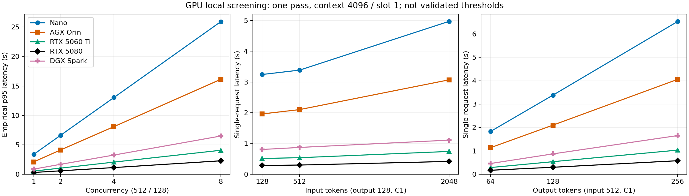

# Llama 장비별 GPU 성능측정

> 후속 [Nano–AGX 서비스 연속성 실험 결과](2026-09-08-Nano-AGX-서비스-연속성-실험결과.md)는
> 8토큰 요청의 실제 전환·복귀 10회를 검증했다. 아래 장비별 성능측정과 작업 조건이 다르다.

## 최신 결과: Spark도 512/128 공통 설정 실측 완료 (2026-09-10)

**실제 DGX Spark GB10의 입력 512·출력 128토큰 측정을 완료했다.**
단일 요청은 **0.871초**, 동시 요청 8개의 대기 포함 표본 p95는 **6.491초**였다.
이번 설정에서는 두 Jetson보다 짧고 두 RTX보다 길었다. 장비의 최적화된 최대 성능 순위는 아니다.

동일 모델 파일 SHA256, llama-server `d222767c7`, context 4096/slot 1, thread 4,
batch 512/128, f16 KV, flash attention off를 사용했다. 모든 측정 요청의 실제 토큰 수와
prefix 미재사용을 확인했고 입력 fixture는 기존 RTX 5060 Ti 시험과 완전히 일치했다.
CUDA backend는 Spark ARM64 `cuda_v13`으로 장비별 차이를 유지한다.

Spark의 최종 sweep은 요청 길이·동시 요청·짧은 지속 부하를 합쳐 **44/44건 성공**했다.
워밍업 1건은 표에서 제외했다. 17/17 GPU layer, native GPU 프로세스 1,688MiB 적재를
확인한 뒤 시험했다. 요청 발생기는 같은 Pod의 API 컨테이너에 있고, 시간은 loopback
HTTP 왕복을 포함한다. Jetson·RTX 자료는 9월 8일, Spark는 9월 10일 측정으로 날짜가 다르다.

첫 시도 a는 45/45건 측정 후 읽기 전용 `/tmp`의 PID 기록 문제로 자동 정리가 실패했다.
소유 프로세스만 확인해 수동 종료하고 데모를 복구했다. PID 기록을 `/dev/shm`으로 바꾸고
기록 실패 시 실행을 중단하도록 수정한 뒤 같은 전체 계획을 b에서 재실행했다.
**정리까지 통과한 b를 본 표에 사용**하며 a 기록도 보존한다. 속도가 좋은 시도를 고른 것이 아니다.
최종 시험 후 GPU compute 프로세스 0, Spark CACHED, 데모 LOCAL·새 실행 가능을 확인했다.
Pod·GPU 예약·모델 파일 캐시는 유지했다. GPU 장치 전체 메모리는 N/A이며 프로세스 메모리와 구분한다.

[토큰·fixture·GPU·복구 검증](assets/llama-sweep-20260908/spark-verification.json),
[실행 스크립트](../qualification/llama-boundaries/spark_sweep.py),
[최종 원본 b](../qualification/llama-boundaries/results/sweep-spark-20260910-b/verification.json)를 제공한다.

## 공통 설정 비교: 요청 크기와 동시 요청 (9월 8일·10일)

**Nano·실제 AGX Orin·RTX 5060 Ti·RTX 5080·실제 DGX Spark 모두 장비 내부에서 측정했다.**
이번에는 승인받아 Nano 기존 시연 모델을 잠시 내리고 공통 설정 모델만 실행했으며,
5080 센서 추론의 GPU도 한시적으로 빌렸다. Spark는 유휴 데모 Pod 안에서 별도 native 서버로
실행했고, 측정 동안 왕복 데모 컨트롤러를 잠시 중지한 뒤 복구했다.

### 무엇으로 어떻게 실험했나

**같은 Llama 모델에 같은 양의 일을 주고, 각 장비 안에서 GPU로 처리하는 시간을 쟀다.**
Nano에서 실행하던 요청을 다른 장비로 넘긴 시험은 아니다.

| 항목 | 이번 실험 조건 |
|---|---|
| 모델 | **Llama 3.2-1B Instruct · Q8_0 GGUF**, 다섯 장비에 동일 파일 사용 |
| 실행 도구 | **llama-server `d222767c7`** (Ollama 0.33.2 배포본), 17/17 layer GPU 적재 확인 |
| 기본 요청 | **입력 512토큰 → 출력 128토큰**. 토큰은 모델이 읽고 쓰는 글의 조각이며, 글자 수와 다르다. |
| 부하를 주는 방법 | 자체 Python 요청 발생기로 로컬 HTTP 스트리밍 API 호출. **동시 요청 1·2·4·8개**로 증가 |
| 추가로 바꾼 조건 | 입력 **128·512·2048**, 출력 **64·128·256토큰** 중 일부 조합. 장비별 처리율 기준 0.5배·1.2배의 요청을 각각 **10초** 발생 |
| 처리 설정 | **slot 1**: 한 번에 한 요청을 처리하고 나머지는 대기. context 4096, thread 4, batch 512/128, f16 KV, flash attention off |
| 실행 위치 | Nano·AGX·5060 Ti: 장비의 독립 프로세스. 5080·Spark: GPU를 할당받은 Kubernetes Pod. **요청 발생기도 각 장비 내부** |
| 측정 범위 | 요청 전송부터 마지막 응답 수신까지. 모델은 미리 GPU에 로딩하고 준비 운동 완료. **로딩 시간·장비 간 통신 시간은 아래 표에 미포함** |
| 비교 통제 | 동일 토큰 입력, 실제 출력 길이 확인, 요청 간 prefix/KV 재사용 차단. OS·드라이버·전력 모드는 기존 상태 유지 |

### 한눈에 보는 결론

**이 설정에서는 RTX 5080이 가장 빨랐고, Nano는 요청 8개가 몰리면 응답시간이 약
26초까지 길어졌다. 모든 장비에서 요청이 몰릴수록 대기가 늘었다.**

아래는 **입력 512 / 출력 128토큰** 결과다. 단위는 초이며 작을수록 빠르다.

| 장비 | 혼자 요청할 때 | 8개가 동시에 몰릴 때¹ | 한 줄 결론 |
|---|---:|---:|---|
| **Orin Nano** | **3.38초** | **25.92초** | 요청이 몰리면 대기 증가가 큼 |
| **AGX Orin** | **2.10초** | **16.12초** | Nano보다 짧지만, 대기는 여전히 큼 |
| **RTX 5060 Ti** | **0.54초** | **4.07초** | 이번 조건에서 두 Jetson보다 짧음 |
| **RTX 5080** | **0.30초** | **2.28초** | 측정한 다섯 장비 중 가장 짧음 |
| **DGX Spark** | **0.87초** | **6.49초** | 두 Jetson보다 짧고 두 RTX보다 김 |

¹ 요청 1개는 **n=1 실측값**, 요청 8개는 **n=8 표본 p95**(느린 쪽 응답시간)다.
각 조건을 한 번 탐색한 결과로, 장시간 운영 p95나 장비의 최대 성능을 뜻하지 않는다.
slot 1로 고정했으므로, 동시에 8개를 계산한 것이 아니라 **대기를 포함해** 측정했다.

**그래서 지금 무엇을 결정할 수 있나?**

- **확인한 것:** 같은 작업도 장비별 시간이 다르고, 동시 요청이 늘면 대기시간이 커진다.
  따라서 GPU 사용률 하나보다 **요청 대기와 응답시간**을 함께 보고 전환 조건을 검증해야 한다.
- **아직 결정할 수 없는 것:** “몇 요청부터 원격으로 보낼지”, “얼마나 오래 몰리면 원격을 켤지”,
  “몇 초 쉬면 끌지”. 이 표에는 원격 통신·모델 활성화·유휴 비용 비교가 없다.
- **다음 시험:** Nano에서 동일 요청 패턴을 로컬과 원격에 재생해 비교하고,
  모델을 켜는 비용까지 포함해 이득이 남는 조건을 찾는다. **지금 표의 수치를 자동 전환 설정에 바로 넣지 않는다.**

다섯 장비의 최종 탐색 합계는 **246건 예정 → 245건 전송·성공, 1건 미전송**이었다.
기존 네 장비의 202건 예정·201건 성공에 Spark b의 44건 성공을 더한 값이다. 미전송은 5080의
별도 요청률 시험에서 발생기 상한에 걸린 건이며 서버 실패가 아니다. 초기 실패 run은
별도 보존했다. Always-On·Cold·Cached 비교, 자원 절약률과 최적 회수 timeout은 미검증이다.

근거: `sweep-nano-session-a/benchmark/sweep`, `sweep-agx-a/sweep`,
`sweep-rtx5060ti-a/sweep`, `sweep-rtx5080-c/sweep`, `sweep-spark-20260910-b/sweep`.
아래에는 더 세밀한 수치, 실패 기록과 원시 데이터를 남겼다.

### 무엇을 바꿔 요청했나

- 기본 입력 512/출력 128토큰: 동시 요청 **1·2·4·8**.
- 출력 128 고정: 입력 **128·512·2048**토큰, 동시 요청 1.
- 입력 512 고정: 출력 **64·128·256**토큰, 동시 요청 1.
- 짧은 요청 묶음: 128/64토큰 × 동시 요청 4.
- 긴 요청: 2048/256토큰 × 동시 요청 1.
- 기본 단일 요청에서 계산한 처리율의 **0.5배·1.2배**로 각각 10초 예정 도착을 생성.
  응답을 기다린 다음 보내는 방식이 아닌 open-loop다. 최대 발생률 5 요청/s,
  요청 발생기 in-flight 상한 8로 제한하고 미전송도 기록했다.

고정 작업량 토큰 fixture이며 자연어 답변 품질 시험은 아니다. 전 조합/반복 날짜/무작위
장비 순서를 적용한 확증 시험이 아니라 **한 번의 순차 탐색**이다. 짧은 동시 도착 wave는
측정했지만 긴 반복 burst와 장시간 지속 부하의 한계는 아직 검증하지 않았다.

### 공통 조건

동일 Instruct Q8_0 파일 SHA와 llama-server `d222767c7`, thread 4, batch 512/ubatch 128,
f16 KV, FA off, **context 4096 / slot 1**, 모든 layer GPU 적재를 사용했다.
2048토큰 입력과 출력을 함께 수용하기 위해 context를 늘렸다.
**이전 context 2048 결과와 분리한다.** OS·driver·전력 모드는 기존 상태를 유지했다.

Nano·AGX·5060 Ti는 호스트 프로세스와 로컬 요청 발생기, 5080·Spark는 GPU Pod 내 서버와 같은
Pod 네트워크의 API 컨테이너에서 실행한 요청 발생기다. 5080의 측정 시간을 외부 관리
명령 실행시간으로 잡지 않았다. 모델 시작·준비 운동은 아래 추론 통계에서 제외해 별도 보존했다.
원격 실행위치 전환·KV cache 이동·운영 자동 오프로딩은 실행하지 않았다.

### 동시 요청에 따른 전체 응답시간

단위: 초. 각 cell의 표본 수는 동시 요청 수와 같은 **1·2·4·8**이다.
C1은 단일 관측값이고, 나머지는 작은 표본의 보간 p95다. 신뢰할 만한 모집단 p95로
해석하지 않는다. warmup 제외, 실제 입력/출력 길이·prefix 미재사용 검증을 통과한 요청만 집계했다.

| 장비 | C1 단일 응답 | C2 표본 p95 | C4 표본 p95 | C8 표본 p95 |
|---|---:|---:|---:|---:|
| Nano | 3.384 | 6.606 | 13.030 | 25.920 |
| 실제 AGX Orin | 2.101 | 4.120 | 8.086 | 16.123 |
| RTX 5060 Ti | 0.537 | 1.037 | 2.058 | 4.070 |
| RTX 5080 | 0.298 | 0.578 | 1.132 | 2.280 |
| DGX Spark | 0.871 | 1.681 | 3.256 | 6.491 |

C8의 표본 p95 TTFT는 표 순서대로 **22.814·14.223·3.577·2.010·5.694초**였다.
동시 요청을 늘려도 완료 처리량은 기본 512/128 조건에서 약
**0.295·0.475·1.88·3.37·1.18 요청/s**로 비슷했다. 이는 고정 slot 1의 관측값이지
각 장비의 최적화된 최대 성능이나 안정적인 운영 RPS 한계가 아니다.

### 요청 길이에 따른 단일 응답시간

단위: 초. **조건별 n=1**이며 변동성·신뢰구간을 추정하지 않았다.

| 입력/출력 토큰 | Nano | AGX Orin | RTX 5060 Ti | RTX 5080 | DGX Spark |
|---|---:|---:|---:|---:|---:|
| 128/128 | 3.242 | 1.960 | 0.513 | 0.285 | 0.805 |
| 512/128 | 3.384 | 2.101 | 0.537 | 0.298 | 0.871 |
| 2048/128 | 4.971 | 3.069 | 0.741 | 0.416 | 1.108 |
| 512/64 | 1.832 | 1.137 | 0.287 | 0.170 | 0.459 |
| 512/256 | 6.536 | 4.060 | 1.031 | 0.577 | 1.655 |
| 2048/256 | 8.321 | 5.120 | 1.262 | 0.712 | 1.933 |



### 짧은 지속 도착 부하

각 장비의 C1 관측값을 기준으로 발생률을 다르게 잡았다. **같은 도착 패턴을 장비 간
재생한 비교가 아니라 각 장비 부하 탐색**이다. 예정 구간은 각 10초이며 미완료 요청을
정상 drain한 뒤 다음 조건으로 넘어갔다. 정수 요청 수 반올림 때문에 실제 발생률은
명목률과 정확히 같지 않으며 원시 예정/실제 시각·발생기 지연을 보존했다.

| 장비 | 1.2배 명목 발생률 | 예정/전송/완료 | 표본 p95 응답 | 표본 p95 TTFT |
|---|---:|---:|---:|---:|
| Nano | 0.355 요청/s | 4/4/4 | 5.073초 | 1.953초 |
| AGX Orin | 0.571 요청/s | 6/6/6 | 3.815초 | 1.877초 |
| RTX 5060 Ti | 2.236 요청/s | 23/23/23 | 2.340초 | 1.845초 |
| RTX 5080 | 4.026 요청/s | 41/40/40 | 2.250초 | 1.978초 |
| DGX Spark | 1.378 요청/s | 14/14/14 | 2.442초 | 1.638초 |

5080의 **1건은 서버 거절이나 성공이 아니라, 발생기 in-flight 상한으로 미전송**됐다.
완료 요청만으로 실패·미전송을 숨기지 않는다. 최종 탐색 run 전체는 Nano 30/30,
AGX 33/33, 5060 Ti 57/57, 5080 예정 82건 중 전송 81/완료 81/미전송 1, Spark b 44/44다.
초기 5080 실행 연결 실패의 timeout 1건은 이 최종 run들과 별도 실패 기록으로 남겼다.

### ELI5 결론과 적용 범위

**주문을 받는 속도가 처리하는 속도보다 빨라지면, 창구가 빨라지는 대신 줄이 길어진다.**
이번에는 Nano에서도 설정을 맞췄고, 짧은 요청·긴 요청·여러 동시 요청을 모두 실제 GPU로
처리했다. 입력이 길면 읽는 시간이 늘고, 출력이 길면 생성 시간이 늘었다.

다음 반복 시험에서 집중할 요청률의 탐색 중심은 기본 조건 기준
Nano 약 0.30, AGX 약 0.48, 5060 Ti 약 1.9, 5080 약 3.4, Spark 약 1.18 요청/s다.
**제안할 다음 탐색 위치이지 검증된 전환 임계값이 아니다.** 이를 그대로 서비스 설정에
넣지 않는다. SLO·최소 개선 폭은 별도 설정으로 두고, 독립 반복·holdout·네트워크·모델
활성화·유휴 회수 비용을 검증한 뒤 운영 판단 기준을 도출한다.

### 복구와 실패 처리

- Nano 기존 모델은 약 **150초** 안에 ACTIVE와 모델 GPU 적재 상태로 복구했다.
- 5080은 대여 시작부터 센서 Ready 복구까지 약 **342초**였다. 센서 1/1 Ready,
  health 두 API 성공, 실험 Pod 제거·GPU 예약 반환, Argo 임시 override 제거를 확인했다.
- 두 서비스 모두 승인된 10분 이내 복구. EdgeX 수집·호스트 전력 설정·공유 캐시는 변경하지 않았다.
- 5080 API 컨테이너의 `/tmp`가 읽기 전용이어서 첫 요청 발생기 배치가 실패했다.
  보안 설정을 바꾸지 않고 쓰기 가능한 `/dev/shm`에서 실행했다.
- 첫 수동 연결의 스트림은 timeout으로 실패했다. 관리 exec 연결이 종료된 상태에서
  남은 실험 서버를 재사용한 경로였으며, 종료되지 않은 소유 PID를 확인해 정리했다.
  수정 실행은 관리 연결을 유지한 채 측정을 완료했다. timeout을 장비 포화 근거로 쓰지 않는다.
- Nano·AGX·5060 Ti는 CPU/RAM/열 센서 시계열을 수집했다. Jetson의 직접 GPU
  memory/util/power 제한은 unavailable이다. 5080은 초기 GPU 적재·프로세스 증거만 있으며
  해당 최종 sweep의 연속 GPU/전력 시계열은 미수집이다. 시스템 에너지 절약을 주장하지 않는다.

### 원시 데이터와 재현

[전체 요청 CSV](assets/llama-sweep-20260908/requests.csv),
[조건별 통계 JSON](assets/llama-sweep-20260908/results.json),
[그래프 산출 근거](assets/llama-sweep-20260908/figure-provenance.json)를 제공한다.
저장소의 원시 로그는 `qualification/llama-boundaries/results/` 아래
`sweep-nano-session-a/benchmark/sweep`, `sweep-agx-a/sweep`,
`sweep-rtx5060ti-a/sweep`, `sweep-rtx5080-c/sweep`, `sweep-spark-20260910-b/sweep`에 있다.
실패한 5080 a/b 실행도 보존했다. 최종 run의 모든 전송 성공 요청은 실제 토큰 수와
prefix 미재사용 검증을 통과했다. 재시도 결과를 부분 스트림에 이어 붙이지 않았다.

```bash
rtk python3 -m unittest discover -s qualification/llama-boundaries -p 'test_*.py'
rtk python3 qualification/llama-boundaries/bench.py smoke \
  --config qualification/llama-boundaries/rtx5060ti-sweep.json \
  --output qualification/llama-boundaries/results/새로운-sweep-ID --sweep
rtk qualification/llama-offloading/.venv/bin/python qualification/llama-boundaries/report_sweep.py
```

Nano/5080 재실행은 서비스 중단 승인을 받은 실행 창에서만 한다. 소유 복구 기록과
watchdog를 사용하지만, 이번에는 정상 종료 복구를 실측했으며 새 Nano watchdog의
강제 프로세스 장애 주입까지 검증한 것은 아니다.

## 별도 조건: 실제 DGX Spark 8토큰 데모 실측 (2026-09-09)

**실제 DGX Spark의 GB10 GPU로 Llama 요청을 처리한 결과를 추가했다.**
짧은 데모 요청을 초당 6개씩 보내는 시험을 3회 통과했고, 캐시에서 모델을 다시 준비해
첫 요청을 완료하는 데 약 2.75~3.11초가 걸렸다.

### 장비·요청·측정 경계

| 항목 | Spark 실측 조건 |
|---|---|
| 실제 장비 | **NVIDIA DGX Spark · GB10**, 서버 노드 `etri-ser0003-cg0ms0` |
| 실행 경로 | `llama-continuity-test`의 Spark worker, `nvidia-spark` RuntimeClass, `nvidia.com/gpu=1` |
| 모델 | Ollama `llama3.2:1b`, manifest digest `baf6a787fdffd633537aa2eb51cfd54cb93ff08e28040095462bb63daf552878` |
| 입력·출력 | 고정 자연어 입력 `In one short sentence, explain why edge computing reduces latency.`, **출력 상한 8토큰** |
| 처리 설정 | worker 동시 처리 1, 모델 활성화 후 HTTP 스트리밍 요청 |
| 측정 범위 | 측정 클라이언트에서 Kubernetes Service를 통해 요청하고 첫 내용·마지막 응답을 받기까지. 순수 GPU 계산 시간은 아님 |
| 표본 | 연속 순차 요청 30건×3회, 캐시 재활성화+probe 10회, 6요청/s·30초 부하×3회. **총 640/640 성공** |
| GPU 실행 근거 | GB10·CUDA runtime 확인과 Ollama 모델 GPU 적재량 **1,348.45MiB**, 실제 응답 노드·모델 digest 검증 |

이 8토큰 시험은 위 다섯 장비의 **입력 512 / 출력 128토큰 공통 설정 시험과 다르다**.
Spark의 0.10초를 다른 장비의 128토큰 응답시간과 나눠 성능 향상률이나 순위를 계산하지 않는다.
고정 입력의 prefix 재사용 차단·실제 입력/출력 토큰 수 일치도 아래 공통 시험처럼 검증하지 않았다.

### 실측 수치

| 항목 | 결과 | 해석 |
|---|---:|---|
| 순차 요청 전체 응답 p95 | **100.66ms** | 각 30건 묶음의 표본 p95 중 최댓값 |
| 순차 요청 첫 토큰 지연 p95 | **41.75ms** | 각 30건 묶음의 표본 p95 중 최댓값 |
| 지속 도착 부하 | **6요청/s × 30초 × 3회**, 540/540 성공 | 확인한 부하 수준이며 최대 처리량·포화점은 아님 |
| 부하 회차별 첫 토큰 지연 p95 | **20.63 / 21.08 / 20.65ms** | 예정 도착 시각부터 측정, 발생기 지연 포함 |
| 부하 회차별 완료 시간 | **29.895 / 29.896 / 29.894초** | 회차별 예정 시작부터 마지막 요청 완료까지 |
| 캐시 재활성화+실제 probe 완료 | **2,747.82~3,107.30ms**, 10회 | 모델 원격 다운로드 없음. Pod 생성·GPU 예약 획득 시간 제외 |
| 시험 종료 후 모델 상태 | **CACHED, 모델 GPU 적재량 0MiB**, 진행·대기 0 | 파일 캐시·Pod·GPU 예약은 유지 |

표본 p95는 원본 측정 스크립트의 nearest-rank 방식이다. 최초 순차 요청도 원본처럼 포함했으며,
짧은 시험의 표본 분위수를 장시간 운영 p95로 확대하지 않는다.
DCGM GPU 사용률·장치 전체 메모리·전력 계측은 이 프로파일에서 unavailable이다.
모델 적재량 0은 **Ollama 모델 해제**를 뜻하며 GPU 예약 반환이나 에너지 절약률의 근거가 아니다.

### 근거와 후속 데모

[공개 실측 요약·원본 SHA256](assets/ordered-offload-20260909/spark-profile.json),
[측정 스크립트](../qualification/llama-offloading/ordered_calibrate.py),
[원본 요청·활성화 기록](../qualification/llama-offloading/results/2026-09-09-ordered-demo/spark-profile.json)을 연결한다.
RuntimeClass가 빠져 CPU로 실행된 첫 시도는 별도 실패 기록이며 위 GPU 수치에 포함하지 않았다.

후속 웹 왕복 데모에서는 **Nano → AGX Orin → Spark → AGX Orin → Nano** 순서로
1,622/1,622 요청을 완료했고 그중 Spark가 625건을 처리했다.
이는 [서비스 전환·복귀 검증](서버-엣지-반복-오프로딩.md)의 근거이며,
장비별 공통 설정 성능비를 대체하지 않는다. 512/128토큰 공통 설정의 후속 실측은 이 문서 상단 비교표에 반영했다.

## 이전 기록: 후속 승인 전 context 2048 로컬 시험

> 측정일: 2026-09-08. **각 장비 내부에서 요청을 발생시킨 로컬 추론 시험**이다.
> 네트워크 오프로딩·부하 자동 전환·실행 중 migration 시험이 아니다.
> Nano의 현재 설정과 공통 설정 시험을 구분한다. 전 장비 동일 조건 비교는 미완료다.

## ELI5 결론

다른 장비로 주문을 넘기기 전에, **각 창구가 혼자 주문을 얼마나 빨리 처리하는지** 쟀다.
동시 요청을 1→2→4로 늘리면 처리량은 비슷한데 기다리는 시간은 늘었다.
현재는 slot 1로 한 요청씩 처리하기 때문이다. 이 결과는 장비의 최적 성능이나
“몇 개부터 무조건 오프로딩”이라는 기준이 아니다.

**AGX Orin은 실제 장비로 측정했다. RTX 서버를 AGX나 DGX Spark로 부르지 않는다.**
Nano는 기존 GPU 모델로 측정했고, 별도 공통 설정 모델은 GPU 메모리 적재에 실패했다.
그래서 Nano 수치와 다른 장비의 비율을 동일 조건의 성능 향상률로 계산하지 않았다.

## 장비와 측정 상태

아래는 9월 8일 이전 시험 시점의 기록이다. 실제 Spark의 최신 확인은 문서 상단을 따른다.

| 실제 장비 | 확인한 노드 | 이번 로컬 측정 | 제한 |
|---|---|---|---|
| Jetson Orin Nano | etri-dev0001-jetorn | 9/9 성공, 기존 GPU 실행 설정 | 공통 설정 추가 모델 적재 실패 |
| Jetson AGX Orin | etri-dev0005-jetagx | 9/9 성공, 공통 설정 | 50W, ARM64, OS/driver 차이 유지 |
| RTX 5060 Ti 8GB | etri-ser0001-cg0msb | 9/9 성공, 공통 설정 | x86 대체 서버, AGX가 아님 |
| RTX 5080 16GB | etri-ser0002-cgnmsb | 이번 로컬 단계 미실행 | 센서 추론 서비스 일시 중단 승인 필요 |
| NVIDIA DGX Spark | 이 과거 시험 당시 미확인 | 해당 시험에는 미포함 | 9월 9일 실제 GB10의 8토큰 실측 완료 — 문서 상단 참고 |

9월 7일의 Nano→RTX 5080 실측은 **원격 API 경로** 결과여서 위 로컬 결과에 섞지 않았다.
측정하지 못한 값은 0이나 실패율 0%로 표시하지 않는다.

## 모델·입력과 실행 설정

- 모델: Llama 3.2-1B **Instruct**, Q8_0 GGUF. 기존 Ollama registry `library/llama3.2:1b`.
- 파일 SHA256: `74701a8c35f6c8d9a4b91f3f3497643001d63e0c7a84e085bed452548fa88d45`.
  Meta 원본 revision/변환 이력은 미확인. manifest digest와 파일 hash는 다르다.
- llama-server: `d222767c7` (Ollama 0.33.2). ARM64 Jetson CUDA backend와 x86 CUDA backend는 다르다.
- 실제 입력 **512토큰**, 실제 출력 **128토큰**, 동일 tokenizer 기반 token-ID fixture.
  seed 20260907, temperature 0, EOS 무시. 생성 품질 평가가 아닌 고정 작업량 성능 시험이다.
- 준비 운동은 측정 통계에서 제외하고 원시 로그에는 남겼다.
  `cache_prompt=false`와 서버 `cache_n=0`으로 요청 간 prefix 재사용이 없음을 확인했다.
- 첫 토큰은 처음 비어 있지 않은 스트리밍 생성 내용 수신 시점이다.
  청크 수를 토큰 수로 세지 않는다. 루프백 HTTP 비용을 포함하며 순수 GPU kernel 시간은 아니다.

| 설정 | 공통 설정: AGX·RTX 5060 Ti | Nano 기존 GPU 모델 |
|---|---|---|
| context / slot | 2048 / 1 | 2048 / 1 |
| CPU threads | 4 | 기존 런타임 자동값, 고정하지 않음 |
| batch / ubatch | 512 / 128 | 512 / 512 |
| KV cache / flash attention | f16 / off | q8_0 / auto |
| GPU 확인 | 17/17 layer + 소유 프로세스 CUDA 증거 | 기존 CUDA runner, Ollama GPU 적재량 1,413,952,307 bytes |
| 실행 형태 | 별도 호스트 프로세스, 종료 후 파일 캐시 유지 | 기존 실험 Pod 내부 GPU 모델 유지 |

AGX는 R39.2.1, driver 595.78, CUDA toolkit 13.2.86, RAM 62878MiB, 50W다.
Nano는 R36.4.7, CUDA toolkit 12.6.68, RAM 7619MiB, 25W다.
OS/driver/전력 모드를 강제로 맞추지 않았다. 공통 설정은 공통 소프트웨어 옵션 비교이며
동일 하드웨어·전력 조건이나 장비별 최적화 비교를 의미하지 않는다.

## 결과 1: 공통 설정 로컬 GPU 성능

각 장비에서 동시 요청 1·2·4 순서로 짧은 wave를 실행했다. 각각 표본 수 3·2·4.
표본이 작고 날짜/순서를 교차한 독립 반복이 아니므로 p95는 **탐색적 표본 분위수**다.

| 장비 | 동시 요청 | 표본 | p95 전체 응답 | p95 TTFT | 완료 요청/s | 전체 출력 tokens/s |
|---|---:|---:|---:|---:|---:|---:|
| AGX Orin | 1 | 3 | 2.122초 | 0.175초 | 0.473 | 60.5 |
| AGX Orin | 2 | 2 | 4.102초 | 2.170초 | 0.475 | 60.7 |
| AGX Orin | 4 | 4 | 8.044초 | 6.104초 | 0.478 | 61.2 |
| RTX 5060 Ti | 1 | 3 | 0.534초 | 0.040초 | 1.874 | 239.8 |
| RTX 5060 Ti | 2 | 2 | 1.038초 | 0.546초 | 1.876 | 240.1 |
| RTX 5060 Ti | 4 | 4 | 2.052초 | 1.559초 | 1.875 | 240.0 |

18/18 측정 요청 성공. tokens/s는 전체 출력 처리량이지 개별 요청 decode 속도와 같지 않다.
지속적인 초당 요청률을 걸어 안정성을 확인한 수치도 아니다.

## 결과 2: Nano 현재 GPU 설정의 로컬 기준선 — 위 표와 별도

| 동시 요청 | 표본 | p95 전체 응답 | p95 TTFT | 완료 요청/s | 전체 출력 tokens/s |
|---|---:|---:|---:|---:|---:|
| 1 | 3 | 3.215초 | 0.224초 | 0.311 | 39.8 |
| 2 | 2 | 6.256초 | 3.268초 | 0.312 | 39.9 |
| 4 | 4 | 12.369초 | 9.383초 | 0.311 | 39.8 |

9/9 성공. 이는 기존 설정에서 줄이 생기는 양상을 보여준다.
기존 [8토큰 시연 부하 기준](Llama-오프로딩-부하-판단-기준.md)의 1500ms·queue 8 등의
값을 이번 512/128 조건의 확정 임계값으로 옮겨 쓰지 않는다.

## 실패·자원·정리

Nano 공통 설정 실행은 scoped `sudo prlimit --memlock=unlimited`에서도
1252.41MiB CUDA buffer 할당이 OOM으로 실패했다. RAM 여유만으로 CUDA 할당 가능성을
판정하지 않는다. 기존 유휴 모델이 있으나 그 모델만을 원인으로 입증하지는 않았다.
호스트 캐시 삭제·운영 모델 강제 종료·CPU fallback은 하지 않았다.

AGX와 RTX 5060 Ti 시험 프로세스는 종료했다. Nano의 기존 모델은 유지했다.
AGX/Nano의 직접 GPU memory/util/power 계측 제한은 unavailable로 남겼고,
프로세스 종료를 GPU 할당량 반환 실측으로 과장하지 않는다.
시스템 전체 에너지·idle 자원 절약·최적 idle timeout은 이번 시험의 결론이 아니다.

## 근거와 재실행

원시 결과는 저장소 `qualification/llama-boundaries/results/`에 있다.

| 장비 | run ID |
|---|---|
| AGX | `agx-smoke-a` |
| RTX 5060 Ti | `local-rtx5060ti-20260908-a` |
| Nano 현재 설정 | `local-nano-existing-20260908-a` |
| Nano 공통 설정 실패 | `nano-window-agx-b` |

성공 run마다 `requests.jsonl`, `requests.csv`, `resources.jsonl`, `provenance.json`,
`summary.json`, `profile.json`과 그래프가 있다. 원시 기록에 예정/실제 전송·첫 응답·완료,
실제 토큰 수·지연·실패·캐시 검증을 남겼다. 프로파일의 운영 활성화는 false,
전환·활성화·회수 기준은 null이다.

```bash
rtk python3 -m unittest discover -s qualification/llama-boundaries -p 'test_*.py' -v
rtk python3 qualification/llama-boundaries/bench.py smoke \
  --config qualification/llama-boundaries/rtx5060ti-0332.json \
  --output qualification/llama-boundaries/results/새로운-실험-ID
```

AGX는 장비에 복사한 `agx-0332.json`을 사용한다. 기존 결과 디렉터리는 덮어쓰지 않는다.
이번 저부하 측정은 장비별 수십 초 규모이며 요청 timeout 30초, RAM 가용 1GiB,
측정 가능한 온도 80°C를 안전 기준으로 둔다. 이는 오프로딩 임계값이 아니다.

## 다음 단계

먼저 Nano 공통 설정 단독 실행과 RTX 5080 로컬 측정의 자원 사용 승인을 확보한다.
그 뒤 반복 block·지속 RPS·요청 길이를 늘려 각 장비의 기준선을 보강한다.
이후에만 Nano→원격 경로, 모델 활성화 비용, 유휴 회수 비용을 더해 판단 기준을 검증한다.
전체 반복 시험은 이전 제안 상한 약 4.5시간이며 지금 실행한 것이 아니다.

**현재 결론: 장비별 로컬 측정 일부 확보. 전 장비 동일 조건 비교와 자동 오프로딩 검증은 미완료.**
