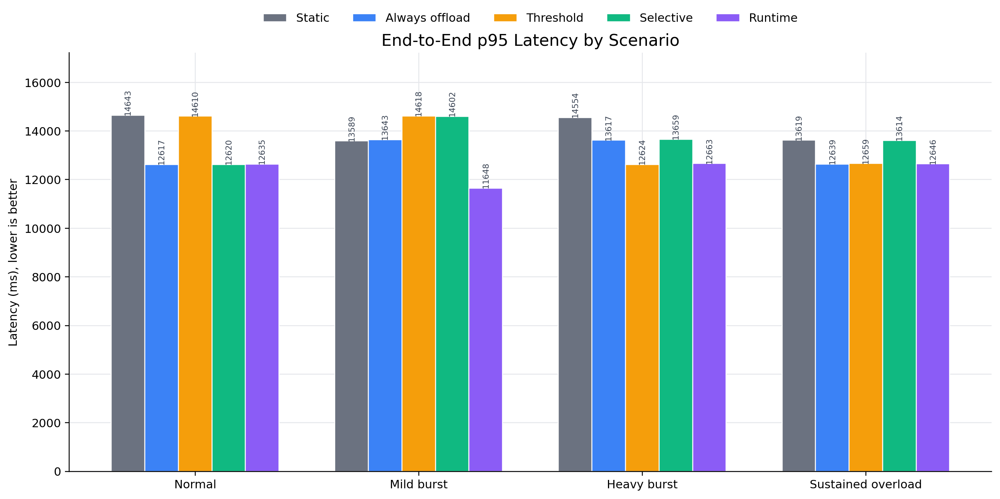
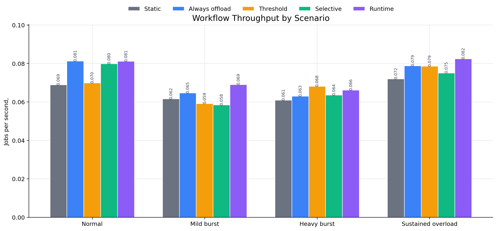
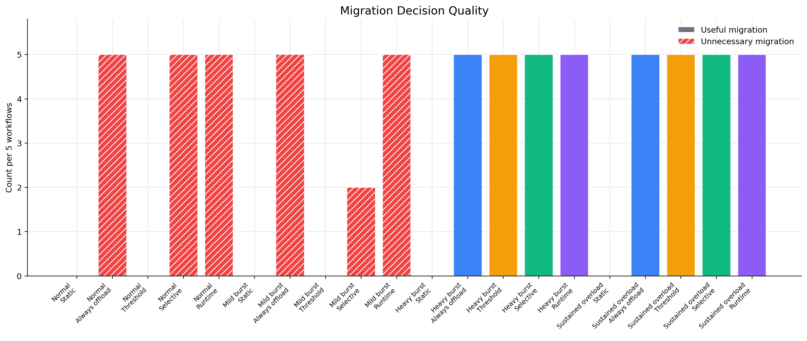
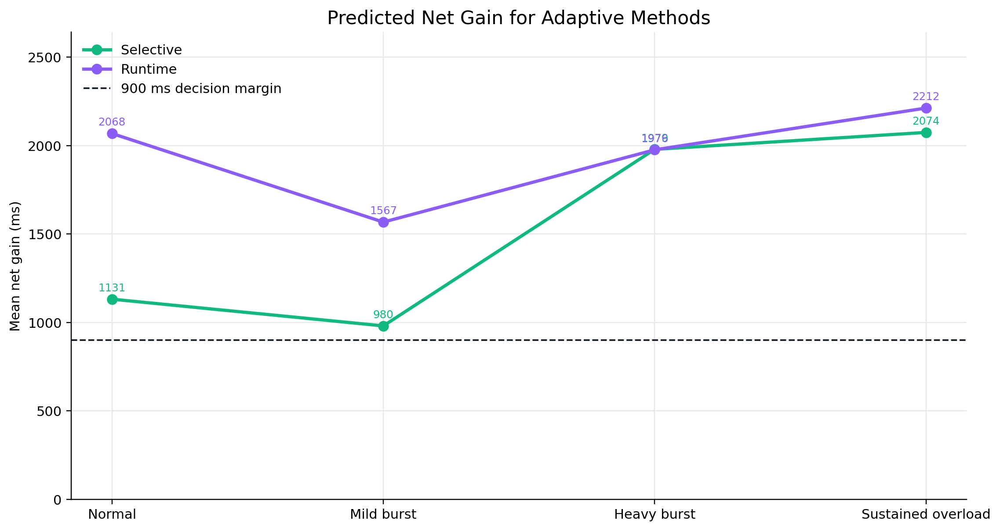
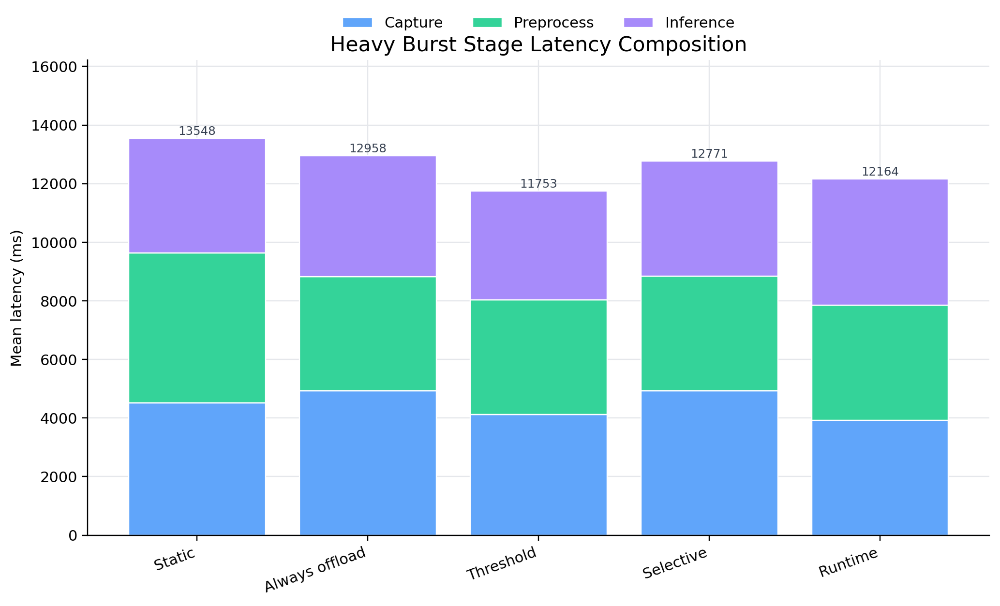
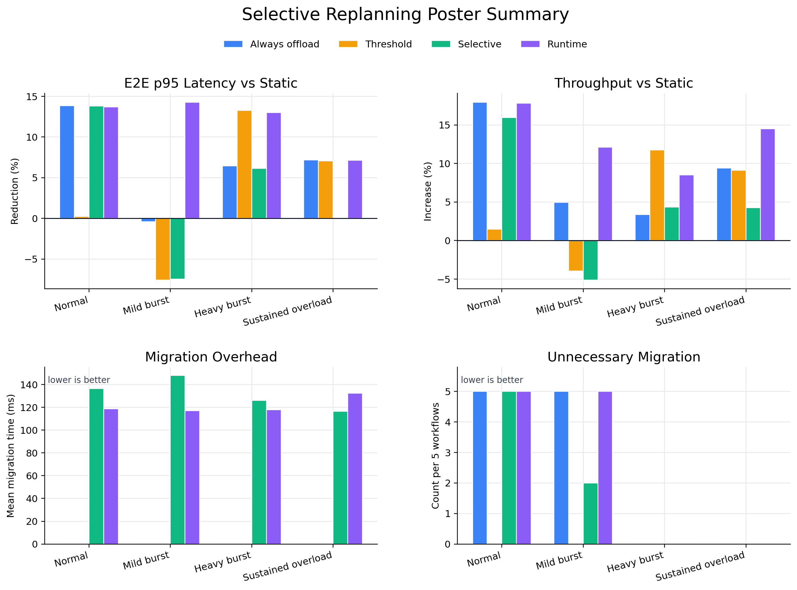
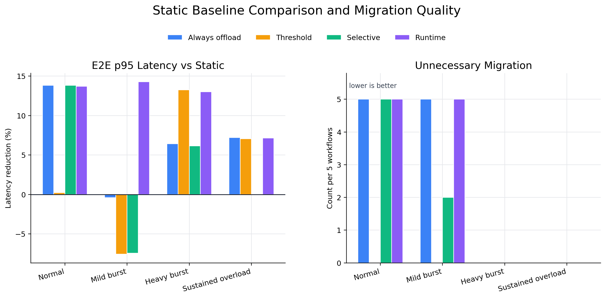
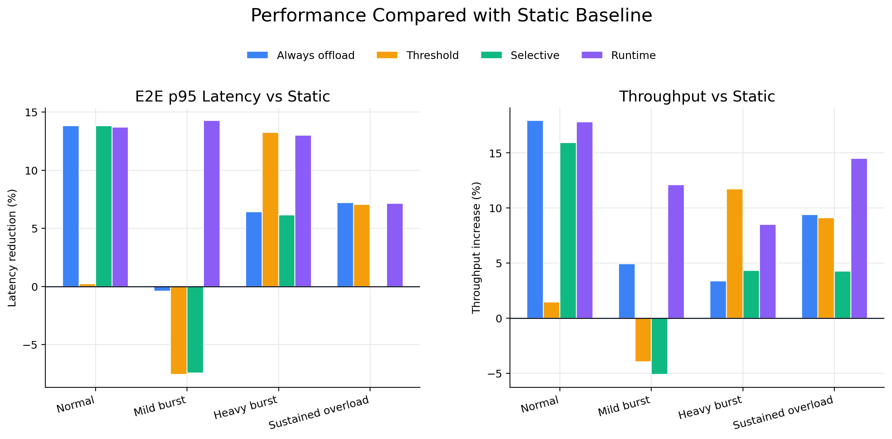

# Selective Replanning Log Figures

Source logs: `docs/archive/embedded-conference/archive/selective-replanning-2026-04-23/*/*.json`

Regenerate:

```bash
python3 docs/archive/embedded-conference/experiments/plot_selective_replanning_logs.py
```

## Figures

### 1. E2E p95 latency



### 2. Throughput



### 3. Migration decision quality



### 4. Adaptive net gain



### 5. Heavy burst stage composition



### 6. Poster static baseline and migration summary



### 7. Poster two-panel latency and migration quality



### 8. Poster two-panel E2E latency and throughput


