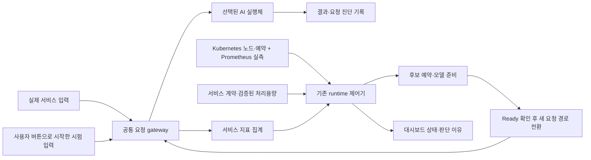

# 전체 AI 서비스 자동 배치 설계안

2026-09-14 · 검토용 제안 · 이 문서는 운영 활성화나 실증 완료를 뜻하지 않는다.
사용자의 요청은 Llama/Nano/Orin/Spark에 한정된 운영을 여러 AI 서비스와 등록된 전체 노드로
확장하는 구상이다. 이번 작업에서는 서비스 실행, 시험 부하, 배포 또는 정책을 변경하지 않는다.

## 쉽게 설명하면

노드는 각자 다른 일을 잘하는 작업자이고, 서비스는 맡길 작업이다. 시스템은 작업 요구사항과
작업자의 실제 검증 능력을 맞춘다. 일이 밀리면 감당할 수 있는 다른 작업자로 옮기고,
한가해지면 더 적은 자원을 쓰는 작업자로 옮긴다. 아무 작업자에게나 맡기는 것은 아니다.

모든 노드를 관측하되 자동 실행 후보는 서비스별 호환성·성능 검증을 통과한 노드로 제한한다.
노드의 장비명에 전체 순위를 매기지 않는다. 같은 노드도 영상 모델과 Llama의 성능 순위가 다르다.

## 현재 코드와 확장점

| 항목 | 확인한 구현 기반 | 필요한 확장 |
|---|---|---|
| 서비스 정의 | RuntimeService, variants, 이미지 digest, architecture, requests/limits | 모델 실행 계약과 정책의 Llama 의존 분리 |
| 후보 필터 | Node Ready/pressure/taint, selector, runtime class, Pod 예약량 검사 | 서비스별 검증 결과와 네트워크·입력 접근성 결합 |
| 처리 능력 | variant의 qualifiedRps/p95/inputProfile | 노드·모델·입력 조건·동시 실행 조건별 검증 이력 |
| 자동 전환 | 지속 부하/지연, 단계 선택 또는 후보 탐색, 복귀·cooldown | 단계가 없는 전체 후보 비교와 전환 이득 평가 |
| 요청 경로 | 공통 gateway, 요청 원장, 준비 후 전환·기존 요청 마무리 | 여러 AI adapter에서 같은 계약과 실패 의미 검증 |
| 실행 adapter | resident llama-worker-v1, 일반 HTTP JSON 경로 | Llama 외 모델의 readiness·추론·해제 규격 |
| 운영 UI | 서비스 목록·위치·지표·노드 버튼·진단 기록 | 전체 후보·탈락 사유·예약·입력 종류의 일관된 표시 |

근거: `edge-orch/runtime-operator/runtime_operator/{contract,placement,controller,resident,api,diagnostics}.py`와
`edge-orch/state-aggregator/app/static/nexus/common-runtime*.js`의 검토 시점 소스.
공유 작업 트리에는 동시 작업 변경이 있으므로 소스에서 확인한 계약을 모든 운영 버전의
완성 기능으로 해석하지 않는다. 기존 서비스별 실장비 증거는 해당 results 문서를 따른다.

## 권위와 구성

- RuntimeService를 운영할 AI 서비스의 주 계약으로 유지한다. 별도 서비스 registry를 중복 생성하지 않는다.
- Git ServiceDescriptor는 입력·모델·사용 목적 설명에 연결하고, 실행 상태는 runtime 관측으로 표시한다.
- EdgeX가 센서 수집·물리 디바이스·원본 Reading의 권위다. 이동 대상은 AI 실행 부분이다.
- Kubernetes scheduler/장치 플러그인이 자원 할당의 최종 권위다. 제어기는 전환 의도와 진행 중
  예약을 추적하고 scheduler가 실제 할당한 후에만 전환한다. dashboard가 별도로 배치하지 않는다.
- 기존 controller/placement를 확장하며 legacy placement_engine이나 workflow 실행을 되살리지 않는다.

## 공통 등록 계약

각 서비스에는 다음을 등록한다. 아래는 설계 항목이며 아직 모두 구현된 필드라는 뜻은 아니다.

1. **식별과 실행**: 서비스 UID, 버전, 모델 digest, 입력/출력 규격, adapter 종류, 모델 준비와 해제 방법.
2. **노드별 실행 형태**: ARM64/AMD64 이미지, 필요한 runtime/GPU 종류, CPU·메모리·GPU 메모리,
   모델 파일 접근, 입력 source 접근, 기본 노드와 허용 후보 selector.
3. **성능 조건**: 허용 지연, 요청 deadline, 최소 표본, 집계·지속 시간, 복귀 여유와 cooldown.
4. **이동 조건**: 이동 가능 여부, 상태 유지 방법, 데이터 위치 제약, 전환 중 기존/신규 실행체의
   동시 자원 요구량. 첫 버전은 요청 단위로 이동 가능한 서비스에 한정한다.
5. **시험 입력**: 검증된 입력 유형, 동시성 한도. 등록·조회·노드 이동으로 시험이 자동 시작되지 않는다.

공통 adapter는 준비 상태·모델 identity·요청 처리·진행 요청 마무리·해제를 같은 의미로 제공한다.
기존 Llama는 하나의 adapter로 유지하고, 두 번째 실제 AI 모델에서 공통성이 성립하는지 검증한다.
실행 중인 resident worker를 여러 서비스가 무조건 공유하지 않는다. 첫 버전은 전용 할당을 기본으로
하고, 공유가 필요한 경우 모델 전환·동시 처리 격리·용량 검증을 명시한 실행체만 허용한다.

## 처리용량 검증

검증 단위는 **서비스 버전 × 모델 × 실행 형태 × 노드 × 입력 조건**이다. 입력 조건에는 Llama의
입력/출력 토큰 수, 영상의 해상도·batch, 센서의 window 크기처럼 실제 처리량을 바꾸는 값을 포함한다.
단일 서비스 기준의 성능을 여러 서비스 동시 실행 상황에도 그대로 보장한다고 가정하지 않는다.

검증 결과에는 지속 처리율, p95, 오류율, 동시 처리 한도, 자원 peak, 준비 시간, 측정 시각과 근거를 저장한다.
기존 노드와 동일 모델·입력 조건에서 비교하며, 이미지·모델·runtime·입력 프로파일 변경 시 재검증한다.
검증 전 노드는 목록에는 표시하되 자동 이동 후보로 사용하지 않는다. 라벨은 등록 조건이지 성능 증명이 아니다.

## 자동 판단 순서

1. **입력과 관측 확인**: 센서 단절·stale, 잘못된 입력, 관측 유실은 용량 부족으로 분류하지 않는다.
   필수 관측이 없으면 새 이동 판단을 보류하고 마지막 정상 상태와 사유를 표시한다.
2. **문제 분류**: 서비스별 대기 길이·가장 오래 기다린 시간·유입량·deadline 초과·지연을 본다.
   노드 CPU/GPU는 보조 근거다. CPU가 높다는 사실만으로 관계없는 서비스를 옮기지 않는다.
3. **후보 필터**: 실행 호환성, 실제 검증, 노드 상태, 입력 접근, 예약 가능한 자원,
   전환 중 두 실행체를 잠시 유지할 여유까지 검사한다.
4. **후보 비교**: 먼저 서비스 지연·처리량 조건을 만족해야 한다. 그 안에서 운영자가 정한
   자원 선호, 데이터와의 거리, 모델 준비 여부, 전환 비용 순으로 비교한다. 첫 버전은 설명 가능한
   우선순위를 쓰고 검증되지 않은 가중치 합산이나 학습 기반 선택은 도입하지 않는다.
5. **전환 수행**: 대상 예약 → 실행체/모델 준비 → Ready·모델 identity 확인 → 새 요청 경로 전환 →
   기존 요청 마무리 → 기존 자원 해제. 준비 실패 시 기존 정상 경로를 유지한다.
6. **복귀**: 저부하가 지속되고, 더 적은 자원을 쓰는 후보가 현재 유입량을 여유 있게 감당하며,
   실제 지연 기준도 충족할 때 이동한다. 무조건 원래 노드로 돌아가지는 않는다.

복귀의 후보 용량 조건은 `관측 유입률 ≤ 해당 입력 조건의 검증 처리율 × 허용 이용 비율`을 기반으로
한다. 비율·지속 시간·지연 기준은 서비스별 정책이며 현재 Llama의 10/60초를 모든 서비스에 복사하지 않는다.
관측 유실을 유입률 0으로 취급하지 않는다. 온도 미수집을 정상 온도로 해석하지 않으며,
열 정책을 필수로 쓰는 노드는 센서 종류와 기준이 검증돼 있어야 한다.

한 번에 너무 많은 서비스가 동일 노드로 몰리지 않도록 노드별 전환 동시성을 제한하고 진행 중인
예약도 후보 용량 계산에 반영한다. 서비스별 한 전환만 수행하며 우선순위와 대기 시간을 함께 고려한다.
현재 실행체가 살아 있는 상태에서 신규 Pod가 예약을 못 받았다고 먼저 기존 실행체를 없애지 않는다.

후보가 없으면 기존 서비스는 유지하고 `이동 보류: GPU 메모리 부족`처럼 사유를 표시한다.
입력 수용 한도와 deadline은 별도로 적용해 대기열을 무한히 늘리지 않는다. 현재 관측된 30초 대기
초과는 기록만 추가된 상태이므로 대기 순서·기아·취소 반영도 공통 gateway의 별도 검증 항목이다.

## 장애와 요청의 의미

실행체 장애로 새 후보를 준비하는 절차와 과부하로 성능을 높이는 절차는 이유·정책을 구분한다.
서비스 경로를 복구하더라도 이미 전송된 요청의 성공 여부가 불명확하면 자동으로 다른 worker에
재전송하지 않는다. request ID·서비스 UID·모델 identity·원장의 기존 중복 방지 의미를 유지한다.
새 요청은 Ready인 경로만 사용하고, 결과 미확인 요청은 명시적으로 기록한다.
상태·대화 세션·스트림의 중간 이동은 별도 adapter 계약과 검증이 필요한 후속 범위다.

## 운영 화면과 버튼

상단은 서비스 행 목록: 이름 / 실행·정지 상태 / 현재 노드 / 유입률·대기·지연 / 자동화 상태 / 시험 부하.
서비스 선택 후 전체 후보 노드를 보여준다. 전체 장비 목록의 고정 3단계 지도 대신 선택 서비스의
현재 노드·전환 대상·가능 후보·제외 사유를 표시한다. 전체 클러스터 자원 화면은 별도 관측 뷰로 유지한다.

- **서비스 실행·중지**: 운영자가 서비스 수명주기를 제어한다.
- **시험 부하 시작·제거**: 버튼으로 시작한 동일 부하만 제어한다. Nano 시작이면 Orin/Spark 처리
  중에도 Nano 제거 버튼을 유지하고 현재 처리 위치를 함께 표시한다.
- **자동 배치**: 서비스가 실행 중일 때 지표로 판단한다. 시험 부하 생성 버튼과 결합하지 않는다.
- **실제 입력과 시험 입력**: 각각의 유입량을 분리 표시한다. 시험 모드에서는 둘의 합계가
  실행 부하이지만 부하 제거가 센서 수집이나 실제 요청까지 중단한 것처럼 표시하지 않는다.
- 등록되지 않았거나 검증되지 않은 서비스는 목록에 보이되 제어 가능 상태로 꾸미지 않는다.

자동화 상태는 `정상 유지 → 악화 관찰 → 후보 선택/예약 대기 → 준비 → 경로 전환 → 기존 요청 마무리
→ 전환 후 관찰`로 보이고, `관측 불가`, `후보 없음`, `복귀 조건 관찰`을 별도로 표시한다.
각 판단에 근거 지표·시각·정책 버전·후보 탈락 사유를 남긴다.

## 단계별 구현과 인수 기준

| 순서 | 작업 | 완료 확인 |
|---|---|---|
| 1 | 공통 실행 계약과 adapter 경계 정의 | Llama 특수 옵션 없이 두 번째 AI 모델의 준비·요청·결과·해제 표현 가능 |
| 2 | 두 번째 AI 서비스와 처리용량 등록 | 다른 모델/입력의 실제 AI 추론을 두 종류 이상 호환 노드에서 검증 |
| 3 | 고정 단계 밖 후보 선택과 복귀 | 동일 제어기로 서비스마다 다른 후보·순위·복귀 목적지 선택, 제외 사유 확인 |
| 4 | 여러 서비스의 자원 경쟁 제어 | 같은 GPU 후보 동시 요청에서 중복 예약·기존 서비스 임의 중지 없음 |
| 5 | 목록·전체 후보 지도·판단 근거 연결 | 선택 서비스와 버튼 소유권 유지, 실제/시험 입력 및 보류 이유 구분 |

모의 시험부터 진행하고 실장비 부하는 사용자가 직접 버튼으로 시작하거나 명시적으로 요청한 시험만
수행한다. 두 서비스의 독립 실행/정지·부하 제거, 후보 없음, 관측 유실, 준비 실패, 제어기 재시작,
반복 증강·복귀에서도 요청 identity와 자원 반환을 검증한다. 본 설계의 숫자 목표는 서비스 입력 계약과
SLO 확정 뒤 정하며, 0건 실패나 무중단을 선행 보장하지 않는다.

첫 구현 묶음은 1~2단계다. 일반 HTTP 시험 서비스를 두 번째 AI 서비스 실증으로 세지 않는다.
초기 적용 모델은 현장 요구와 실제 모델 가용성을 확인해 선정하며, 옥동 생산품질 판별·펌프/모터
이상감지 두 서비스를 이미 구현했다고 설명하지 않는다.

구현 승인 시 프로젝트 범위·저장소 구조·단계별 추진계획에 적용 범위, 검증 기준, 운영 책임을 먼저
맞춘다. 이 문서 작성만으로 현재 운영 범위를 확대하지 않는다.

## 2026-09-14 대시보드 가시화 1차 구현

사용자의 후속 요청에 따라 기존 OFFLOAD DEMO 서비스 운영 화면 아래에 전체 노드 후보 표를
연결했다. 서비스 계약 요약은 기존 gateway 관측에서 허용된 모델·입력 종류·공통 자원 선언·
기본/후보 노드만 읽으며 입력 본문·worker endpoint는 공개하지 않는다.
노드 목록과 자원은 기존 `/state/nodes`, `/api/resources`를 재사용한다.
정지된 서비스는 후보 재평가 대기, 관측 유실은 판단 불가로 표시한다.
현재 실행 형태 중 하나라도 후보 필터를 통과하면 다른 형태의 제외만으로 노드 전체를
제외하지 않는다. 표에서 노드를 선택하면 예약량과 실행 형태별 근거를 표시한다.
노드별 이미지·요구량 상세, 입력별 유입량 분리, 범용 자동 선택·다중 서비스 예약 조정은
이 변경으로 구현된 기능이 아니며 UI에 미연결/후속 범위로 명시한다.
서비스 실행·부하 버튼·오프로딩 정책은 변경하지 않았다.

## 실행 맵과 실제 후보 순위 (2026-09-14)

선택한 서비스의 기본 화면을 `요청 입구 → 실행 노드` 맵으로 변경했다.
문제·복귀 조건 확인, 후보 평가, 실행체 준비, 요청 경로 전환, 이전 요청 마무리를
실제 제어기 상태로 표시한다. 전체 노드의 등록·제외 근거 표는 하단 상세로 접는다.

`placementDecision`은 제어기가 실제 선택에 사용한 후보 배열을 기록한다.
최초 배치·장애는 기존 배치 순서, 지연 초과는 검증 p95 오름차순,
용량 부족은 현재보다 큰 검증 요청률(없으면 동시 처리 한도) 오름차순,
복귀는 기존 선호·단계 순서를 사용한다. 기존 선택·승인·복귀 정책은 변경하지 않았다.
순위는 노드와 실행 variant의 조합이며, 여러 variant가 같은 노드에 대응할 수 있다.
단계 계약이 있는 Llama는 다음/이전 단계로 제한되어 실제 이동 후보가 하나일 수 있다.
CPU/GPU 사용률로 임의 점수나 검증되지 않은 처리량을 계산하지 않는다.

준비 중에는 결정 당시 순위를 고정한다. 전환 후 60초 동안은 `전환 당시` 기록으로
구분하고 이후에는 마지막 전환 기록을 남긴다. 정지·제어기 재시작·계약 세대 변경 시
이전 순위를 제거하며, 관측 지연 때 현재 순위를 표시하지 않는다.
노드별 부하 시작·제거는 기존 버튼을 사용한다. 서비스 이동은 새 부하를 시작하지 않으며,
동일 시험의 제거 버튼은 처음 시작한 노드에 유지된다.

검증은 실제 선택 로직의 로컬 시험과 브라우저 시험 상태를 사용한다.
이 화면 변경 검증을 위해 실제 Llama 서비스나 부하 시험을 시작하지 않았다.
