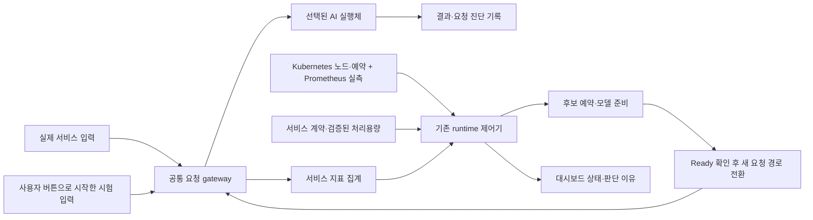
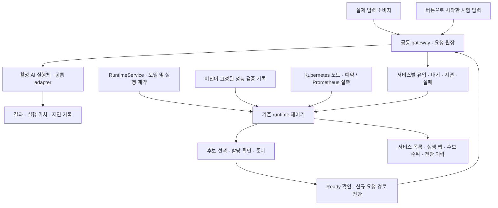

# 전체 AI 서비스 자동 배치 설계안

2026-09-15 개정 · 검토용 제안 · 이 문서는 운영 활성화나 실증 완료를 뜻하지 않는다.
2026-09-14 대시보드 배포 기록과 2026-09-15 범용 실행 구현 제안을 구분한다.
사용자의 요청은 Llama/Nano/Orin/Spark에 한정된 운영을 여러 AI 서비스와 등록된 전체 노드로
확장하는 구상이다. 이번 작업에서는 서비스 실행, 시험 부하, 배포 또는 정책을 변경하지 않는다.

## 쉽게 설명하면

노드는 각자 다른 일을 잘하는 작업자이고, 서비스는 맡길 작업이다. 시스템은 작업 요구사항과
작업자의 실제 검증 능력을 맞춘다. 일이 밀리면 감당할 수 있는 다른 작업자로 옮기고,
한가해지면 더 적은 자원을 쓰는 작업자로 옮긴다. 아무 작업자에게나 맡기는 것은 아니다.

모든 노드를 관측하되 자동 실행 후보는 서비스별 호환성·성능 검증을 통과한 노드로 제한한다.
노드의 장비명에 전체 순위를 매기지 않는다. 같은 노드도 영상 모델과 Llama의 성능 순위가 다르다.

## 현재 코드와 확장점

| 항목 | 확인한 구현 기반 | 필요한 확장 |
|---|---|---|
| 서비스 정의 | RuntimeService, variants, 이미지 digest, architecture, requests/limits | 모델 실행 계약과 정책의 Llama 의존 분리 |
| 후보 필터 | Node Ready/pressure/taint, selector, runtime class, Pod 예약량 검사 | 서비스별 검증 결과와 네트워크·입력 접근성 결합 |
| 처리 능력 | variant의 qualifiedRps/p95/inputProfile | 노드·모델·입력 조건·동시 실행 조건별 검증 이력 |
| 자동 전환 | 지속 부하/지연, 단계 선택 또는 후보 탐색, 복귀·cooldown | 단계가 없는 전체 후보 비교와 전환 이득 평가 |
| 요청 경로 | 공통 gateway, 요청 원장, 준비 후 전환·기존 요청 마무리 | 여러 AI adapter에서 같은 계약과 실패 의미 검증 |
| 실행 adapter | resident llama-worker-v1, 일반 HTTP JSON 경로 | Llama 외 모델의 readiness·추론·해제 규격 |
| 운영 UI | 서비스 목록·위치·지표·노드 버튼·진단 기록 | 전체 후보·탈락 사유·예약·입력 종류의 일관된 표시 |

근거: `edge-orch/runtime-operator/runtime_operator/{contract,placement,controller,resident,api,diagnostics}.py`와
`edge-orch/state-aggregator/app/static/nexus/common-runtime*.js`의 검토 시점 소스.
공유 작업 트리에는 동시 작업 변경이 있으므로 소스에서 확인한 계약을 모든 운영 버전의
완성 기능으로 해석하지 않는다. 기존 서비스별 실장비 증거는 해당 results 문서를 따른다.

## 권위와 구성

- RuntimeService를 운영할 AI 서비스의 주 계약으로 유지한다. 별도 서비스 registry를 중복 생성하지 않는다.
- Git ServiceDescriptor는 입력·모델·사용 목적 설명에 연결하고, 실행 상태는 runtime 관측으로 표시한다.
- EdgeX가 센서 수집·물리 디바이스·원본 Reading의 권위다. 이동 대상은 AI 실행 부분이다.
- Kubernetes scheduler/장치 플러그인이 자원 할당의 최종 권위다. 제어기는 전환 의도와 진행 중
  예약을 추적하고 scheduler가 실제 할당한 후에만 전환한다. dashboard가 별도로 배치하지 않는다.
- 기존 controller/placement를 확장하며 legacy placement_engine이나 workflow 실행을 되살리지 않는다.

## 공통 등록 계약

각 서비스에는 다음을 등록한다. 아래는 설계 항목이며 아직 모두 구현된 필드라는 뜻은 아니다.

1. **식별과 실행**: 서비스 UID, 버전, 모델 digest, 입력/출력 규격, adapter 종류, 모델 준비와 해제 방법.
2. **노드별 실행 형태**: ARM64/AMD64 이미지, 필요한 runtime/GPU 종류, CPU·메모리·GPU 메모리,
   모델 파일 접근, 입력 source 접근, 기본 노드와 허용 후보 selector.
3. **성능 조건**: 허용 지연, 요청 deadline, 최소 표본, 집계·지속 시간, 복귀 여유와 cooldown.
4. **이동 조건**: 이동 가능 여부, 상태 유지 방법, 데이터 위치 제약, 전환 중 기존/신규 실행체의
   동시 자원 요구량. 첫 버전은 요청 단위로 이동 가능한 서비스에 한정한다.
5. **시험 입력**: 검증된 입력 유형, 동시성 한도. 등록·조회·노드 이동으로 시험이 자동 시작되지 않는다.

공통 adapter는 준비 상태·모델 identity·요청 처리·진행 요청 마무리·해제를 같은 의미로 제공한다.
기존 Llama는 하나의 adapter로 유지하고, 두 번째 실제 AI 모델에서 공통성이 성립하는지 검증한다.
실행 중인 resident worker를 여러 서비스가 무조건 공유하지 않는다. 첫 버전은 전용 할당을 기본으로
하고, 공유가 필요한 경우 모델 전환·동시 처리 격리·용량 검증을 명시한 실행체만 허용한다.

## 처리용량 검증

검증 단위는 **서비스 버전 × 모델 × 실행 형태 × 노드 × 입력 조건**이다. 입력 조건에는 Llama의
입력/출력 토큰 수, 영상의 해상도·batch, 센서의 window 크기처럼 실제 처리량을 바꾸는 값을 포함한다.
단일 서비스 기준의 성능을 여러 서비스 동시 실행 상황에도 그대로 보장한다고 가정하지 않는다.

검증 결과에는 지속 처리율, p95, 오류율, 동시 처리 한도, 자원 peak, 준비 시간, 측정 시각과 근거를 저장한다.
기존 노드와 동일 모델·입력 조건에서 비교하며, 이미지·모델·runtime·입력 프로파일 변경 시 재검증한다.
검증 전 노드는 목록에는 표시하되 자동 이동 후보로 사용하지 않는다. 라벨은 등록 조건이지 성능 증명이 아니다.

## 자동 판단 순서

1. **입력과 관측 확인**: 센서 단절·stale, 잘못된 입력, 관측 유실은 용량 부족으로 분류하지 않는다.
   필수 관측이 없으면 새 이동 판단을 보류하고 마지막 정상 상태와 사유를 표시한다.
2. **문제 분류**: 서비스별 대기 길이·가장 오래 기다린 시간·유입량·deadline 초과·지연을 본다.
   노드 CPU/GPU는 보조 근거다. CPU가 높다는 사실만으로 관계없는 서비스를 옮기지 않는다.
3. **후보 필터**: 실행 호환성, 실제 검증, 노드 상태, 입력 접근, 예약 가능한 자원,
   전환 중 두 실행체를 잠시 유지할 여유까지 검사한다.
4. **후보 비교**: 먼저 서비스 지연·처리량 조건을 만족해야 한다. 그 안에서 운영자가 정한
   자원 선호, 데이터와의 거리, 모델 준비 여부, 전환 비용 순으로 비교한다. 첫 버전은 설명 가능한
   우선순위를 쓰고 검증되지 않은 가중치 합산이나 학습 기반 선택은 도입하지 않는다.
5. **전환 수행**: 대상 예약 → 실행체/모델 준비 → Ready·모델 identity 확인 → 새 요청 경로 전환 →
   기존 요청 마무리 → 기존 자원 해제. 준비 실패 시 기존 정상 경로를 유지한다.
6. **복귀**: 저부하가 지속되고, 더 적은 자원을 쓰는 후보가 현재 유입량을 여유 있게 감당하며,
   실제 지연 기준도 충족할 때 이동한다. 무조건 원래 노드로 돌아가지는 않는다.

복귀의 후보 용량 조건은 `관측 유입률 ≤ 해당 입력 조건의 검증 처리율 × 허용 이용 비율`을 기반으로
한다. 비율·지속 시간·지연 기준은 서비스별 정책이며 현재 Llama의 10/60초를 모든 서비스에 복사하지 않는다.
관측 유실을 유입률 0으로 취급하지 않는다. 온도 미수집을 정상 온도로 해석하지 않으며,
열 정책을 필수로 쓰는 노드는 센서 종류와 기준이 검증돼 있어야 한다.

한 번에 너무 많은 서비스가 동일 노드로 몰리지 않도록 노드별 전환 동시성을 제한하고 진행 중인
예약도 후보 용량 계산에 반영한다. 서비스별 한 전환만 수행하며 우선순위와 대기 시간을 함께 고려한다.
현재 실행체가 살아 있는 상태에서 신규 Pod가 예약을 못 받았다고 먼저 기존 실행체를 없애지 않는다.

후보가 없으면 기존 서비스는 유지하고 `이동 보류: GPU 메모리 부족`처럼 사유를 표시한다.
입력 수용 한도와 deadline은 별도로 적용해 대기열을 무한히 늘리지 않는다. 현재 관측된 30초 대기
초과는 기록만 추가된 상태이므로 대기 순서·기아·취소 반영도 공통 gateway의 별도 검증 항목이다.

## 장애와 요청의 의미

실행체 장애로 새 후보를 준비하는 절차와 과부하로 성능을 높이는 절차는 이유·정책을 구분한다.
서비스 경로를 복구하더라도 이미 전송된 요청의 성공 여부가 불명확하면 자동으로 다른 worker에
재전송하지 않는다. request ID·서비스 UID·모델 identity·원장의 기존 중복 방지 의미를 유지한다.
새 요청은 Ready인 경로만 사용하고, 결과 미확인 요청은 명시적으로 기록한다.
상태·대화 세션·스트림의 중간 이동은 별도 adapter 계약과 검증이 필요한 후속 범위다.

## 운영 화면과 버튼

상단은 서비스 행 목록: 이름 / 실행·정지 상태 / 현재 노드 / 유입률·대기·지연 / 자동화 상태 / 시험 부하.
서비스 선택 후 전체 후보 노드를 보여준다. 전체 장비 목록의 고정 3단계 지도 대신 선택 서비스의
현재 노드·전환 대상·가능 후보·제외 사유를 표시한다. 전체 클러스터 자원 화면은 별도 관측 뷰로 유지한다.

- **서비스 실행·중지**: 운영자가 서비스 수명주기를 제어한다.
- **시험 부하 시작·제거**: 버튼으로 시작한 동일 부하만 제어한다. Nano 시작이면 Orin/Spark 처리
  중에도 Nano 제거 버튼을 유지하고 현재 처리 위치를 함께 표시한다.
- **자동 배치**: 서비스가 실행 중일 때 지표로 판단한다. 시험 부하 생성 버튼과 결합하지 않는다.
- **실제 입력과 시험 입력**: 각각의 유입량을 분리 표시한다. 시험 모드에서는 둘의 합계가
  실행 부하이지만 부하 제거가 센서 수집이나 실제 요청까지 중단한 것처럼 표시하지 않는다.
- 등록되지 않았거나 검증되지 않은 서비스는 목록에 보이되 제어 가능 상태로 꾸미지 않는다.

자동화 상태는 `정상 유지 → 악화 관찰 → 후보 선택/예약 대기 → 준비 → 경로 전환 → 기존 요청 마무리
→ 전환 후 관찰`로 보이고, `관측 불가`, `후보 없음`, `복귀 조건 관찰`을 별도로 표시한다.
각 판단에 근거 지표·시각·정책 버전·후보 탈락 사유를 남긴다.

## 단계별 구현과 인수 기준

| 순서 | 작업 | 완료 확인 |
|---|---|---|
| 1 | 공통 실행 계약과 adapter 경계 정의 | Llama 특수 옵션 없이 두 번째 AI 모델의 준비·요청·결과·해제 표현 가능 |
| 2 | 두 번째 AI 서비스와 처리용량 등록 | 다른 모델/입력의 실제 AI 추론을 두 종류 이상 호환 노드에서 검증 |
| 3 | 고정 단계 밖 후보 선택과 복귀 | 동일 제어기로 서비스마다 다른 후보·순위·복귀 목적지 선택, 제외 사유 확인 |
| 4 | 여러 서비스의 자원 경쟁 제어 | 같은 GPU 후보 동시 요청에서 중복 예약·기존 서비스 임의 중지 없음 |
| 5 | 목록·전체 후보 지도·판단 근거 연결 | 선택 서비스와 버튼 소유권 유지, 실제/시험 입력 및 보류 이유 구분 |

모의 시험부터 진행하고 실장비 부하는 사용자가 직접 버튼으로 시작하거나 명시적으로 요청한 시험만
수행한다. 두 서비스의 독립 실행/정지·부하 제거, 후보 없음, 관측 유실, 준비 실패, 제어기 재시작,
반복 증강·복귀에서도 요청 identity와 자원 반환을 검증한다. 본 설계의 숫자 목표는 서비스 입력 계약과
SLO 확정 뒤 정하며, 0건 실패나 무중단을 선행 보장하지 않는다.

첫 구현 묶음은 1~2단계다. 일반 HTTP 시험 서비스를 두 번째 AI 서비스 실증으로 세지 않는다.
초기 적용 모델은 현장 요구와 실제 모델 가용성을 확인해 선정하며, 옥동 생산품질 판별·펌프/모터
이상감지 두 서비스를 이미 구현했다고 설명하지 않는다.

구현 승인 시 프로젝트 범위·저장소 구조·단계별 추진계획에 적용 범위, 검증 기준, 운영 책임을 먼저
맞춘다. 이 문서 작성만으로 현재 운영 범위를 확대하지 않는다.

## 2026-09-14 대시보드 가시화 1차 구현

사용자의 후속 요청에 따라 기존 OFFLOAD DEMO 서비스 운영 화면 아래에 전체 노드 후보 표를
연결했다. 서비스 계약 요약은 기존 gateway 관측에서 허용된 모델·입력 종류·공통 자원 선언·
기본/후보 노드만 읽으며 입력 본문·worker endpoint는 공개하지 않는다.
노드 목록과 자원은 기존 `/state/nodes`, `/api/resources`를 재사용한다.
정지된 서비스는 후보 재평가 대기, 관측 유실은 판단 불가로 표시한다.
현재 실행 형태 중 하나라도 후보 필터를 통과하면 다른 형태의 제외만으로 노드 전체를
제외하지 않는다. 표에서 노드를 선택하면 예약량과 실행 형태별 근거를 표시한다.
노드별 이미지·요구량 상세, 입력별 유입량 분리, 범용 자동 선택·다중 서비스 예약 조정은
이 변경으로 구현된 기능이 아니며 UI에 미연결/후속 범위로 명시한다.
서비스 실행·부하 버튼·오프로딩 정책은 변경하지 않았다.

## 실행 맵과 실제 후보 순위 (2026-09-14)

선택한 서비스의 기본 화면을 `요청 입구 → 실행 노드` 맵으로 변경했다.
문제·복귀 조건 확인, 후보 평가, 실행체 준비, 요청 경로 전환, 이전 요청 마무리를
실제 제어기 상태로 표시한다. 전체 노드의 등록·제외 근거 표는 하단 상세로 접는다.

`placementDecision`은 제어기가 실제 선택에 사용한 후보 배열을 기록한다.
최초 배치·장애는 기존 배치 순서, 지연 초과는 검증 p95 오름차순,
용량 부족은 현재보다 큰 검증 요청률(없으면 동시 처리 한도) 오름차순,
복귀는 기존 선호·단계 순서를 사용한다. 기존 선택·승인·복귀 정책은 변경하지 않았다.
순위는 노드와 실행 variant의 조합이며, 여러 variant가 같은 노드에 대응할 수 있다.
단계 계약이 있는 Llama는 다음/이전 단계로 제한되어 실제 이동 후보가 하나일 수 있다.
CPU/GPU 사용률로 임의 점수나 검증되지 않은 처리량을 계산하지 않는다.

준비 중에는 결정 당시 순위를 고정한다. 전환 후 60초 동안은 `전환 당시` 기록으로
구분하고 이후에는 마지막 전환 기록을 남긴다. 정지·제어기 재시작·계약 세대 변경 시
이전 순위를 제거하며, 관측 지연 때 현재 순위를 표시하지 않는다.
노드별 부하 시작·제거는 기존 버튼을 사용한다. 서비스 이동은 새 부하를 시작하지 않으며,
동일 시험의 제거 버튼은 처음 시작한 노드에 유지된다.

검증은 실제 선택 로직의 로컬 시험과 브라우저 시험 상태를 사용한다.
이 화면 변경 검증을 위해 실제 Llama 서비스나 부하 시험을 시작하지 않았다.

## 2026-09-15 범용 실행 구현 설계

이 절은 서비스·장비 제한을 제거하기 위한 **구현 제안**이다. 앞 절의 실제 배포 기록과
구분한다. 기존 [공통 AI 서비스 실행 규격](공통-AI-서비스-실행-규격.md)의 입력·결과 의미를
유지하면서 구현 경계와 단계별 완료 조건을 구체화한다. 문서 작성으로 운영 기능을 활성화하지 않는다.

### 1. 목표와 첫 구현 경계

**서비스를 한 번 등록하면, 등록된 전체 노드 중 그 서비스를 실행할 수 있는 후보를 찾아
실행하고, 문제가 지속되면 이동하며, 부하가 줄면 더 적합한 배치로 복귀한다.**

- 서비스명·hostname으로 제어기 분기를 만들지 않는다. Llama는 공통 실행 규격을 구현하는
  adapter 한 종류다. 준비된 일반 HTTP AI 실행 경로도 유지하고 공통 readiness·결과 계약으로 연결한다.
- 장비 중립은 모든 모델을 모든 장비에서 실행한다는 뜻이 아니다. CPU 구조·가속기·runtime·
  모델 변환본·입력 접근·실측 성능이 맞는 조합만 후보가 된다.
- 첫 버전은 요청 하나가 독립적으로 완료되는 AI와 서비스별 단일 활성 요청 경로를 지원한다.
  병렬 replica 확장, 진행 중 추론·KV cache 이동, 세션·무한 스트림 이동, 단계별 pipeline 분할은 후속이다.
  센서 window는 소비자가 완성한 독립 입력으로 보낼 때만 이 범위에 들어간다.
- 원본 센서·카메라 수집과 원본 저장은 그대로 두고 AI 실행체와 신규 요청 경로만 이동한다.
  준비 중에는 기존·신규 실행체가 잠시 공존할 수 있다.

### 2. 구성과 소유권

| 대상 | 권위·보관 위치 | 변경 주체 |
|---|---|---|
| 서비스 desired 상태·실행 계약 | 기존 Kubernetes RuntimeService | 서비스 운영자, 공통 제어 API |
| 모델·입출력·시험 fixture·성능 검증 artifact | digest가 고정된 Git/등록 artifact, RuntimeService에서 참조 | 모델 제공자·플랫폼 검증 담당 |
| 노드·Pod·실제 예약 | Kubernetes/KubeEdge·장치 플러그인 | 기존 cluster 운영·scheduler |
| 사용률·온도 | 현재 telemetry 수집기·Prometheus | 고정 수집기 |
| 요청·시험 run·전환 의도·결정 기록 | 기존 gateway/runtime SQLite 원장 | runtime-operator |
| 센서 원본·물리 디바이스 | EdgeX | Device Service·EdgeX 운영 |
| 화면 | state-aggregator의 읽기 전용 projection | 운영자는 별도 명시적 버튼으로 명령 |

별도 배치 제어기나 서비스 registry를 새로 만들지 않는다. 첫 버전은 현재 단일 제어기와
영속 원장을 유지하며, 이 설계만으로 다중 replica 제어기·gateway HA를 보장하지 않는다.

### 3. 서비스 등록 규격

RuntimeService에 아래 의미를 담는다. **다음 항목은 제안 스키마이며 현재 CRD에 바로 apply하는
manifest가 아니다.** 서비스 입력 소비 설정과 모델 특수 옵션을 공통 운영 정책에서 분리한다.

| 영역 | 필수 내용 | 일반화 방법 |
|---|---|---|
| identity | 서비스 UID, 계약 버전, model·전후처리 digest | 모델명이 달라도 동일한 요청·배치 수명주기 |
| input/output | schema 참조, input profile, 최대 입력 크기, 결과 schema | text/image/sensor-window 등을 별도 schema로 검증 |
| execution | adapter 이름·버전, stateless 이동 가능 여부 | Llama 옵션은 adapter 설정 내부에만 둠 |
| variants | image digest, architecture, backend, runtime class, CPU/RAM/가속기 요청·제한 | 동일 서비스의 장비별 실행 형태 목록 |
| placement | allowed selector, preferred selector, 배치 전략 | 새 서비스는 qualified-candidates, 기존 단계 방식은 호환 옵션 |
| policy | SLO, 관측창·표본, 진입/복귀 지속 시간, cooldown, 준비·drain timeout | 서비스별 실측 뒤 수치 동결 |
| qualification | 검증 artifact와 입력 profile 참조 | 유효한 모델×노드×variant×입력 조합만 자동 이동 |
| test | fixture 참조, 허용 요청률·동시성·기간·총량 | 사용자가 시작할 때만 시험 run 생성 |

`allowed`는 필수 제약이고 `preferred`는 선호다. 기본 노드 hostname을 반드시 지정할 필요는 없다.
예를 들어 `site=okdong`인 호환 노드 전체를 허용하고 `role=edge`를 선호하도록 표현한다.
노드별 모델 별칭은 adapter의 검증된 binding에 두며 서비스 계약의 공통 필수 필드로 만들지 않는다.
변환·양자화 artifact가 서로 다르면 의미상 같은 서비스라도 출력 동등성 검증이 있어야 이동한다.

새 공통 실행 envelope는 별도 버전으로 도입한다. 현재 `edgeai.execution/v1`을 이미지 입력이나
시험 source를 허용하도록 조용히 변경하지 않는다. 요청에는 서비스 UID·request ID·계약 버전·
모델 identity·input profile·입력 종류·payload 또는 등록된 artifact 참조·deadline을 담는다.
실제 입력과 시험 입력은 origin kind와 test run ID로 구분하며 원본 event ID는 원본 근거로 보존한다.
임의 URL을 실행체가 가져오게 하지 않고 등록된 입력 소비자·artifact 전달 경로만 연결한다.

### 4. 공통 실행 adapter

제어기는 아래 의미만 호출한다. 구체적인 모델 서버 API와 옵션은 adapter가 번역한다.
초기 구현은 명시적으로 등록된 adapter 목록이며, UI에서 임의 Python 모듈·셸 명령을 넣지 않는다.

| 동작 | 공통 반환·판정 | 완료 의미 |
|---|---|---|
| prepare | 준비 operation ID, Preparing/Ready/Failed | 실행체와 모델 준비 시작; Ready와 구별 |
| observe | 실제 모델·계약 identity, 수용 가능 여부, inflight, backend | Pod Running만으로 추론 준비 완료라고 판단하지 않음 |
| invoke | 요청 ID, 결과 schema, 모델·실행 revision, 성공/오류, 측정 범위 | Llama 문자열 외에도 구조화된 모델 결과 허용 |
| drain | 신규 요청 수용 중단, 남은 요청 수, 완료 여부 | 이미 전송된 요청의 종료·미확인 상태 확인 |
| release | 해제 대상·결과·자원 readback | 모델 메모리 해제와 Pod/GPU 예약 반환을 구별 |

준비·drain·해제는 operation ID로 중복 호출에 안전해야 한다. 일반 Pod 실행체는 kube lifecycle과
ready/invoke 규격으로 구현할 수 있고, resident Llama는 기존 activate/release API를 감싼다.
worker 자체가 지원하지 않는 추론 시간·메모리는 미수집으로 표시한다. 업무 결과의 정상/이상과
전송·실행 성공/실패를 섞지 않는다.

첫 버전은 서비스별 전용 실행체를 기본으로 한다. 동일 resident worker를 여러 서비스가 공유해
다른 서비스의 모델을 해제하지 못하도록 소유권을 검증한다. 가속기 time slicing의 예약 슬롯 수를
독립 GPU 수나 보장 처리량으로 해석하지 않는다. 공유 가속기의 동시 실행 조합이 검증되지 않았다면
해당 공유 조합의 자동 배치를 제한한다.

### 5. 장비 등록과 성능 자격

노드 후보 모집단은 기존 Kubernetes Node 전체다. 새 장비가 join하고 관측되면 목록에 나타나지만,
라벨만으로 모델 실행·성능 자격을 통과시키지 않는다.

등록 흐름은 `노드 관측 → 필요한 runtime 확인 → 호환 variant 확인 → 명시적 자격시험 → 후보 허용`이다.
자동 관측·정적 호환성 검사는 가능하되, 모델을 실행하는 성능 시험은 별도 명시적 실행이다.
단계별 실패는 `ARM 이미지 없음`, `runtime 미설치`, `입력 접근 불가`, `성능 미검증`처럼 표시한다.

검증 키는 `(서비스 계약, 모델·전후처리, image, adapter, 실제 node identity,
장비/runtime fingerprint, input profile, 자원 할당, 동시 실행 조건)`이다.
장비를 교체해 hostname만 같아도 동일 자격으로 사용하지 않는다.
CPU/GPU/NPU backend, 입력 크기, 배치 크기, 출력 상한이 달라지면 다른 자격이다.
검증 기록에는 원본 시험 근거, 성공 처리율, E2E p95, 오류율, peak 메모리, 준비 시간,
허용 부하 범위, 유효 조건을 보관한다. 입력 분포가 검증 범위를 벗어나면 해당 자격으로 순위를 보장하지 않는다.

### 6. 후보 순위 알고리즘

평가 단위는 `(노드, 실행 variant)`다. 화면에서는 노드별 최상위 실행 형태를 대표 순위로 묶고,
그 노드의 다른 실행 형태와 탈락 이유를 펼쳐 볼 수 있게 한다. 제어기는 같은 평가 결과의
선택 revision을 실행하며 프런트엔드에서 점수를 다시 계산하지 않는다.

**먼저 필터:** 관측 신뢰성 → 계약/모델/입력 호환 → node Ready와 자원 압력 → 접근 가능한 입력·결과 경로 →
유효한 성능 자격 → CPU/RAM/가속기 실제 할당 가능성 → 전환 중 이중 실행 여유를 순서대로 확인한다.
GPU 메모리 요구를 Kubernetes의 GPU 개수만으로 충족했다고 판단하지 않는다.
가속기 격리·실측 자격으로 보장하지 못하는 메모리 조건은 미확인으로 제외한다.

유입 지표는 유효한 논리 요청의 실제·시험 유입을 합산한다. 접수 제한으로 거절된 수요와
대기 중 수요도 따로 관측하여 완료율 감소를 저부하로 오인하지 않는다. 같은 요청 재조회는
새 수요로 중복 계산하지 않는다. 종류가 섞인 입력은 검증된 혼합 profile이 필요하다.

| 판단 목적 | 적격 후보의 비교 순서 — 제안 |
|---|---|
| 최초 배치 | 선호 위치 → 운영자가 정한 자원 등급 → 검증 지연 → 준비 시간 → node/variant ID |
| 지속 과부하 | 현재 수요를 여유 있게 감당 → 같은 수요 구간의 검증 E2E 지연 → 준비 시간 → 자원 등급 → 안정적인 ID |
| 실행체 장애 | 독립적으로 최신 준비·가용성을 확인 → 복구 준비 시간 → 수요 수용·지연 등급 → 안정적인 ID |
| 저부하 복귀 | 수요와 복귀 SLO 충족 → 선호 위치/낮은 자원 등급 → 검증 지연 → 준비 시간 → 안정적인 ID |

수요 수용 조건은 `현재 유입률 ≤ 후보의 해당 profile 검증 처리율 × 허용 이용 비율`이다.
그 수요에서 지연·오류 조건도 통과해야 한다. 기존 `qualifiedRps` 한 점만으로 전체 지연 곡선을
예측하지 않으며, 비교 가능한 부하 구간이 없으면 성능 이득 미확인으로 둔다.
준비 시간은 요청 E2E와 별도로 표시하고, 구성요소 p95를 더해서 새로운 E2E p95를 만들지 않는다.

자원 등급은 운영자가 선언한 배치 선호이며 장비 가격·소비 전력 추정치가 아니다.
과부하 전환은 검증된 최소 개선 폭, 복귀는 자원 등급/선호의 엄격한 개선이 있을 때만 수행한다.
동등한 후보 사이에는 현재 위치를 유지한다. 위 비교 순서는 구현·검증할 새 정책이며
현재 배포된 `qualified_latency`/`smallest_sufficient_capacity` 정렬을 이미 변경한 것으로 보지 않는다.

전체 수요를 만족하는 후보가 없을 때 첫 버전은 부분 분산을 임의로 시작하지 않는다.
현재 실행체가 정상이라면 경로와 제한된 admission을 유지하고 `용량을 만족하는 후보 없음`을 표시한다.
현재 실행체가 고장 났다면 SLO·입력 계약을 통과하는 복구 후보의 검증 한도로 요청을 제한해
복구할 수 있으며, 수요 전체 수용과 구분해 `제한 복구`로 표시한다. 그 후보도 없으면 서비스는 Unavailable이다.

### 7. 전환·복귀 상태와 경쟁 처리

`관측 → 문제 지속 확인 → 평가 → 예약 대기 → 준비 → 신규 요청 전환 → 이전 요청 마무리
→ 해제 확인 → 전환 후 관측`을 공통 상태기계로 사용한다. 복귀도 같은 상태기계를 거친다.

- 서비스 UID당 활성 전환 하나. 요청 경로는 `(UID, 계약 generation, active revision, route epoch)`로
  확인하고 그 조합에 대한 전환 의도를 먼저 원장에 저장한다. 오래된 승인·재시작 응답으로 경로를 바꾸지 않는다.
- 실제 Kubernetes 할당과 worker Ready·모델 identity가 모두 확인된 다음 새 요청 경로를 바꾼다.
  이전 실행체를 먼저 중지해 자리를 만드는 동작은 첫 버전의 기본 전략에 포함하지 않는다.
- 노드별 준비 동시성을 제한하고 전환 대기 순서는 서비스 priority와 대기 시간으로 결정한다.
  서비스별 잠금만으로 다중 서비스 경쟁이 해결된 것으로 간주하지 않는다. scheduler의 실제 예약과
  제어기의 진행 중 준비 의도를 함께 반영하되 동일 Pod의 자원을 중복 차감하지 않는다.
- 자원 할당 실패·준비 timeout이면 후보를 잠시 제외하고 조건을 새로 평가한다. 과거 2위가 지금도
  유효하다고 가정하지 않는다. 준비 실패 시 살아 있는 기존 경로는 유지한다.
- 신규 경로 이상 시 기존 실행체가 아직 Ready이고 소유권·입력·수용 조건을 만족하면 새 요청 경로만
  되돌린다. 그렇지 않으면 복구 후보를 다시 평가한다. 이미 전송된 요청은 별개로 추적한다.
- 전송 전 취소와 전송 후 결과 미확인을 분리한다. 결과 미확인 요청을 다른 노드에 자동 재실행하지 않는다.
  drain timeout은 해제 성공이 아니며, 남은 요청·자원을 표시하고 기본적으로 강제 종료하지 않는다.
- 관측 유실은 부하 0이 아니다. 성능 이동·복귀 판단을 보류하고 관측창을 다시 쌓는다.
  입력 장애는 입력 복구 대상으로, 직접 확인한 실행체 장애는 별도 장애 복구 대상으로 구분한다.
- 정책·계약 변경은 기존 후보 결정을 무효화한다. 제어기 재시작 뒤 실행체·요청·전환 의도를
  다시 확인하고 실제 경로를 재검증한다. 새 시험 run이나 중복 준비를 자동 생성하지 않는다.

복귀는 고정 역순이 아니라 현재 수요를 감당하는 더 적합한 후보로 이동하는 것이다.
운영자가 고정 단계 정책을 선택한 기존 서비스에는 해당 단계 제한을 계속 적용한다.

### 8. 범용 시험 부하와 운영 버튼

모든 시험은 **선택한 서비스의 실제 추론 입력을 반복 생성하는 요청 부하**다.
노드 전체의 CPU/GPU를 강제로 점유하는 host stress는 이 설계의 시험 버튼에 포함하지 않는다.

| 서비스 예시 | 시험 fixture | 표시할 단위 |
|---|---|---|
| Llama 등 텍스트 추론 | 등록 텍스트와 출력 토큰 상한 | 요청/s, 지연; 지원 시 토큰/s 별도 |
| 영상 분류·검출 | 해상도·형식이 고정된 등록 이미지 | 이미지 요청/s; batch 크기 별도 |
| 센서 이상감지 | 길이·signal·단위가 고정된 sensor window | window 요청/s; 원본 sample 수 별도 |

첫 공통 시험기는 요청률과 동시성 상한을 분리한다. 기존 동시성 기반 시험 모드는 호환하되,
요청률 모드에서는 목표 요청률·실제 전송률·생성기 제한으로 미전송된 건수를 함께 표시한다.
실행체가 느려져 생성기도 느려지는 현상을 정상 수요 감소로 보지 않는다. 총량·기간 상한에
도달하면 종료 이유를 표시하고 조용히 재시작하지 않는다.

run에는 `(service UID, run ID, origin node, input profile, fixture digest, 목표 요청률,
동시성/기간/총량 한도, 실제 처리 revision 이력)`을 고정한다. 첫 버전은 서비스당 활성 시험 하나다.
새 입력마다 고유 request ID를 만들며, 시험 결과는 test run으로 표시해 실제 업무 판정·알림과
섞지 않는다. 실제·시험 지표를 분리 표시하되 실행 capacity 판단에는 실제 합계를 사용한다.

현재 실행 노드 카드에서만 `시험 부하 시작`이 가능하다. 서비스가 이동해도 run은 서비스 gateway를
따라가고 **제거 버튼은 시작한 노드에 유지**한다. 다른 노드에는 현재 처리 위치와 제거 위치를 안내한다.
선택 서비스 변경·노드 이동·화면 갱신은 새 시험을 시작하지 않는다. 원장에 run이 있으면
관측이 잠시 끊겨도 같은 run ID로 제거 요청을 할 수 있다.

- 부하 제거: 해당 시험의 새 입력 생성과 미전송 대기를 중단한다. 전송된 요청은 완료/미확인까지
  추적하고 실제 운영 입력·EdgeX 수집은 계속된다.
- 서비스 중지: 해당 서비스의 신규 요청 수용·전용 AI 입력 소비·시험 생성부터 중단하고
  진행 요청을 마무리한 뒤 실행 자원을 해제한다. EdgeX 원본 수집기는 중지하지 않는다.
- 실행 노드 장애: 중앙 시험 생성기와 run이 살아 있으면 같은 서비스 gateway와 시험 한도 안에서
  계속한다. 시작 노드 장애만으로 제거 버튼 소유권을 옮기거나 새 run을 만들지 않는다.
- 시험 생성기·제어기 재시작: 살아 있는 생성기를 증명할 수 없는 run은 Interrupted로 기록하고
  사용자의 새 시작 없이 재개하지 않는다.
- 시험 중 계약·fixture 변경: 기존 run을 새 모델 시험으로 조용히 전용하지 않고 중단·재시작을 명시한다.

### 9. 화면·API 연결

상단 목록에는 서비스 상태, 현재 노드, 실제/시험 요청률, 대기·p95, 자동화 상태를 표시한다.
선택 상세는 현재 구현한 실행 맵을 확장한다. 서비스별 후보·제외 원인이 달라지고 단계명 대신
실제 노드 이름과 역할을 표시한다. 노드에 있는 서비스와 시험이 어디서 시작됐는지를 구분한다.
후보 클릭 시 호환성, 검증 profile, 예약 여유, 지연·용량, 순위 근거를 보여준다.

기존 `GET /state/runtime-services`를 확장해 상태를 읽으며 gateway의
`POST /services/{name}/invoke`는 공통 버전 envelope를 받도록 점진적으로 확장한다.
운영 명령은 현재 `/api/runtime-demos/...` 호환 경로를 유지한 뒤 공통 서비스 제어 경로로 정리한다.
서비스 실행/중지, 자동/승인 정책, 시험 시작/제거는 분리된 명령이다.
UI가 Kubernetes에 직접 쓰거나 노드 IP로 모델 준비 명령을 보내지 않는다.

결정 기록에는 decision ID, service UID, generation, 원인·관측 시각, 입력 profile·수요,
노드 snapshot·자격 근거, 후보별 통과/탈락·정렬 키, 선택 revision, 준비/전환/반환 결과를 담는다.
`현재 평가`, `준비에 사용한 평가`, `지난 전환 당시 평가`를 구별한다. 미등록 서비스·미설치 runtime·
미측정 성능을 사용할 수 있는 후보로 꾸미지 않는다.

### 10. 코드 변경 순서와 완료 판정

| 묶음 | 변경 지점 | 인수 기준 |
|---|---|---|
| A. 공통 계약 | `contract.py`, `common_ai.py`, 새 adapter 경계, 버전 envelope | Llama 문자열·token 필드 없이 구조화된 실제 AI 입력/결과 표현; 기존 v1 호환 |
| B. 두 번째 AI | 전용 worker/adapter, 등록 계약, 성능 자격 artifact | Llama 외 실제 모델이 두 종류 호환 장비에서 준비·추론·drain·해제, 합성 HTTP 응답으로 대체 금지 |
| C. 장비 중립 배치 | `placement.py`, qualification 검증, `controller.py` | hostname 분기 없이 후보 탐색; 서비스별 다른 순위; 미검증 새 노드 자동 선택 차단 |
| D. 공통 시험 | `demo.py`, 요청 지표·원장, 입력 소비 경계 | 텍스트 외 fixture 부하 시작/제거; 실제 입력 유지; 시작 노드 제거 소유권 유지 |
| E. 경쟁·복구 | controller/journal/kube, 결정 기록 | 두 서비스의 동일 GPU 경쟁·준비 실패·관측 단절·재시작에서 잘못된 전환·이중 소유 없음 |
| F. 운영 화면 | `common_runtime.py`, 실행 맵·노드 버튼 | 서비스별 다른 후보 지도와 실제/시험 지표, pending·보류·실패 이유, 선택 유지 |

A→B로 실제 공통성을 먼저 확인하고 C→D→E를 연결한 뒤 F에서 운영 의미를 완성한다.
현재 맵은 각 단계의 관측 결과를 표시하는 데 재사용한다. 기존 승인/자동 정책·실장비 Llama는
각 묶음마다 회귀 검증하며 새 범용 계약은 서비스별 opt-in으로 적용한다.

최종 범용화 완료는 아래를 모두 증명해야 한다.

1. 다른 종류의 실제 AI 서비스 두 개를 동시에 등록·운영한다.
2. 모델·입력에 따라 동일 노드도 서로 다른 후보/순위를 가진다.
3. 새 호환 장비를 자격 등록하면 제어기 코드 수정 없이 해당 서비스 후보에 추가된다.
4. 두 서비스의 시험을 독립적으로 시작·제거하며 한 서비스 이동/중지가 다른 서비스에 영향을 주지 않는다.
5. 과부하 이동과 저부하 복귀, 후보 없음, 실행체 장애, 준비 실패, 관측 유실, 제어기 재시작을 검증한다.
6. 실제 추론 결과·요청 identity·Ready 선행 전환·기존 요청 완료·자원 해제 증거가 남는다.

첫 두 번째 모델은 CPU 실행도 가능한 작은 실제 AI 모델을 우선 검토하되, 제공 artifact·사용 권한·
입출력 계약을 확인한 뒤 정한다. 현장 옥동 모델을 받지 않은 상태에서 이를 현장 품질/이상감지
실증이라고 부르지 않는다. 성능 수치·업무 정확도 기준·공유 GPU 보장은 서비스별 미확정 항목이다.

### 11. 2026-09-15 첫 구현 결과와 다음 경계

공통 JSON 텐서 adapter와 `digits-classifier` 실제 이미지 모델을 연결했다.
[서비스 안내](../edge-orch/runtime-operator/examples/digits-model/README.md),
[검증 결과](../edge-orch/runtime-operator/results/2026-09-15-generic-model/README.md)를 기준으로 한다.
ARM64/x86 모델 실행과 정책 지정 경로 전환·중지, 기존 맵·노드 버튼 연결은 확인했다.
`verifiedNodes`는 실행 검증 목록이며 처리량 자격을 대체하지 않는다.
새 모델은 preferred 모드이고 자동 부하 이동·복귀는 비활성이다.
앞의 A~F 전체와 최종 범용화 인수 기준이 완료된 것은 아니다.
