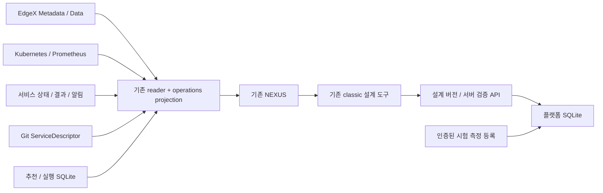

# 통합 Edge AI 운영 대시보드 고도화

## 조사 기준과 실제 상태

2026-09-08 현재 체크아웃의 코드·API·테스트와 운영 GET 응답을 조사했다. 기존 미커밋
작업을 보존한다. 운영 배포와 로컬 구현은 별도다. 요청된
`2차년도-가상디바이스-워크플로-설계.md`, `자원-증강-가상디바이스-대시보드.md`,
`edge-orch/device-augmentation/`은 이 체크아웃에 없다. 대체 근거는 프로젝트 범위,
저장소 구조, 단계별 추진계획, 대시보드 정보 구조·판단 정책, 옥동 데이터 계약,
디바이스-서비스 연결과 아래 현행 모듈이다.

운영 조회 2026-09-08 04:37 UTC: Kubernetes 7 node Ready. 서비스 API는
sensor-anomaly-demo의 입력 stale, 모델 warming_up, 실행 STANDBY/Lease 만료를 반환한다.
최신 저장 결과는 2026-08-28이다. Pod Ready와 서비스 처리 성공을 동일시하면 안 된다.
추천은 BLOCKED(input_stale/model_not_ready/service_performance_unavailable)이며,
candidate workload가 존재해도 선택·요청 전환 성공의 근거가 아니다.

## KEEP / MODIFY / ADD / DEFER

| 판단 | 기능 | 현재 구현 수준 | 코드 → API → runtime 근거 / 다음 작업 |
|---|---|---|---|
| KEEP | EdgeX inventory·telemetry·관측 트윈 | 실제 구현·운영 경로 | edgex.py/device_twins.py → /state/devices, /state/device-twins → Core Metadata/Data |
| KEEP | 발견·등록 Saga | 제한 구현 | device_management API → Adapter Controller SQLite·고정 Catalog → EdgeX readback/first Event. Serial/I2C와 simulator 수준 구분 |
| KEEP | 노드·자원 | 실제 구현·운영 경로 | kube.py/prometheus.py/resource_pool.py → /api/resources. scheduling request와 usage 별도 |
| MODIFY | 기본 NEXUS | 실제 API 연결·상세 부족 | static/nexus → 기존 GET. /classic 관리·설계·운영 기능은 재사용 |
| MODIFY | 서비스 DAG | 정의 UI·관측 결합 부족 | Git graph는 Configured. 단계별 workload·Pod·노드와 서비스 관측을 별도 연결 |
| MODIFY | 서비스 품질 | backend 존재·기본 UI 부족 | /state/service-demo performance/counters/routing/storage → 유효성·원 시각 포함 표시 |
| MODIFY | 자원 추천 | 실제 읽기 전용 판단 | runtime_recommendation/placement → /api/runtime-recommendations. 후보 탈락·점수·dwell를 서비스와 연결 |
| MODIFY | 실행·복구 이력 | backend·기존 도구 존재 | runtime_execution_controller SQLite → /api/executions 및 audit. Failed/rollback과 Applied 구분 |
| KEEP | 독립 가상 실행체 | 단일 대상 제한 구현 | virtual_resource_registry/virtual_device_control → vd-demo-001. 센서나 서비스 증강 수로 합산 금지 |
| ADD | 통합 서비스 운영 projection | 신규 backend/API | 기존 reader를 조합해 provenance·부분 실패·stage/workload·문제 영향 제공. 권위 DB 복제 없음 |
| ADD | 통합 이벤트·KPI | 신규 연결 | 실제 저장 event만 통합. 공식 측정 없는 최종 목표는 NOT_MEASURED |
| MODIFY | 데이터 탐색 | Core Data 기간 조회 존재 | 기존 이력 재사용, 다중 resource·시각·품질·통계 확장 |
| ADD | 서비스 버전 저장·모델/benchmark 계약 | browser local draft만 존재 | 서버 SQLite에 versioned design, Git 모델 계약, 실행 계획 연결. 저장은 배포와 구분 |
| KEEP | 제한 배포 controller | backend 존재·격리 검증 | /api/deployments, execution plan → allowlist/전용 namespace. 범용 DAG 실행 아님 |
| DEFER | production route switch·cleanup | 일부 코드·운영 차단 | EdgeMesh routing 계약 미입증, 성능 자격 rejected. mock success 금지 |
| DEFER | 범용 예약·자원증강·자동 복구 | 후속 기능 | 실제 controller/readiness/rollback/운영 책임과 실험 gate 확보 후 적용 |
| DEFER | 옥동 모델·PLC/MES field mapping | 계약만 존재 | 현장 mapping·모델 미확정, 테스트베드와 별도 표시 |
| DEFER | legacy workflow/placement/mapper | reference | edge-orch/workflow_executor, workflow_reporter, placement_engine 및 mappers를 현재 경로로 복원하지 않음 |

## 구현 순서와 설계

1. PHASE 1–2: 위 조사 및 baseline Python/JS 회귀, 실제 GET 근거 보존.
2. PHASE 3–4: 현행 NEXUS를 확장한다. 운영 현황/디바이스/데이터/AI 서비스/서비스 제작/
   자원·오프로딩/장애·이력/검증·설정의 정보 구조로 기존 상세 도구를 연결한다.
   서비스 중심 read model에서 Configured/Observed/Recommended/Applied를 분리한다.
3. PHASE 5: Priority 1의 실제 입력·stage·workload·품질·후보·이력을 먼저 구현한다.
4. Priority 2–3: server design persistence와 모델·성능 계약을 추가하고 기존 검증·추천을 연결한다.
5. Priority 4–5: 현재 실행 controller의 사실을 표시하며 실제 control 부재는 NOT_APPLIED.
   비교는 동일 모델·입력·workload 증거가 있을 때만 산출한다. 복구 T1→T3만 공식 경계다.
6. PHASE 6–7: 실패·누락·오래된 응답·XSS·모바일·기존 설계 보존 테스트, 아키텍처·사용법 갱신.

### 권위와 화면 의도

운영자가 선택한 서비스의 데이터 수집부터 결과·문제·조치 근거까지 추적하는 화면이다.
기존 NEXUS의 백색 산업 패널, 청록 physical·청색 compute·보라 logical 토큰과 4px 간격,
14px 본문/강조 weight, 저대비 경계·12px radius를 재사용한다. 핵심은 서비스별 연결 흐름이며
동일 카드 반복·전체 인프라 거대 그래프·장식 gradient를 추가하지 않는다.

EdgeX = 물리 Device/Profile/Event, Kubernetes/KubeEdge = node/workload,
서비스 API = AI 처리/결과, Git = 실행 정의, 플랫폼 SQLite = 설계 버전·판단·작업 이력.
관측 트윈에는 desired 제어 권위를 추가하지 않는다. Desired placement는 서비스 계획에 둔다.
관측 실패는 0·정상·미연결로 대체하지 않는다. 새 메뉴는 기존 도구를 제거하지 않는다.

## 검증 기록

구현 후 실제 실행한 테스트와 로컬/운영 검증 범위를 여기에 기록한다.

## 이번 구현과 사용법

기본 NEXUS의 메뉴를 운영 현황 → 디바이스 → 데이터 → AI 서비스 → 서비스 제작 →
자원·오프로딩 → 장애·이력 → 검증·설정으로 연결했다. 기존 `/classic` 등록·발견·설계·운영
화면, 버전별 local draft와 독립 가상 디바이스 제어는 보존한다.

| 영역 | 현재 실제 가능한 것 | 부분 구현 / 화면에서 확인 가능한 것 | 향후 구현 대상 |
|---|---|---|---|
| 운영 현황 | 서버/현장 node/EdgeX Device/가상 정의·실행체 수 분리, 서비스 영향 이슈 | 관측 API와 시각에 따라 보존 응답 구분 | 현장 설비별 SLA와 이슈 상관분석 |
| AI 서비스 | 실제 입력→Git 단계→workload profile의 Pod·node, 공유 자원과 품질 관측 | 각 단계 CPU·GPU·latency는 공유 workload 계측이며 독립 단계 계측 아님 | stage-level tracing, 독립 분산 stage runtime |
| 데이터 | 최대 6개 Device의 기간 조회, resource별 공통 시간축·min/max/avg·중복·형식 오류 | 각 Device 최신 1,000 Reading의 제한 통계, origin과 API 수신 구분 | 센서 원 clock, 전체 기간 pagination, AI score와 raw 입력 join |
| 자원·오프로딩 | 실제 요청량/할당가능량/usage, 기존 판단·dwell·후보 점수/제외 사유 | 원격 결과 identity·freshness로 Applied 여부 구분, 동일 조건 benchmark 비교 API·화면 | 범용 route switch·cleanup·promotion·rollback 실증 |
| 장애·이력 | 저장된 추천 전환·실행 단계·센서 알림, service 링크 | 최대 200개 통합 이력. 전체 audit는 기존 운영 도구 | discovery/등록 원장의 통합 feed, T0–T4 계측 연결 |
| 서비스 제작 | 실제 SQLite immutable 서비스 버전 저장·조회·복원, 모델 계약·노드 profile·request 선택 | 저장은 Configured; 서버 계획 검증은 범용 deployment adapter 부재로 BLOCKED | 모델 artifact lifecycle, 완전한 stage execution contract와 승인 배포 연결 |
| Model / Performance | Git 통계 모델 계약, 인증된 benchmark 기록·조회, raw sample 기반 p95와 대응 비교 | RECORDED는 제출된 시험 근거이며 공식 합격 판정이 아님 | 실장비 시험 importer, 모델 캐시·가속기·예약·scheduler 자격 검증 |
| 과제 검증 | 8개 최종 Target/Measured/Status/Evidence/환경/시각 경계 | 공식 실측 미연결은 NOT_MEASURED | 공식 KPI evidence 검토·인증과 이력 import |
| 옥동 PoC | 기존 현장 계약·기준선 서비스 구분 | 생산품질·현장 펌프 모델 연결 미완료 | PLC/MES mapping·label·실모델 제공 후 구현 |

### ELI5

센서가 값을 보내는 것은 공장의 재료가 도착한 것과 같다. AI Pod가 켜져 있는 것은
기계의 전원이 들어온 것이다. 실제로 제품을 만드는지는 입력·실행 권한·모델·최근 결과를
함께 봐야 한다. 이번 화면은 이 네 가지를 나란히 보여준다. 오래된 결과를 오늘의 결과로
바꾸거나, 후보 서버를 이미 작업을 넘겨받은 서버로 표시하지 않는다.

### 사용 흐름

1. 운영 현황의 문제에서 AI 서비스를 선택한다.
2. EdgeX 입력 Device/Resource와 원 Event 시각을 확인한다. Device 링크는 해당 등록 장비로 이동한다.
3. 5개 단계에서 Configured 위치와 Observed 위치를 구분한다. `Pod·자원 근거`를 펼쳐
   Pod 이름, Ready 수, request/limit/actual과 원 관측 시각을 확인한다.
4. 입력 상태·모델 상태·실행 Lease와 유효 성능 표본을 확인한다. `STANDBY`, `SHADOW`,
   `Unknown`은 현재 정상 서비스 실행이 아니다. `PROCESSING_OBSERVED`도 공유 서비스
   처리 증거이며 각 stage별 span 관측은 아니다.
5. 자원 압박의 자원·서비스 dwell, 후보 적격성·점수·탈락 이유를 확인한다. 후보 평가 전
   BLOCKED이면 후보를 임의로 만들지 않는다.
6. 원격 Applied는 최근 remote 결과의 request ID·node와 fresh runtime mode 근거가 있을 때만
   표시한다. 과거 실행 성공·candidate Ready·Lease 변경만으로 승격하지 않는다.
7. 실제 실행·실패·복구 이력을 확인한다. 실행 작업 소요시간은 과제 복구시간 T1→T3이 아니다.
8. 서비스 제작의 기존 도구에서 `서버 서비스 버전 · 모델 · 배치 계약`을 펼친다.
   조회 → 모델·노드·request 지정 → 서버 계획 검증 → 관리 토큰으로 버전 저장 → 저장 버전
   복원 순서다. 저장된 graph는 runtime을 만들지 않으며 배포 버튼은 비활성이다.

## 아키텍처와 API

| API | 의미 / 저장소 | 쓰기 경계 |
|---|---|---|
| `GET /state/operations` | `edgeai.operations/v1`; sources/services/issues/events 합성 | 외부 reader만 호출, 새로운 workload mutation 없음 |
| `GET /api/model-contracts` | Git 모델·입출력 계약, resource/image 미제공은 null/빈 목록 | read-only, artifact registry가 아님 |
| `GET /api/service-designs` | 최근 200개 immutable 버전 metadata | read-only |
| `GET /api/service-designs/{service_id}/{version}` | graph·stage plan·content digest·생성 시각 | read-only |
| `POST /api/service-designs` | 버전 저장; 동일 내용 재전송 idempotent, 변경 충돌 409 | 운영 bearer token 필요, runtime 호출 없음 |
| `POST /api/service-designs/validate` | DAG/type/input/placement 조건 및 실행 계획 | 읽기 전용 검증, 저장·배포하지 않음 |
| `GET /api/benchmarks` | 최근 100개 제출 원장, raw sample·환경·버전·p95 | read-only, 공식 KPI 아님 |
| `POST /api/benchmarks` | immutable test ID와 raw 측정 저장 | 운영 bearer token 필요 |
| `GET /api/benchmarks/compare?before=ID&after=ID` | 동일 입력·workload·모델·runtime·경계·기간·표본 수 비교 | 조건 불일치/오류/동일 test/nonpositive baseline은 NOT_COMPARABLE |

구현 모듈은 `app/operations.py`, `app/design_registry.py`, `app/benchmark_registry.py`다.
새 registry는 기존 aggregator `DATA_DIR/service-designs.sqlite3`를 사용한다. 운영 manifest는 DATA_DIR=/app/data와 같은 경로의 PVC 마운트를 선언하므로 새 파일도 기존 영속 경로에 포함된다. 기본 기존 data dir를
사용하며 서비스 이미지나 EdgeX 저장소에 정의를 복제하지 않는다.

서버 저장은 `SERVICE_DESIGN_MANAGEMENT_TOKEN` 또는 기존 `EXECUTION_MANAGEMENT_TOKEN`이
설정된 경우에만 허용한다. 토큰 미설정은 503, 불일치는 401이다. 브라우저는 입력 토큰을
localStorage·저장 graph·URL에 넣지 않는다. 저장 API에 Kubernetes manifest/command/hostPath
또는 credential key를 포함할 수 없다. 이번 변경은 Kubernetes RBAC·운영 image·feature flag를
수정하지 않는다. 설계·시험 원장은 append-only identity/digest/생성 시각을 유지하며, 기존
장비·runtime mutation의 별도 감사 원장은 해당 controller가 계속 소유한다.

### 데이터 모델

- `OperationsState`: schema_version, generated_at, sources(원 API/수신/error), services, issues,
  events. 원천별 실패를 격리하고 Git 서비스 identity를 남긴다. metric 누락은 null이다.
- `DesignRevision`: service_id, version, 기존 design graph, stage plan. stage에는 model_id,
  resource_profile, preferred/allowed node, CPU/memory request, architecture/accelerator,
  local-data dependency가 있다. 현재 resource_profile UI는 `/api/resources` node snapshot
  참조이며 별도 가상 자원 공급·예약 계약이 아니다.
- `BenchmarkRecord`: test_id, timestamp, git_commit, immutable image digest, model name/version,
  runtime/node/environment, input digest, workload/policy/resource configuration,
  raw_latency_ms, duration/completed/error, load/TTFT/tokens/power, measurement boundary/evidence.
  p95는 raw 표본의 nearest-rank로 계산한다. 다른 장비의 모델 benchmark는 저장 가능하지만
  모델 호환성·현장 적용·scheduler 자격을 자동 승인하지 않는다.

### 서버 validation 범위

실제 구현: graph identity/edge/cycle, 관측 resource/type, stale input, latest origin 차이,
모델 계약 선택, node schedulability, 요청량 수용, architecture/accelerator, allowed node,
local-data 위치 계약. 최신 Reading만으로 전체 window 표본 수·동기화를 입증할 수 없으므로
기존 캔버스의 live input preflight와 별개 WARNING을 남긴다. storage/model runtime readiness와
범용 deployment adapter는 미검증·미연결이며 BLOCKED 배포를 활성화하지 않는다.

## 실제 controller 연동 TODO와 남은 위험

1. 현재 서비스 STANDBY/만료 Lease의 운영 복구는 별도 관측·소유권 계약에 따라 수행한다.
   이번 대시보드 수정에서 임의 Lease 갱신이나 live workload 재배포를 수행하지 않는다.
2. source와 target model 버전의 성능 자격을 확보하고 network RTT·endpoint readiness를 검증한다.
3. 승인된 route prepare→model ready→switch→remote result verification→cleanup 단계를
   기존 Execution Controller에 연결한다. EdgeMesh routing 지원·ownership rollback이 gate다.
4. source cleanup/promotion·예약 만료·GPU 반환·원 workload 복귀와 재시작 복원은 별도 실증한다.
5. 동일 workload/input 조건의 전후 시험 원장을 실제 operation ID와 연결한다. 단순 저장된
   benchmark 두 개의 비교를 live offloading 효과로 보고하지 않는다.
6. T0/T1/T2/T3/T4의 권위 clock·correlation ID를 구현한 뒤 T3−T1을 공식 복구시간으로 계산한다.
7. raw telemetry durable outbox·checkpoint·PVC 증설은 별도 capability 검증 대상이다.
   recent cache를 offline queue로 표시하거나 shrink 버튼을 추가하지 않는다.
8. 옥동 field mapping과 현장 모델 제공 전까지 2개 현장 서비스를 완료 서비스로 등록하지 않는다.
9. 성능 지표·profile·추천 원천의 부분 실패와 오래된 응답은 Unknown으로 남긴다. 실시간 API에
   공식 KPI 저장소·실장비 반복시험이 없으므로 최종 과제 달성값은 비어 있다.

### 이번 검증 근거

- 수정 전 baseline: aggregator Python 355개, JavaScript 200개 통과.
- 기능 회귀: Python/JS 전체 결과는 최종 검증 로그로 확인한다. 새 테스트는 부분 실패·Lease
  만료·원천별 상태 격리·stale profile·공유 stage 계측·실제 이력 timestamp·서버 영속 버전/
  중복·충돌·인증·cycle/자원 불일치·benchmark 대응 조건·결측/중복·XSS를 검증한다.
- 브라우저: 1440px/390px의 운영 현황·AI 서비스·자원·데이터·장애·검증 12개 화면에서
  문서 전체 가로 넘침 없음. 실제 API 기반 5개 stage 표시, iframe 내부 서버 버전 저장→
  BLOCKED 검증→배포 비활성→저장 버전 복원을 확인했다. 테스트 코드:
  `edge-orch/state-aggregator/tests/browser/operations_smoke.js`.
- 브라우저 시험은 로컬 코드 + 실제 운영 GET projection과 격리 로컬 설계 DB를 사용했다.
  원천 `/state/devices`의 간헐적 500·timeout을 관측했다. 이를 빈 정상 목록으로 숨기지 않는다.
  JavaScript pageerror는 없었지만 HTTP 원천 오류가 있으므로 “모든 API 정상”을 주장하지 않는다.
- 최초 로컬 검증 당시 운영 배포는 미수행이었다. 아래 후속 배포 결과를 참조한다. 현재 서비스의 만료 Lease·STANDBY와 remote 후보 자격
  rejected/production routing 차단을 해소한 것으로 보고하지 않는다.

최종 자동검증: aggregator Python **370 passed**, JavaScript **208 passed**(browser 실행 script는 별도),
문서 생성기 **14 passed**, Kustomize render·diff check 통과. 공개 HTML 24개와 검색 색인을 재생성했다.
저장소 전체 `tests`는 **115 passed / 1 failed**다. 남은 실패는 기존
`test_sensor_anomaly_demo_argocd_application_contract`가 targetRevision=`main`을 기대하지만
HEAD의 실제 manifest가 `agent/edgex-central-docs`인 불일치다. 이번 변경에서 해당 manifest를
수정하지 않았다. 루트 `.venv`가 없어 aggregator의 기존 venv로 실행했다.

Data Explorer의 실제 센서 2개·Reading 2,000개 표본 표시를 추가 확인했다. 공개 문서 신규
경로의 live 응답은 404이며 **로컬 HTML 생성 완료 / 운영 웹 미반영** 상태다.

### 2026-09-08 사용자 승인 후 운영 반영

- 배포 코드 커밋: `dd4d090c93153fe3f2487a2db8380a658cbc27b5`.
- 이미지: `192.168.0.56:5000/state-aggregator@sha256:64d6f28dc86b4328f1220b307122164c1a973263caa19d99f05c88a94967d530`.
- 기존 GitOps 브랜치에 immutable digest를 반영했다. Argo CD `edge-orch-state-aggregator`
  Synced/Healthy, Pod Ready·restart 0과 실제 imageID 일치를 확인했다.
- 운영 주소: http://aggregator.192.168.0.56.sslip.io/ . `/state/operations`, `/state/services`,
  `/api/model-contracts`, `/api/service-designs`, `/api/benchmarks` HTTP 200.
  통합 projection에서 서비스 1개·이력 80개, 해당 요청의 observation_errors 빈 목록을 확인했다.
- 운영 브라우저 1440px/390px·6개 메뉴에서 가로 넘침 없음, pageerror 0. 기존 탭의
  hash 메뉴 이동은 문서를 다시 받지 않으므로 배포 후 전체 새로고침이 필요하다.
- 배포 snapshot 검증: Python 369개 통과 후 기존 cross-stack 시험의 미추적
  `virtual-device-runtime` 로컬 의존성을 연결하여 나머지 1개도 통과. JavaScript 208개 통과.
  이 테스트 의존성은 dashboard 이미지에 포함하거나 별도로 배포하지 않았다.
- 서비스 Lease 만료·STANDBY는 그대로 관측되며 offloading은 NOT_APPLIED다.
  이번 반영은 dashboard/API 배포이며 AI 실행 Lease 갱신 또는 workload migration이 아니다.
- 다른 작업을 보존하기 위해 `/tmp/edge-dashboard-release`의 별도 Git worktree에서
  snapshot을 빌드·커밋·push했다. 원래 작업 폴더의 미커밋 변경과 브랜치는 보존했다.
- 설계/benchmark 쓰기 API의 인증과 기존 PVC를 유지했다. 운영 DB에 시험용 서비스나
  benchmark를 쓰지 않았으며 저장 왕복 시험은 격리 로컬 DB에서 수행했다.
