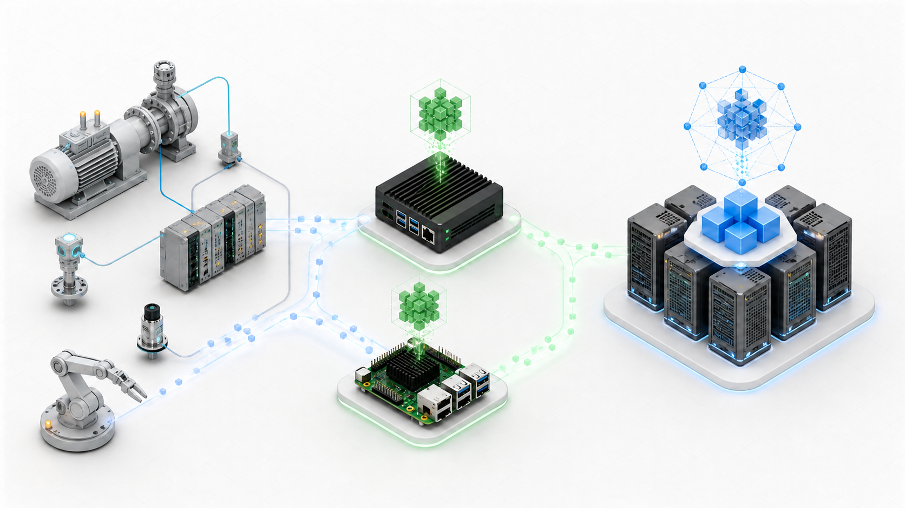
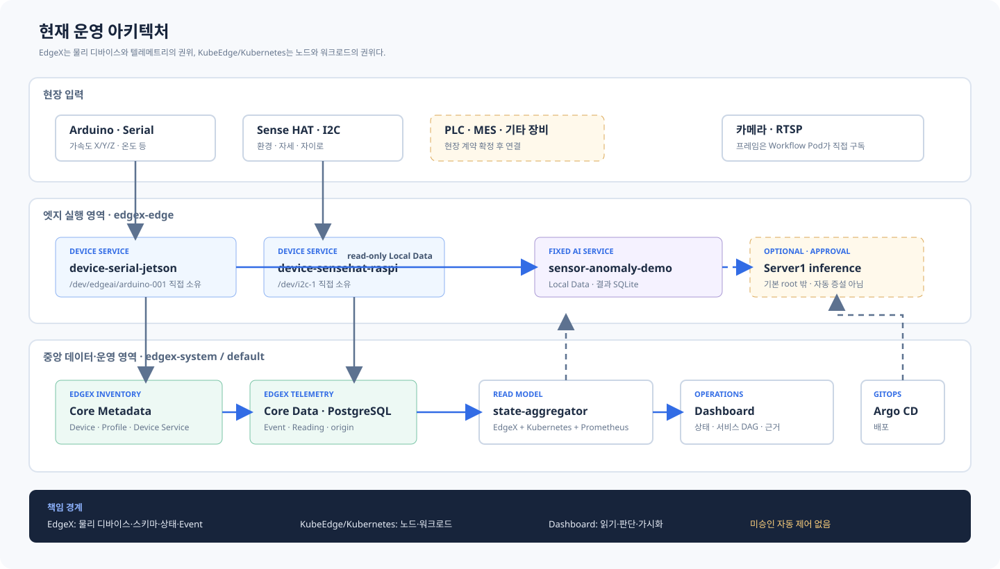

# 플랫폼 개요

이 플랫폼은 KubeEdge의 노드·workload 관리와 EdgeX의 물리 디바이스 관리를 결합한 실공장
Edge AI PoC다. 현재 목표는 범용 자동 오케스트레이션이 아니라, 실제 장비와 AI 서비스를
연결하고 그 근거를 운영 화면에서 추적할 수 있게 만드는 것이다.



*개념 비주얼이다. 정확한 책임과 데이터 경로는 아래 아키텍처를 기준으로 한다.*

## 현재 아키텍처



### 책임 경계

| 영역 | 권위 | 현재 역할 |
|---|---|---|
| 물리 디바이스 | EdgeX Core Metadata | Device, Device Profile, Device Service, 관리 상태 |
| 텔레메트리 | EdgeX Core Data | Event, Reading, nanosecond `origin`, 장기 이력 |
| 노드·workload | Kubernetes/KubeEdge | 배치, Ready, Pod/Service endpoint, 재시작 |
| 서비스 정의 | Git `ServiceDescriptor` | 서비스 identity, 입력 계약, DAG, 관측 API |
| 운영 화면 | `state-aggregator` | 권위 데이터 결합, freshness·상태 계산, read-only 상태 API |
| 장비 관리 | 관리 BFF + Adapter Controller | 검증 Catalog 기반 Profile/Device 등록 Saga와 Controller Runtime 관리 |

## 데이터가 이동하는 방식

```text
Arduino / Sense HAT / 승인된 장비
  → 노드의 EdgeX Device Service
  → 중앙 EdgeX MessageBus
  → Core Data / PostgreSQL
  → state-aggregator / dashboard

같은 노드의 AI 서비스
  ← Device Service의 bounded Local Data API
  → 서비스 소유 결과 저장소
  → state-aggregator / dashboard
```

현재 Serial과 I2C 정상 경로는 Device Service가 물리 장치를 직접 소유한다. 이전
`edgex-edge-agent-*`, outbox PVC, mapper direct-to-Influx 경로는 현재 fallback이 아니다.
중앙 ingest gateway는 유지되지만 현재 Serial/I2C Event 정상 경로에는 참여하지 않는다.

서비스 설계 canvas는 브라우저 내부 validation과 plan preview만 수행한다. 이와 별도로 장비
관리 API는 기능 플래그·idempotency·내부 HMAC 경계에서 제한된 mutation을 수행한다. 내부
HMAC은 사용자 인증이 아니므로 현재 관리 기능은 테스트베드 접근 경계를 전제로 한다.

## 현재 서비스 데모

`sensor-anomaly-demo`는 Jetson의 Arduino 가속도 X/Y/Z와 온도 입력을 정렬해 진동·온도
특징과 종합 점수를 계산한다. 실행 과정은 다음 DAG로 표현한다.

```text
센서 수집 → 전처리 → 특징 추출 → AI 추론 ┬→ Device1
                                           └→ Server1 후보
                              → 결과 저장 → 대시보드
```

기본 실행은 Device1의 고정 edge-local 경로다. Server1 후보는 HAMi GPU 할당과 실제 CUDA
시험 계산을 readiness에 포함한다. 같은 통계 기준선의 GPU 실행 경로이며 옥동 현장 학습
모델은 아니다. 승인 기반 선택 경로이고 자동 증설이나 범용 offloading이 아니다. 서비스
입력·판단·출력과 상태 의미는
[펌프·모터 이상감지 서비스](펌프-모터-이상감지-서비스.md)에서 설명한다.

## 현재 완료로 말하지 않는 것

- 옥동 PLC·MES field mapping과 생산품질 판별 서비스
- 일반 OPC-UA·Modbus·MQTT·RTSP 장비 자동 지원
- 승인 없는 디바이스 자동 등록
- workflow canvas에서 실제 Kubernetes workload 실행
- 자동 workload 증설, runtime migration, 전역 offloading
- LLM의 Kubernetes·EdgeX 직접 제어

상세 경계는 [프로젝트 범위](프로젝트-범위.md), 실제 상태는
[현재 구현 상태](현재-구현-상태.md)를 확인한다.
