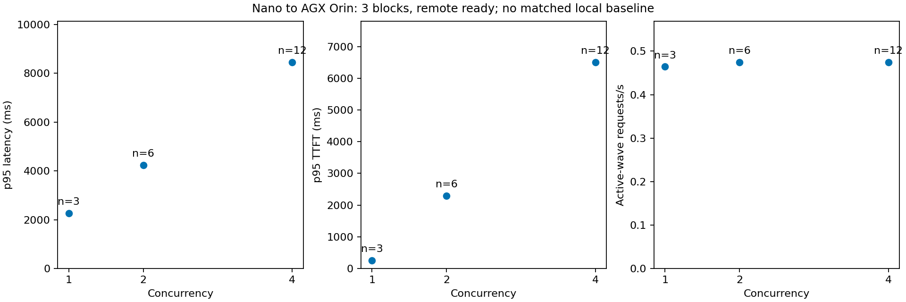

# 실제 AGX Orin 저부하 GPU 실험 — 2026-09-08

## 결론 / ELI5

**Nano가 AGX에 API로 주문을 보내고, AGX GPU가 계산한 답을 Nano가 받는 것까지 성공했다.**
AGX 단독 9건, Nano→AGX 21건이 모두 입력 512/출력 128 실제 토큰으로 완료됐다.
이미 생성하던 요청을 옮기거나, 부하에 따라 자동으로 전환한 실험은 아니다.

현재 설정은 한 번에 한 주문을 처리하는 창구(slot 1)다. AGX도 동시 주문을 늘리면
창구 처리 속도보다 줄 길이가 늘었다. **약 0.47 요청/s는 짧은 wave에서 관측한 값이지,
지속 부하의 안전 한계나 AGX 최적 성능이 아니다.**

오늘 Nano에 동일 설정의 추가 모델을 띄우려 했으나 GPU 메모리 할당에 실패했다.
따라서 오늘의 Nano 로컬 대 AGX 교차 비교는 **미완료**다. 어제 Nano 결과로 대체하거나
기존 Nano 모델의 다른 설정을 동일 조건으로 취급하지 않았다.

## 실제 장비와 실행 경계

- Kubernetes에서 확인한 노드: `etri-dev0005-jetagx`, `192.168.0.8`, Ready.
- SSH 및 device-tree: **NVIDIA Jetson AGX Orin Developer Kit**. RTX 대체 장비가 아니다.
- ARM64, 12 online CPU, RAM 62878MiB, Ubuntu 24.04.4, kernel 6.8.12-1021-tegra.
- L4T R39.2.1, driver 595.78, CUDA toolkit 13.2.86, **MODE_50W (3)** 유지.
- Nano는 기존 R36.4.7/CUDA 12.6 환경이다. OS·driver·전력 모드 차이는 통제하지 않았다.
- 모델과 실행파일은 Nano의 격리된 실험 디렉터리에서 AGX의 새 디렉터리로 복사했다.
  Nano 원본과 운영 이미지·캐시를 변경하지 않았다. 복사 직후 파일 캐시 상태이므로
  준비 시간은 캐시가 식은 SSD 읽기나 Cold 다운로드 결과가 아니다.
- **이번 AGX와 Nano 비교용 서버는 SSH로 시작한 별도 호스트 프로세스**다.
  Kubernetes는 inventory 확인만 했고, 실험 Pod/가속기 예약을 만들지 않았다.
- 준비된 AGX의 `POST /completion`으로 API 요청, 스트리밍 응답 수신을 Nano에서 계측했다.
  포트 18200은 실험 전 비어 있었고 개인 실험용 API key를 요구했다.

같은 llama-server `d222767c7`, Q8_0 GGUF SHA256
`74701a8c35f6c8d9a4b91f3f3497643001d63e0c7a84e085bed452548fa88d45`,
thread 4, context 2048, batch 512/ubatch 128, slot 1, f16 KV, FA off를 사용했다.
AGX의 `cuda_jetpack6` backend를 실제 GPU 적재 17/17 layer와 소유 프로세스 CUDA 매핑,
실제 추론으로 검증했다. CPU fallback을 허용하지 않았다.
새 드라이버에서 이전 CUDA 애플리케이션을 실행할 수 있다는 일반 원칙은
[NVIDIA CUDA 호환성 문서](https://docs.nvidia.com/deploy/cuda-compatibility/minor-version-compatibility.html)를 참고했으나,
이 장비 조합의 지원을 문서만으로 단정하지 않고 실제 실행으로 확인했다.
Meta 원본 revision과 GGUF 변환 이력은 기존과 같이 미확인이다.

## 실측 결과

### AGX 내부 요청 발생기 → AGX GPU

`results/agx-smoke-a/`: 준비 운동 별도, 9/9 측정 성공. 단계 순서 1→2→4의 smoke이며
아래 소표본 p95를 정밀한 꼬리 지연 추정으로 해석하지 않는다.

| 동시 요청 | 표본 | p95 전체 응답 | p95 TTFT |
|---|---:|---:|---:|
| 1 | 3 | 2.122초 | 0.175초 |
| 2 | 2 | 4.102초 | 2.170초 |
| 4 | 4 | 8.044초 | 6.104초 |

### Nano 요청 발생기 → 준비된 AGX GPU → Nano 결과 수신

`results/nano-to-agx-a/`: 3개 세션 내 block, block마다 동시 요청 1·2·4.
같은 token-ID 데이터와 예정 도착 offset 0의 wave. 경로가 하나라 무작위 경로 교차 시험은 아니다.
실제 전송 지연·실제 출력 토큰·실패를 원시 기록하고 전 요청의 prefix 재사용 없음 확인.
21/21 성공, 실패율 0/21. p값·신뢰구간·holdout 판정은 제공하지 않는다.

| 동시 요청 | 표본 | 평균±요청 간 SD | p50 응답 | p95 응답 | p95 TTFT | 활성 wave 요청/s |
|---|---:|---:|---:|---:|---:|---:|
| 1 | 3 | 2.152±0.109초 | 2.121초 | 2.257초 | 0.253초 | 0.464 |
| 2 | 6 | 3.162±1.153초 | 3.153초 | 4.233초 | 2.292초 | 0.474 |
| 4 | 12 | 5.271±2.454초 | 5.254초 | 8.454초 | 6.505초 | 0.475 |

SD에는 큐에서의 순번 효과가 포함된다. 요청 21건이 장비 21개의 독립 반복은 아니다.
`summary.json`의 전체 시간 기준 처리량에는 다른 동시 요청 조건의 시험 공백이 들어간다.
위 표는 `profile.json`의 `active_wave_completed_rps`를 사용했다.
원격 API 전체 시간에는 통신과 서버 대기가 함께 포함되며 순수 RTT를 따로 추정하지 않았다.



## 준비 비용과 자원 반환

- Cached 호스트 프로세스 시작→추론 probe READY: 단독 시험 **2.891초**, 원격 창 **2.563초**.
- 원격 창의 전체 준비 운동 512/128 비용은 별도로 **2.276초**다.
  warmed 지연과 비교할 때 이를 숨기지 않는다. Pod 기동·이미지 다운로드·관리 RPC는 포함되지 않았다.
- 원격 창에서 CPU/RAM·열 센서 표본 318개, 관측 최고 열 센서 온도 **47.687°C**,
  최소 가용 RAM **57026.8MiB**. GPU memory/util/power는 nvidia-smi 지원 제한으로 unavailable.
  시스템 전체 에너지나 idle GPU 메모리 절약은 계산하지 않았다.
- 실험 종료 시 AGX 소유 모델 프로세스 종료와 포트 18200 리스너 부재 확인.
  프로세스 종료 확인까지 **0.440초**. 직접 GPU 할당량 반환은 측정할 수 없어
  `gpu_allocation_released=null`, `UNVERIFIED`로 유지한다.
- Nano 실패 프로세스도 종료됐다. 기존 Nano 시연 모델 PID 2263165는 유지했고,
  센서 서비스·EdgeX·전력 설정·운영 배포는 변경하지 않았다.
- 파일은 `/home/etri/llama-boundaries-20260908/`에 보존했다. AGX에는 모델·runtime 약 4.5GB가
  캐시로 남으며 모델 프로세스는 남지 않았다. 이는 무자원 점유 상태와 다르다.

## 실패와 남은 판단

1. `nano-window-agx-a`: GPU 실행 전 새 온도 collector가 비활성 CV 열 센서의
   EAGAIN 읽기에서 Python TypeError로 중단. 실제 sysfs 재현 후 해당 센서를 null로
   기록하도록 수정했고 회귀 시험을 추가했다. 활성 CPU/GPU 열 센서는 정상 수집한다.
2. `nano-window-agx-b`: `sudo prlimit --memlock=unlimited` 조건에서도
   CUDA0의 1252.41MiB 할당이 `cudaMalloc out of memory`로 실패.
   전체 가용 RAM이 있다는 사실이 CUDA 할당 가능성을 보장하지 않는다.
   기존 유휴 모델이 있지만 그것만을 원인으로 입증하지는 않았다.
3. `paired-nano-agx-a`: Nano endpoint 미기동으로 초기 연결 실패. 비교 요청은 실행되지 않았다.
   이후 `--remote-only` 경로는 `matched_comparison=false`로 따로 기록했다.

전환·활성화·회수 정책 기준은 여전히 null/운영 비활성이다. 다음 비교에는 **기존 Nano 시연 모델을
잠시 내렸다가 복구하는 별도 승인** 또는 두 모델을 동시에 적재할 수 있는 조건의 원인 확인이 필요하다.
그 후 동일 조건 교차 비교, 지속 RPS, 짧은/긴 burst, 유휴 timeout을 순차 평가한다.
실제 DGX Spark는 아직 미검증이다.

## 재실행 / 검증

```bash
rtk python3 -m unittest discover -s qualification/llama-boundaries -p 'test_*.py' -v
rtk qualification/llama-offloading/.venv/bin/python \
  qualification/llama-boundaries/analyze_remote.py \
  qualification/llama-boundaries/results/nano-to-agx-a
```

AGX 접속 후, 새 결과 디렉터리를 사용한다:

```bash
python3 /home/etri/llama-boundaries-20260908/bench.py smoke \
  --config /home/etri/llama-boundaries-20260908/agx-0332.json \
  --output /home/etri/llama-boundaries-20260908/agx-smoke-NEW
```

원격 창은 `agx-window.json`, `--hold-seconds 240 --key-file <개인 키 파일>`로 열며
유효한 READY와 GPU gate를 확인한 뒤 Nano의 `paired_client.py --remote-only`를 실행한다.
실행 중 요청이 끝난 후 해당 결과 디렉터리의 `STOP` 파일 또는 실행 창 만료로 종료한다.
다른 프로세스를 이름만으로 일괄 종료하지 않는다. 16개 단위 시험과 원시 길이·캐시·종료
검증을 수행했으며, 정책 자동 전환/Pod 운영 경로를 검증한 것은 아니다.
