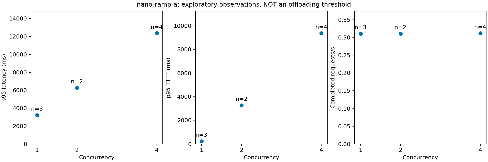

# Llama 신규 요청 오프로딩 기준점 실험 — 진행 중

## 최신: 승인된 다양한 요청 로컬 GPU 탐색

2026-09-08 후속 승인으로 Nano 모델과 5080 센서 추론을 한시 중단하고 복구했다.
동일 context4096/slot1·f16·thread4 설정으로 실제 Nano·AGX와 RTX 5060 Ti·5080에서
입력128/512/2048, 출력64/128/256, 기본 동시 요청1/2/4/8 및 10초 도착률 탐색을 수행했다.
최종 예정202건 중 전송201/성공201/발생기 상한 미전송1. 초기5080 timeout1은 별도 보존.
Nano150초, 센서342초 안에 복구 확인. 실제 DGX Spark·장시간 포화·운영 정책은 미검증.
현재 상세 결과는 [장비별 GPU 성능측정](../../docs/Llama-장비별-GPU-성능측정.md)이 기준이다.
`sweep.py`, `*-sweep.json`, `nano_session.py`, `pod_runtime.py --local-sweep`,
`analyze_sweep.py`, `report_sweep.py`가 재현 코드다. 과거 context2048 결과와 섞지 않는다.

## 최신: 2026-09-08 실제 AGX Orin GPU 측정

[AGX 실험 결과·실패 원인·재실행](AGX-실험-20260908.md)에 정리했다.
AGX 단독 9/9, **Nano→AGX API 경로 21/21 성공**. 동시 요청 1·2·4의 원격 p95 응답은
2.257·4.233·8.454초였다. 시험용 AGX 모델은 종료했고 파일만 캐시로 보존했다.
오늘 Nano 동일 설정 추가 모델은 GPU 메모리 할당에 실패해 **당일 로컬 교차 비교는 미완료**다.
자동 부하 전환이나 Kubernetes Pod 기동 실험이 아니라 격리된 호스트 프로세스의 GPU/API 계측이다.
아래 9월 7일 기록의 AGX 미검증 상태는 이 후속 측정으로 일부 갱신됐다.

## 최신: RTX 5080 실경로 측정과 센서 서비스 복구

2026-09-07 사용자 승인으로 센서 **추론** 서비스의 GPU를 한시적으로 빌렸다.
EdgeX 수집은 변경하지 않았다. 대여 시작부터 센서 Ready 복구까지 약 **361초**였으며,
승인된 15분 안에 종료했다. 센서 1/1 Ready, `/healthz`와
`/api/v1/augmentation-readyz` 성공, 실험 worker 0/0 및 Pod 부재,
Argo 임시 replica override와 소유권 annotation 제거를 확인했다.

Nano 발생기에서 같은 모델·공통 설정으로 3개 무작위 경로 순서 block을 실행했다.
42/42 요청 성공. 입력 512/출력 128 실제 토큰, prefix 재사용 없음.
장비는 **RTX 5080 대체 서버이지 DGX Spark가 아니다**.

| 동시 요청 | 경로별 표본 | Nano p95 전체 응답 | Nano→RTX 5080 p95 전체 응답 | 감소율 |
|---|---:|---:|---:|---:|
| 1 | 3 | 3.590초 | 0.315초 | 91.2% |
| 2 | 6 | 6.857초 | 0.595초 | 91.3% |
| 4 | 12 | 13.576초 | 1.217초 | 91.0% |

### ELI5: 지금 알게 된 기준과 아직 모르는 기준

**문을 열어 둔 큰 창구로 보내면 더 빨랐다.** Nano에서 줄이 길어지면 기다리는 시간이
늘었고, 준비된 두 RTX 서버로 보내면 네트워크 왕복을 포함해도 빨랐다.
하지만 **문을 새로 여는 시간은 별도**다. 빨리 끝날 주문 때문에 창구를 새로 열면
오히려 늦을 수 있다. 이번에는 언제 닫는 게 이득인지까지 시험하지 않았다.

- **전환:** 시험한 512/128, slot 1, 동시 요청 1·2·4, 관측 LAN/자원 조건에서
  준비된 RTX 5060 Ti와 RTX 5080 경로가 각각 대응 Nano 기준선보다 빨랐다.
  날짜·시간이 다른 두 원격 시험을 하나의 무작위 3장비 비교로 해석하지 않는다.
- **활성화:** 5080의 이미 실행된 Pod 안에서 native worker 시작→추론 probe는
  **1.081초**, 별도 준비 운동은 **0.308초**였다. 이 경계만 포함한 단일 요청
  가산 Gain 추정은 **+1.791초**다. **Pod 기동과 GPU 확보 비용을 포함하지 않는다.**
  이번 센서 중단→GPU 확보→Pod Ready 준비 단계는 별도로 **6.529초**였으므로,
  이를 단순 합산하면 Gain은 약 **−4.738초**다. 이는 관리 RPC·구간 간 공백을
  모두 재생한 실제 on-demand 시험이 아니라, 비용 경계를 보여 주는 추정이다.
  따라서 `1.081초`를 전체 활성화 비용이나 활성화 정책 근거로 쓰면 안 된다.
- **회수:** 실험 종료 후 Pod 제거와 GPU 예약 반환, 센서 복구는 확인했다.
  유휴 대기 비용과 재활성화 비용을 비교한 최적 idle timeout은 아직 미측정이다.
- Nano의 기존 유휴 시연 모델은 유지됐다. Nano 실험 프로세스 종료는 확인했으나
  직접 GPU 할당량 반환은 계측 불가로 `UNVERIFIED`다.
- 5080은 GPU 적재 17/17 layer와 GPU 프로세스를 확인했다. 연속 자원·전력 시계열은
  이번 Pod 경로에서 수집하지 않았으므로 에너지 절약·idle 메모리 차이를 주장하지 않는다.

근거: `results/paired-nano-rtx5080-a/`의 원시 JSONL/CSV와 `comparison.json`,
`results/paired-rtx5080-window-b/`의 모델 준비 기록,
`results/paired-nano-window-5080-a/`의 Nano 프로세스 종료 기록.
첫 준비 시도 `paired-rtx5080-window-a`는 키 복사 시 소유권 보존 권한 오류로 실패했고
측정 성공에 포함하지 않았다. 복사는 소유권 보존 없이 재시도해 해결했다.

`borrow_5080.py`는 기존 GPU 복구 saga, 영속 소유권 기록과 독립 watchdog을 사용한다.
새 대여 실행은 센서 일시 중단 승인이 필요하다. 복구 명령은
`python3 qualification/llama-boundaries/borrow_5080.py restore --state <해당 실행 상태 경로>`다.
`pod_runtime.py`는 고정된 승인 대상 Pod에서만 실행하며, 종료 시 GPU 예약 반환은
대여 saga의 Pod 제거까지 확인해야 한다. 런타임 프로세스 종료만으로 완료 처리하지 않는다.

```bash
rtk python3 qualification/llama-boundaries/analyze_paired.py \
  qualification/llama-boundaries/results/paired-nano-rtx5080-a \
  --activation-run qualification/llama-boundaries/results/paired-rtx5080-window-b
```

**다음 단계:** 지속 요청률과 burst 지속시간을 바꾸어 전환·활성화 교차점을 찾고,
유휴 시간별 재활성화 비용을 비교한다. 현재는 소표본 탐색이며 세 정책 기준은 null,
운영 자동 전환은 비활성이다. 실제 AGX Orin과 DGX Spark는 계속 미검증이다.

## 최신: 같은 실행 조건의 Nano → RTX 5060 Ti 실경로 비교

2026-09-07 후속 실험에서 외부 다운로드 문제를 해결했다. RTX 5080 서버에 캐시된
동일 digest 이미지의 실행파일을 **GPU를 요청하지 않는 임시 Pod**에서 읽어와
원본/복사본 실행파일과 CUDA backend SHA256을 확인했다. 임시 Pod 2개는 모두 정리했다.

Nano와 RTX 모두 llama-server **d222767c7**, 같은 GGUF SHA, context 2048,
thread 4, batch 512/ubatch 128, KV f16, flash attention off, slot 1로 실행했다.
각 아키텍처의 CUDA backend는 JetPack 6 / CUDA 12 계열로 다르다.
Nano의 일반 계정 실행은 GPU 1252MiB 할당에 실패했다. memlock 제한은 약 952MiB였고,
실험 프로세스에 한해 `sudo prlimit --memlock=unlimited`로 실행한 시험은
17/17 layer GPU 적재에 성공했다. **권한과 memlock을 함께 바꾼 실행이므로 원인 분리 실험은 아니다.**
호스트 전력 설정·전역 limits·운영 서비스는 변경하지 않았다.

실제 Nano에서 두 경로를 **3개 block 안에서 순서를 무작위화**해 교차 실행했다.
각 wave의 예정 도착 offset은 모두 0이며 실제 전송 지연을 별도 기록했다.
42/42건 성공, 실제 입력 512/출력 128, 모든 요청 `cache_n=0` 확인.

| 동시 요청 | 경로별 표본 수 | Nano p95 전체 응답 | Nano→RTX p95 전체 응답 | 관측 감소율 |
|---|---:|---:|---:|---:|
| 1 | 3 | 3.601초 | 0.548초 | 84.8% |
| 2 | 6 | 6.883초 | 1.075초 | 84.4% |
| 4 | 12 | 13.625초 | 2.150초 | 84.2% |

**현재 결론:** 이 모델·요청 길이·준비된 원격·관측된 자원 상태·LAN 조건에서는
신규 요청을 RTX 5060 Ti로 보내는 경로가 더 빨랐다. 아직 일반적인 전환 임계값은 아니다.

중요한 제한:

- 원격이 이미 준비된 비교군이다. 모든 후보를 항상 켜 두는 운영안이 아니다.
  시험용 두 모델은 제한된 실행 창이 끝난 뒤 종료됐다.
- Nano의 기존 시연 모델은 계속 유휴 상태로 남아 RAM을 점유했다.
  비교 결과는 **이 추가 유휴 모델이 있는 Nano 자원 조건**에 한정한다.
- 각 wave 안의 완료 처리량은 Nano 약 0.28~0.29 요청/s, RTX 약 1.84~1.86 요청/s였다.
  `summary.json`의 경로별 wall-span 처리량에는 다른 경로를 시험하던 공백도 포함된다.
  처리량 비교에는 `comparison.json`의 `active_wave_completed_rps`를 사용하며,
  이것도 지속 요청률 포화 한계는 아니다.
- block은 3개뿐이다. holdout·독립 날짜 반복·지속 RPS·burst crossover 검증은 남아 있다.
  p값이나 통계적 확정 판정을 하지 않았다. SLO도 아직 설정되지 않았다.
- RTX의 Cached 시작→probe READY는 별도 실행에서 0.964초였다.
  준비 운동은 따로 기록했고, warmed 원격 지연을 사용하는 gain 추정에서는 **준비 운동 비용도 더한다**.
  실제 on-demand 첫 요청이나 Nano 관리 RPC까지 실측한 값으로 표현하지 않는다.
- RTX는 소유 프로세스 종료 및 GPU PID 소멸을 확인했다.
  Nano는 소유 프로세스 종료를 확인했지만 직접 GPU 할당량 계측이 지원되지 않아
  `gpu_allocation_released=null`, 반환 계측 상태는 `UNVERIFIED`로 남겼다.
- 후속 2초 진단에서 `tegrastats`의 GPU util/온도/VDD_IN 출력 가능성은 확인했다.
  이를 과거 42건의 전력 측정 데이터로 소급하지 않는다. 다음 반복 시험 collector에 연결해야 한다.
- 당시 RTX 5080은 승인 대기였으며, 후속 승인·실험 결과는 맨 위 절에 기록했다.

근거 및 재실행 코드:

- `results/paired-nano-rtx5060ti-a/`: `plan.json`, 원시 JSONL/CSV, `provenance.json`, `comparison.json`.
- `common-0332.json`, `nano-0332.json`, `rtx5060ti-0332.json`: 공통 설정과 장비별 경로.
- `paired_client.py`: Nano hostname 및 서버 build/context 확인, bounded 교차 wave, 실패 즉시 다음 wave 중단.
- `analyze_paired.py`: block별 수치, 표본 수·SD·p50/p95·활성 wave 처리량과 명시적 추정.
- `*-window.json`, `bench.py --hold-seconds 180 --key-file <private-file>`: API key를 요구하는 한시적 실험 창.
  키 값은 결과·문서에 기록하지 않는다. 최대 300초를 넘길 수 없다.

```bash
rtk python3 -m unittest discover -s qualification/llama-boundaries -p 'test_*.py' -v
rtk python3 qualification/llama-boundaries/analyze_paired.py \
  qualification/llama-boundaries/results/paired-nano-rtx5060ti-a \
  --activation-run qualification/llama-boundaries/results/paired-rtx-window-a
```

아래 내용은 이전 단일 장비 탐색 이력이다. 버전 불일치/다운로드 차단 상태는 위 후속 시험에서 해결됐으며,
Cold·idle·burst·회수 정책 검증이 남았다는 경계는 계속 유효하다.

## ELI5 결론

Nano의 현재 설정은 **주문을 한 번에 하나씩 처리하는 창구**다.
여러 사람이 동시에 주문하면 창구가 빨라지는 게 아니라 줄이 길어진다.
실제로 동시 요청을 1→2→4로 늘렸을 때 처리량은 비슷하고 응답시간이 늘었다.
하지만 다른 창구를 여는 시간과 왕복 시간을 아직 같은 조건으로 재지 않았으므로,
**“동시 요청 2개부터 오프로딩하자”라고 결론 내릴 수는 없다.**

이 디렉터리는 기존 시연·센서 서비스와 분리한 qualification 코드다.
운영 자동 전환은 비활성이다. 기존 dashboard나 placement_engine을 수정하지 않았다.
실제 AGX Orin/DGX Spark 결과가 아니라 **Nano + 대체 RTX 장비**의 결과다.

## 2026-09-07 실제 확인

- checkout `agent/edgex-central-docs`, HEAD `214f2008aa7a276ad53513efe3a888eddc2c6522`.
  원격 개발 브랜치도 같은 commit이며 main은 다른 commit이다. 기존 미커밋 변경은 보존했다.
- Nano SSH 접속, ARM64, Ubuntu 22.04.5, L4T 36.4.7, CUDA toolkit 12.6.68,
  RAM 7619 MiB, **25W 모드** 확인. 전력 모드는 변경하지 않았다.
- 두 장비의 모델 파일 SHA256을 실제 계산해 동일함을 확인했다.
  `74701a8c35f6c8d9a4b91f3f3497643001d63e0c7a84e085bed452548fa88d45`
- 모델은 기존 Ollama registry의 **Llama 3.2-1B Instruct / Q8_0** GGUF다.
  Meta 원본 revision과 변환 이력은 미확인이다. Ollama manifest digest를 파일 SHA와 혼동하지 않는다.
- Nano: 기존 실험용 Ollama 0.33.2, llama-server `d222767c7`, context 2048,
  KV q8_0, flash attention auto, batch/ubatch 512, slot 1.
  runtime allocation 1,413,952,307 bytes와 실제 프로세스의 JetPack CUDA 라이브러리 매핑을 확인했다.
  Jetson nvidia-smi의 GPU 메모리·util은 지원되지 않아 unavailable이다.
- RTX 5060 Ti: 기존 배포를 바꾸지 않고 별도 프로세스/포트 18200에서 실행.
  Ollama 0.32.5에 포함된 llama-server `b4d6c7d8f`, context 4096,
  KV f16, flash attention off, batch 512/ubatch 128, thread 4, slot 1.
  **17/17 GPU layer + 소유 프로세스의 nvidia-smi 등록**을 모두 확인했다.
- RTX 5080은 센서 서비스가 사용 중이므로 이번 실험에 사용하지 않았다.
- 따라서 아래 수치를 **동일 실행 조건의 기기 성능 비율**로 해석하면 안 된다.

## 실측 결과: Nano 짧은 동시 요청 탐색

근거: `results/nano-ramp-a/requests.jsonl`, `summary.json`, `provenance.json`.
요청 발생기도 실제 Nano에서 실행했다. 입력 512 실제 토큰 / 출력 128 실제 토큰.
고정 작업량 계측을 위해 token-ID 배열을 사용하고 EOS를 무시했다. 대화 품질 시험은 아니다.
준비 운동 1건은 별도로 기록하고 아래 집계에서 제외했다.
모든 요청에서 서버 `cache_n=0`, `prompt_n=512`를 확인했다.

| 동시 요청 | 측정 요청 수 | p95 TTFT | p95 전체 응답시간 | 완료 요청/s |
|---|---:|---:|---:|---:|
| 1 | 3 | 0.232초 | 3.224초 | 0.311 |
| 2 | 2 | 3.278초 | 6.267초 | 0.311 |
| 4 | 4 | 9.363초 | 12.348초 | 0.312 |

측정 9건 모두 목표 길이로 완료했다. 이 p95는 작은 표본의 보간 분위수이며
독립된 반복 실험이나 검증 데이터에 의한 임계값 추정이 아니다.
1→2→4 순서의 짧은 wave라 시간 효과를 통제한 무작위 실험도 아니다.



RTX 별도 smoke(`rtx5060ti-smoke-20260907-d`)는 3/3 완료,
p95 TTFT 39.1ms, p95 응답시간 530.8ms였다.
Cached 프로세스 시작→추론 probe 완료는 1229.5ms, 종료→소유 GPU 할당 해제 확인은 190.5ms였다.
활성화 값에는 tokenizer fixture 준비와 probe를 포함하며 CUDA 초기화·파일 읽기·GPU 적재를
따로 계측한 값은 아니다. 모델 파일은 유지했고 Kubernetes GPU 예약은 만들지 않았다.
Nano→RTX 왕복 경로 결과도 아니다.

## 도구와 재실행

실행 전 포트·GPU 소유권·runtime help·모델 SHA를 확인한다. 동일 이름 결과 디렉터리는 덮어쓰지 않는다.

```bash
rtk python3 -m unittest discover -s qualification/llama-boundaries -p 'test_*.py' -v
rtk python3 qualification/llama-boundaries/bench.py smoke \
  --output qualification/llama-boundaries/results/rtx-new-run
rtk qualification/llama-offloading/.venv/bin/python qualification/llama-boundaries/analyze.py \
  qualification/llama-boundaries/results/nano-ramp-a
```

Nano에 복사한 파일은 `/home/etri/llama-boundaries-20260907/`에 있다.
`client_smoke.py --help`에 기존 experimental endpoint용 명령이 있다.
해당 endpoint의 동적 포트는 매번 실제 프로세스에서 확인해야 한다.
기존 worker를 내리거나 운영 서비스에 이 명령을 사용하지 않는다.

- `bench.py`: 모델 hash/실행 버전/GPU 검증, Cached 기동, health와 추론 probe,
  준비 운동, 스트리밍 원시 JSONL, 자원 수집, 종료와 GPU 반환 확인.
- `client_smoke.py`: 기존 실험 endpoint에 bounded 요청. 재시도·fallback 없음.
  Nano 자체에서 계측. `--ramp`는 1·2·4의 짧은 탐색만 수행.
- `analyze.py`: 원시 CSV, 표본 수를 표시하는 그래프, 비활성 프로파일 출력.
- `inventory.json`, `config.json`: 실제 inventory와 제안 설정·미측정값의 구분.
- `profile.json`: 기존 배치 모듈이 읽을 수 있는 `edge-ai.llm-observation/v1` 형식 제안.
  `production_enabled=false`, 세 판단 기준은 아직 null이다. 운영 연동은 하지 않았다.

스트리밍 청크 수를 토큰 수로 쓰지 않는다. 서버의 최종 토큰 수와 종료 여부를 확인한다.
TTFT는 요청 발생 측에서 처음 비어 있지 않은 생성 내용을 받기까지다.
전체 시간에서 서버 시간을 뺀 값을 순수 네트워크 시간이라고 하지 않는다.
원시 resource 자료의 GPU 전력은 장치 전체이며 시스템 전체 전력이 아니다.

## 실패 및 중단 기록

- RTX `smoke-a`: backend 환경변수에 디렉터리를 넣어 CPU fallback 경고 발생.
  GPU gate가 **측정 전에 차단**했고 프로세스를 종료했다.
- `smoke-b`: 종료 후 TIME_WAIT 포트 검사 오류. 리스너 부재 확인 후 SO_REUSEADDR 검사로 수정.
- `smoke-c`: 기본 로그가 GPU layer 정보를 숨겨 증거 gate에서 중단.
  상세 로그에서 실제 배치를 확인한 `smoke-d`만 성공 결과다.
- RTX를 Nano와 같은 0.33.2로 맞추기 위한 공식 배포물은 1.42GB다.
  다운로드가 느려 300초 제한에 걸려 실패했다(exit 28, 37,257,194 bytes 수신). 불완전 archive는
  `.runtime/ollama-0.33.2/archive.tar.zst`에만 남았고 설치·실행하지 않았다.
  공식 배포물 SHA는 `9785247dea264d9072f09f6c9c0eb4b8e666892826a3d8388eba3e8fb9ed1db9`다.
  출처: [Ollama v0.33.2 공식 릴리스](https://github.com/ollama/ollama/releases/tag/v0.33.2).

## 남은 범위와 다음 반복 실험

아직 **동일 runtime/설정 비교, Nano→원격 실경로, Cold 준비,
Always-On 5분 idle, 반복 burst, 활성화/회수 정책과 break-even 검증은 미완료**다.
단순히 GPU 사용률 80%, 큐 8개, 2초, 15%를 실측 기준으로 승격하지 않는다.

다음 순서는 같은 빌드·설정 확인 → Nano 발생기의 동일 도착 패턴 재생 → 상태별 준비 비용 비교다.
실험 설계는 시간 block 안에서 방식·경로 순서를 교차/무작위화하고,
독립 반복 block과 정책 검증용 holdout 패턴을 분리한다.
실제 GPU 장비 하나씩뿐이므로 장비 집단 전체로 일반화하지 않는다.

전체 반복 시험의 **제안 예산**은 2개 기기 × 4개 운영 방식 × 4개 concurrency × 3개 block,
cell당 측정 60초와 간격 30초면 144분이다. 별도 activation 상한 90초를 72회 잡으면
최대 108분이 추가되고 idle 측정까지 약 **4.5시간 상한**이다.
이는 실측 소요시간이 아닌 보수적 계획이며 지금 실행한 것이 아니다.
실제 접근성과 baseline으로 줄인 뒤 자원·시간 승인을 받고 진행한다.
request timeout 30초, RAM available 1GiB 미만, GPU 80°C 이상(측정 가능할 때),
기존 서비스 이상, 모델/토큰/GPU 검증 실패 시 중단한다.
80°C는 이번 안전 제한 제안값이지 오프로딩 임계값이 아니다.

일반식은 `local 예상 완료시간 - (activation + 원격 경로 전체 예상 완료시간)`이다.
원격 경로 전체 시간에 왕복 비용을 이미 포함했다면 네트워크를 다시 더하지 않는다.
실제 미래 출력 길이·미래 부하는 정책 입력으로 쓰지 않는다.
현재는 비교 가능한 근거가 없어 Gain과 break-even을 숫자로 제시하지 않는다.

## 정리 경계

RTX smoke는 finally에서 자신이 시작한 process group만 종료하고 GPU PID 소멸을 확인한다.
강제 외부 종료·호스트 장애까지 자동 복구하는 운영 도구는 아니다.
Nano client는 완료 후 종료되며 기존 모델을 종료하지 않는다.
공유 모델·이미지·호스트 파일 캐시는 삭제하지 않았다. 기존 센서 서비스는 유지했다.
결과·실험 코드·불완전 다운로드는 재현을 위해 남겼다. SSH 비밀번호는 저장하지 않는다.
